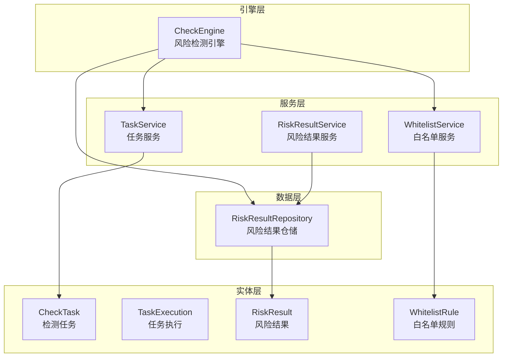
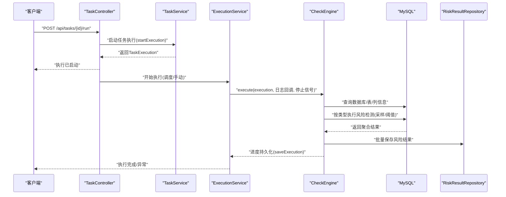
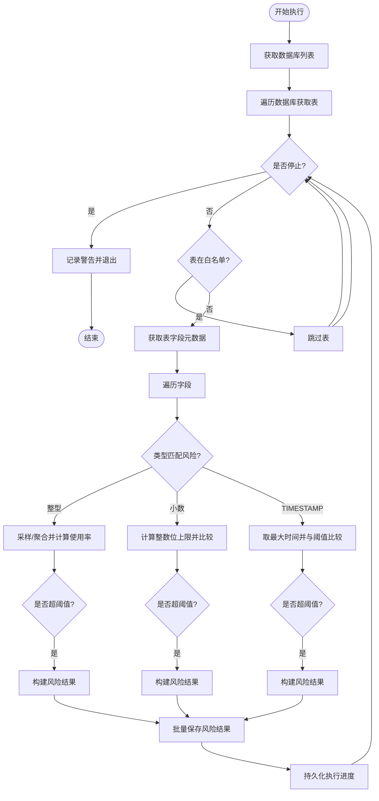
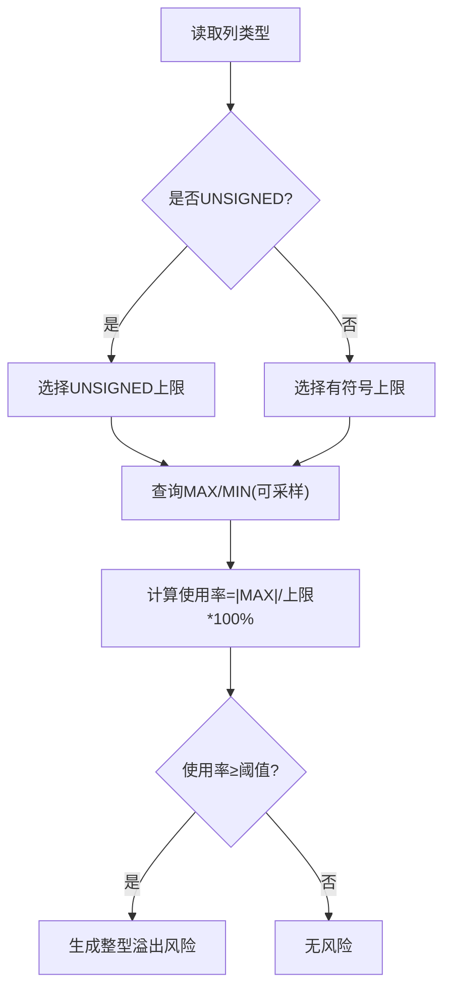
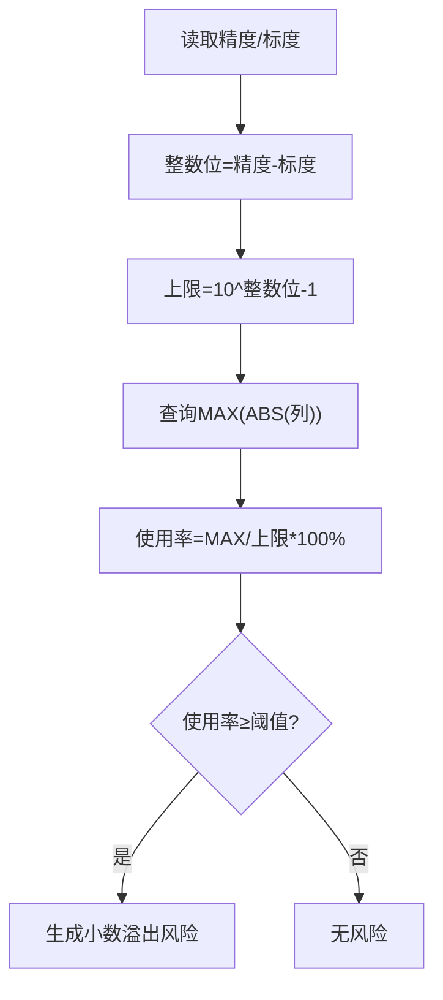
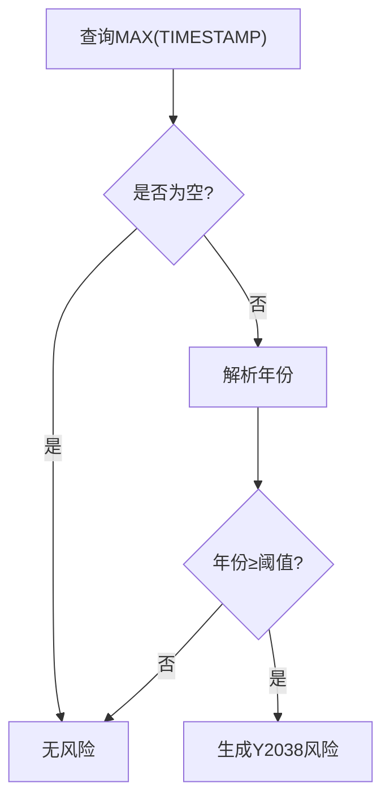
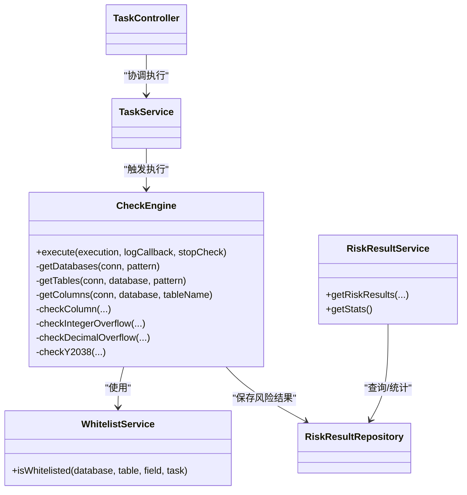

# 风险检测引擎

<cite>
**本文引用的文件**
- [CheckEngine.java](file://backend/src/main/java/com/fieldcheck/engine/CheckEngine.java)
- [RiskType.java](file://backend/src/main/java/com/fieldcheck/entity/RiskType.java)
- [RiskResult.java](file://backend/src/main/java/com/fieldcheck/entity/RiskResult.java)
- [CheckTask.java](file://backend/src/main/java/com/fieldcheck/entity/CheckTask.java)
- [TaskExecution.java](file://backend/src/main/java/com/fieldcheck/entity/TaskExecution.java)
- [WhitelistService.java](file://backend/src/main/java/com/fieldcheck/service/WhitelistService.java)
- [RiskResultRepository.java](file://backend/src/main/java/com/fieldcheck/repository/RiskResultRepository.java)
- [RiskResultService.java](file://backend/src/main/java/com/fieldcheck/service/RiskResultService.java)
- [TaskService.java](file://backend/src/main/java/com/fieldcheck/service/TaskService.java)
- [TaskController.java](file://backend/src/main/java/com/fieldcheck/controller/TaskController.java)
- [application.yml](file://backend/src/main/resources/application.yml)
</cite>

## 目录
1. [简介](#简介)
2. [项目结构](#项目结构)
3. [核心组件](#核心组件)
4. [架构总览](#架构总览)
5. [详细组件分析](#详细组件分析)
6. [依赖分析](#依赖分析)
7. [性能考量](#性能考量)
8. [故障排除指南](#故障排除指南)
9. [结论](#结论)
10. [附录](#附录)

## 简介
本文件面向“风险检测引擎”的技术文档，聚焦于后端核心类 CheckEngine 的实现与运行机制。该引擎负责扫描目标数据库中的数据库、表与字段，针对以下风险类型进行检测与评估：
- 整型溢出（含有符号/无符号）
- 小数溢出（DECIMAL/NUMERIC）
- Y2038 问题（TIMESTAMP）

同时，文档阐述了采样策略、阈值配置、白名单过滤、进度持久化与事务控制、异常处理与性能优化等关键技术点，并给出配置参数说明、调优建议与故障排除指引。

## 项目结构
后端采用 Spring Boot + JPA 架构，核心模块划分如下：
- engine：风险检测引擎主类
- entity：领域模型（任务、执行、风险结果、白名单规则等）
- repository：数据访问层
- service：业务服务（任务、执行、风险结果、白名单等）
- controller：REST 控制器
- resources：应用配置（数据库连接、JPA、日志、JWT、加密密钥等）

图表来源
- [CheckEngine.java](file://backend/src/main/java/com/fieldcheck/engine/CheckEngine.java#L26-L454)
- [TaskService.java](file://backend/src/main/java/com/fieldcheck/service/TaskService.java#L21-L177)
- [RiskResultService.java](file://backend/src/main/java/com/fieldcheck/service/RiskResultService.java#L23-L124)
- [WhitelistService.java](file://backend/src/main/java/com/fieldcheck/service/WhitelistService.java#L22-L153)
- [RiskResultRepository.java](file://backend/src/main/java/com/fieldcheck/repository/RiskResultRepository.java#L16-L70)
- [CheckTask.java](file://backend/src/main/java/com/fieldcheck/entity/CheckTask.java#L20-L75)
- [TaskExecution.java](file://backend/src/main/java/com/fieldcheck/entity/TaskExecution.java#L19-L58)
- [RiskResult.java](file://backend/src/main/java/com/fieldcheck/entity/RiskResult.java#L23-L68)
- [WhitelistRule.java](file://backend/src/main/java/com/fieldcheck/entity/WhitelistRule.java#L18-L34)

章节来源
- [CheckEngine.java](file://backend/src/main/java/com/fieldcheck/engine/CheckEngine.java#L26-L454)
- [application.yml](file://backend/src/main/resources/application.yml#L1-L75)

## 核心组件
- 检测引擎（CheckEngine）：负责数据库扫描、表与字段枚举、风险检测、采样与阈值判断、结果落库与进度持久化。
- 任务与执行（CheckTask、TaskExecution）：承载检测任务的配置与执行状态。
- 风险结果（RiskResult）：记录具体风险项、阈值、使用率、建议等。
- 白名单服务（WhitelistService）：按任务级别（全局/自定义/不使用）匹配数据库/表/字段白名单。
- 风险结果服务（RiskResultService）：查询、统计与 DTO 转换。
- 任务服务（TaskService）：任务 CRUD、关联告警配置、DTO 映射。
- 应用配置（application.yml）：数据源、连接池、JPA 方言、日志、JWT、AES 密钥等。

章节来源
- [CheckEngine.java](file://backend/src/main/java/com/fieldcheck/engine/CheckEngine.java#L26-L454)
- [CheckTask.java](file://backend/src/main/java/com/fieldcheck/entity/CheckTask.java#L20-L75)
- [TaskExecution.java](file://backend/src/main/java/com/fieldcheck/entity/TaskExecution.java#L19-L58)
- [RiskResult.java](file://backend/src/main/java/com/fieldcheck/entity/RiskResult.java#L23-L68)
- [WhitelistService.java](file://backend/src/main/java/com/fieldcheck/service/WhitelistService.java#L22-L153)
- [RiskResultService.java](file://backend/src/main/java/com/fieldcheck/service/RiskResultService.java#L23-L124)
- [TaskService.java](file://backend/src/main/java/com/fieldcheck/service/TaskService.java#L21-L177)
- [application.yml](file://backend/src/main/resources/application.yml#L1-L75)

## 架构总览
下图展示了从任务触发到风险检测、结果入库与统计的整体流程。

图表来源
- [TaskController.java](file://backend/src/main/java/com/fieldcheck/controller/TaskController.java#L74-L86)
- [TaskService.java](file://backend/src/main/java/com/fieldcheck/service/TaskService.java#L43-L84)
- [CheckEngine.java](file://backend/src/main/java/com/fieldcheck/engine/CheckEngine.java#L57-L139)
- [RiskResultRepository.java](file://backend/src/main/java/com/fieldcheck/repository/RiskResultRepository.java#L16-L70)

## 详细组件分析

### CheckEngine：风险检测引擎核心
- 扫描范围与过滤
  - 获取数据库列表，支持模式匹配；排除系统库。
  - 枚举表清单，支持行数与模式过滤。
  - 枚举字段元数据（类型、精度、长度等）。
- 白名单过滤
  - 支持任务级白名单（全局/自定义/不使用），按数据库/表/字段粒度匹配。
- 风险检测算法
  - 整型溢出：基于列类型映射到最大/最小值，计算使用率，超过阈值即判定风险。
  - 小数溢出：根据精度与标度计算整数位上限，比较绝对值最大值与阈值。
  - Y2038：对 TIMESTAMP 列取最大时间，若年份达到阈值则告警。
- 采样与阈值
  - 对大表（行数大于阈值且未开启全量扫描）采用随机抽样，抽样数量由任务配置决定。
  - 阈值百分比用于衡量使用率是否达到风险线。
- 进度与持久化
  - 每处理若干张表统一持久化执行进度，减少写入压力。
  - 使用事务模板确保进度更新一致性。
- 中断与异常
  - 支持外部停止信号，及时退出。
  - 数据库异常统一捕获并抛出运行时异常。

图表来源
- [CheckEngine.java](file://backend/src/main/java/com/fieldcheck/engine/CheckEngine.java#L57-L139)
- [CheckEngine.java](file://backend/src/main/java/com/fieldcheck/engine/CheckEngine.java#L216-L256)
- [CheckEngine.java](file://backend/src/main/java/com/fieldcheck/engine/CheckEngine.java#L258-L311)
- [CheckEngine.java](file://backend/src/main/java/com/fieldcheck/engine/CheckEngine.java#L346-L385)
- [CheckEngine.java](file://backend/src/main/java/com/fieldcheck/engine/CheckEngine.java#L313-L344)

章节来源
- [CheckEngine.java](file://backend/src/main/java/com/fieldcheck/engine/CheckEngine.java#L26-L454)

### 整型溢出检测算法
- 数值上限映射：根据列类型（含 UNSIGNED）映射到对应的最大/最小值。
- 使用率计算：取实际最大/最小值，计算绝对值占上限的比例。
- 风险判定：当使用率超过阈值时，生成风险结果并附带建议。

图表来源
- [CheckEngine.java](file://backend/src/main/java/com/fieldcheck/engine/CheckEngine.java#L258-L311)

章节来源
- [CheckEngine.java](file://backend/src/main/java/com/fieldcheck/engine/CheckEngine.java#L258-L311)

### 小数溢出检测算法
- 上限计算：整数位 = 精度 - 标度，上限 = 10^(整数位) - 1。
- 实际比较：取绝对值最大值，计算使用率，超过阈值即风险。

图表来源
- [CheckEngine.java](file://backend/src/main/java/com/fieldcheck/engine/CheckEngine.java#L346-L385)

章节来源
- [CheckEngine.java](file://backend/src/main/java/com/fieldcheck/engine/CheckEngine.java#L346-L385)

### Y2038 问题检测算法
- 最大时间提取：对 TIMESTAMP 列取最大时间戳。
- 年份比较：若年份达到或超过阈值，则生成风险。

图表来源
- [CheckEngine.java](file://backend/src/main/java/com/fieldcheck/engine/CheckEngine.java#L313-L344)

章节来源
- [CheckEngine.java](file://backend/src/main/java/com/fieldcheck/engine/CheckEngine.java#L313-L344)

### 采样策略与阈值配置
- 大表采样：当表行数超过阈值且未开启全量扫描时，使用 ORDER BY RAND() LIMIT N 的方式抽样。
- 阈值百分比：用于衡量使用率是否达到风险线。
- 配置项（来自任务实体）：
  - fullScan：是否强制全表扫描
  - sampleSize：抽样条数
  - maxTableRows：大表阈值
  - thresholdPct：阈值百分比
  - y2038WarningYear：Y2038告警年份
- 配置来源与默认值：
  - 任务创建/更新时设置默认值
  - 应用配置中包含连接池、JPA 等基础参数

章节来源
- [CheckEngine.java](file://backend/src/main/java/com/fieldcheck/engine/CheckEngine.java#L274-L277)
- [CheckEngine.java](file://backend/src/main/java/com/fieldcheck/engine/CheckEngine.java#L292-L307)
- [CheckEngine.java](file://backend/src/main/java/com/fieldcheck/engine/CheckEngine.java#L364-L380)
- [CheckEngine.java](file://backend/src/main/java/com/fieldcheck/engine/CheckEngine.java#L325-L339)
- [CheckTask.java](file://backend/src/main/java/com/fieldcheck/entity/CheckTask.java#L35-L53)
- [TaskService.java](file://backend/src/main/java/com/fieldcheck/service/TaskService.java#L44-L84)
- [application.yml](file://backend/src/main/resources/application.yml#L8-L22)
- [application.yml](file://backend/src/main/resources/application.yml#L24-L32)

### 白名单过滤机制
- 白名单类型：
  - NONE：不使用白名单
  - GLOBAL：使用全局规则
  - CUSTOM：使用自定义规则（多行文本，支持注释）
- 匹配规则：
  - 支持通配符（. * ?），大小写不敏感
  - 规则粒度：数据库、表、字段三级
- 执行流程：
  - 在扫描表与字段前分别进行白名单匹配，命中则跳过

章节来源
- [WhitelistService.java](file://backend/src/main/java/com/fieldcheck/service/WhitelistService.java#L66-L89)
- [WhitelistService.java](file://backend/src/main/java/com/fieldcheck/service/WhitelistService.java#L106-L140)
- [CheckEngine.java](file://backend/src/main/java/com/fieldcheck/engine/CheckEngine.java#L94-L112)

### 结果存储与统计
- 风险结果实体包含数据库名、表名、列名、类型、风险类型、当前值、阈值、使用率、详情、建议、状态等字段。
- 提供按条件查询、分页、趋势统计、按类型计数等接口。
- 统计服务提供总数、各类别分布、近 30 天趋势等。

章节来源
- [RiskResult.java](file://backend/src/main/java/com/fieldcheck/entity/RiskResult.java#L23-L68)
- [RiskResultRepository.java](file://backend/src/main/java/com/fieldcheck/repository/RiskResultRepository.java#L16-L70)
- [RiskResultService.java](file://backend/src/main/java/com/fieldcheck/service/RiskResultService.java#L52-L90)

### 任务与执行生命周期
- 任务（CheckTask）：包含连接、模式、采样、阈值、白名单策略、定时表达式等。
- 执行（TaskExecution）：记录执行状态、进度、错误信息等。
- 控制器提供启动/停止任务、查看执行历史等接口。

章节来源
- [CheckTask.java](file://backend/src/main/java/com/fieldcheck/entity/CheckTask.java#L20-L75)
- [TaskExecution.java](file://backend/src/main/java/com/fieldcheck/entity/TaskExecution.java#L19-L58)
- [TaskController.java](file://backend/src/main/java/com/fieldcheck/controller/TaskController.java#L74-L97)

## 依赖分析
- 组件耦合
  - CheckEngine 依赖 WhitelistService、RiskResultRepository、TaskExecutionRepository、TransactionTemplate。
  - TaskService 与 TaskController 协作管理任务生命周期。
  - RiskResultService 依赖 RiskResultRepository 提供查询与统计。
- 外部依赖
  - MySQL JDBC 驱动、HikariCP 连接池、JPA/Hibernate、Spring 事务。

图表来源
- [CheckEngine.java](file://backend/src/main/java/com/fieldcheck/engine/CheckEngine.java#L26-L454)
- [WhitelistService.java](file://backend/src/main/java/com/fieldcheck/service/WhitelistService.java#L22-L153)
- [RiskResultRepository.java](file://backend/src/main/java/com/fieldcheck/repository/RiskResultRepository.java#L16-L70)
- [RiskResultService.java](file://backend/src/main/java/com/fieldcheck/service/RiskResultService.java#L23-L124)
- [TaskService.java](file://backend/src/main/java/com/fieldcheck/service/TaskService.java#L21-L177)
- [TaskController.java](file://backend/src/main/java/com/fieldcheck/controller/TaskController.java#L25-L99)

章节来源
- [CheckEngine.java](file://backend/src/main/java/com/fieldcheck/engine/CheckEngine.java#L26-L454)
- [WhitelistService.java](file://backend/src/main/java/com/fieldcheck/service/WhitelistService.java#L22-L153)
- [RiskResultRepository.java](file://backend/src/main/java/com/fieldcheck/repository/RiskResultRepository.java#L16-L70)
- [RiskResultService.java](file://backend/src/main/java/com/fieldcheck/service/RiskResultService.java#L23-L124)
- [TaskService.java](file://backend/src/main/java/com/fieldcheck/service/TaskService.java#L21-L177)
- [TaskController.java](file://backend/src/main/java/com/fieldcheck/controller/TaskController.java#L25-L99)

## 性能考量
- I/O 与网络
  - 使用连接池（HikariCP）降低连接开销，默认最大池大小与空闲超时等参数可在配置中调整。
- 扫描策略
  - 大表默认采样，避免全表扫描带来的锁与 IO 压力；可通过任务配置切换全量扫描。
- 写入与事务
  - 批量保存风险结果，定期持久化执行进度，减少数据库写入频率。
- SQL 优化
  - 使用 information_schema 快速获取元数据；对大表采用 RAND() 采样时注意索引与排序成本。
- 并发与中断
  - 支持外部停止信号，及时释放资源；应用配置中可限制并发任务数。

章节来源
- [application.yml](file://backend/src/main/resources/application.yml#L13-L22)
- [CheckEngine.java](file://backend/src/main/java/com/fieldcheck/engine/CheckEngine.java#L125-L131)
- [CheckEngine.java](file://backend/src/main/java/com/fieldcheck/engine/CheckEngine.java#L274-L277)

## 故障排除指南
- 数据库连接失败
  - 检查 JDBC URL、用户名与密码；确认解密密钥正确；核对连接池参数。
- 执行中断
  - 若中途停止，检查停止信号回调逻辑；确认任务状态为 STOPPED。
- 结果缺失
  - 检查批量保存与进度持久化的事务模板是否生效；确认阈值配置是否合理。
- 白名单误判
  - 校验规则格式（数据库.表.字段）、通配符转义与大小写不敏感匹配。
- 性能问题
  - 调整采样大小与大表阈值；必要时关闭全量扫描；监控连接池与数据库负载。

章节来源
- [CheckEngine.java](file://backend/src/main/java/com/fieldcheck/engine/CheckEngine.java#L135-L139)
- [CheckEngine.java](file://backend/src/main/java/com/fieldcheck/engine/CheckEngine.java#L73-L76)
- [WhitelistService.java](file://backend/src/main/java/com/fieldcheck/service/WhitelistService.java#L106-L140)
- [application.yml](file://backend/src/main/resources/application.yml#L13-L22)

## 结论
该风险检测引擎以 CheckEngine 为核心，结合白名单过滤、采样策略与阈值配置，实现了对整型溢出、小数溢出与 Y2038 问题的自动化检测。通过合理的 I/O 与事务控制、连接池配置以及可调的采样与阈值参数，能够在保证准确性的同时兼顾性能与可运维性。建议在生产环境中结合业务规模与数据特征，动态调整采样与阈值，并建立完善的白名单与告警机制。

## 附录

### 配置参数说明（任务级）
- fullScan：是否强制全表扫描
- sampleSize：抽样条数
- maxTableRows：大表阈值
- thresholdPct：阈值百分比
- y2038WarningYear：Y2038 告警年份
- dbPattern/tablePattern：数据库/表匹配模式（支持逗号分隔与通配符）
- whitelistType/customWhitelist：白名单类型与自定义规则
- cronExpression/status：定时表达式与任务状态

章节来源
- [CheckTask.java](file://backend/src/main/java/com/fieldcheck/entity/CheckTask.java#L29-L69)
- [TaskService.java](file://backend/src/main/java/com/fieldcheck/service/TaskService.java#L44-L129)

### 风险类型枚举
- INT_OVERFLOW：整型溢出
- DECIMAL_OVERFLOW：小数溢出
- Y2038：Y2038 问题
- STRING_TRUNCATION：字符串截断
- DATE_ANOMALY：日期异常
- OTHER：其他风险

章节来源
- [RiskType.java](file://backend/src/main/java/com/fieldcheck/entity/RiskType.java#L3-L10)

### 关键流程与调用路径参考
- 启动执行：TaskController → TaskService → CheckEngine.execute
- 风险检测：CheckEngine.checkColumn → checkIntegerOverflow/checkDecimalOverflow/checkY2038
- 结果持久化：CheckEngine.saveExecution → RiskResultRepository.saveAll
- 统计查询：RiskResultService.getStats → RiskResultRepository.countByRiskType/getRiskTrend

章节来源
- [TaskController.java](file://backend/src/main/java/com/fieldcheck/controller/TaskController.java#L74-L86)
- [TaskService.java](file://backend/src/main/java/com/fieldcheck/service/TaskService.java#L43-L84)
- [CheckEngine.java](file://backend/src/main/java/com/fieldcheck/engine/CheckEngine.java#L57-L139)
- [RiskResultRepository.java](file://backend/src/main/java/com/fieldcheck/repository/RiskResultRepository.java#L52-L65)
- [RiskResultService.java](file://backend/src/main/java/com/fieldcheck/service/RiskResultService.java#L52-L90)