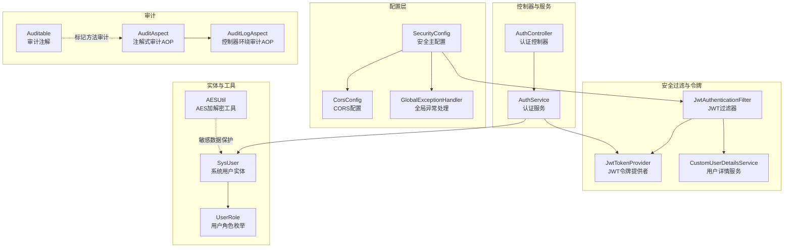
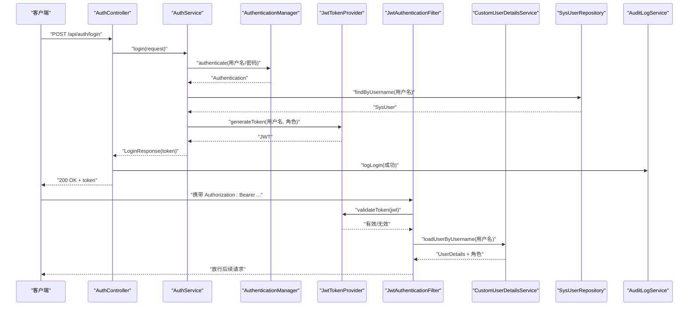
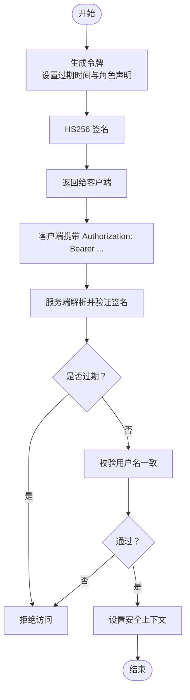
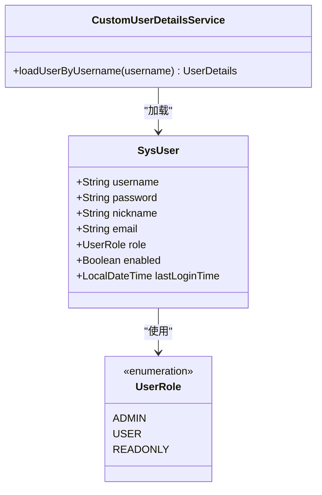
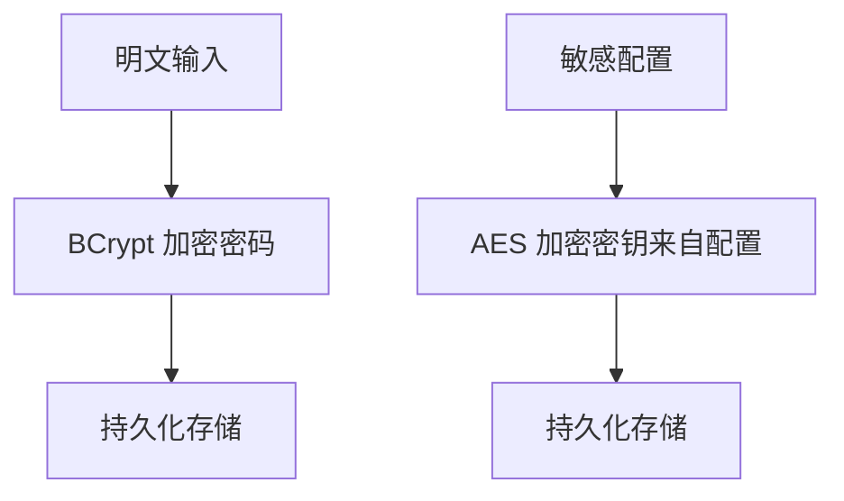
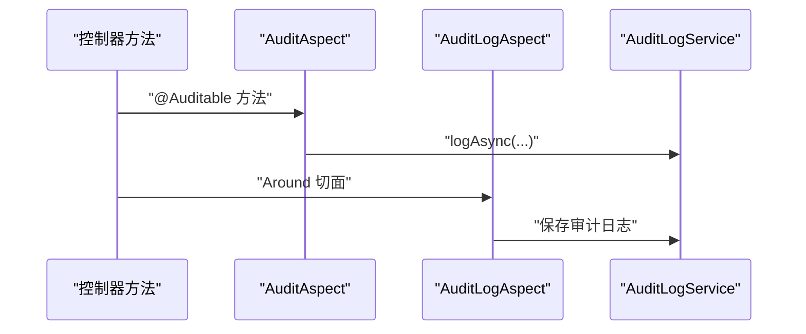
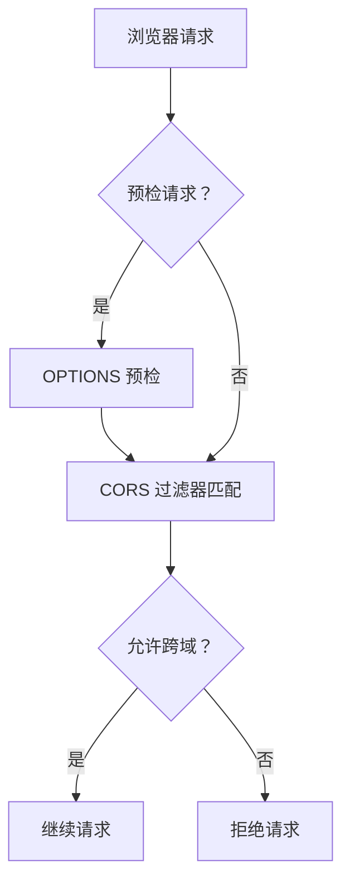
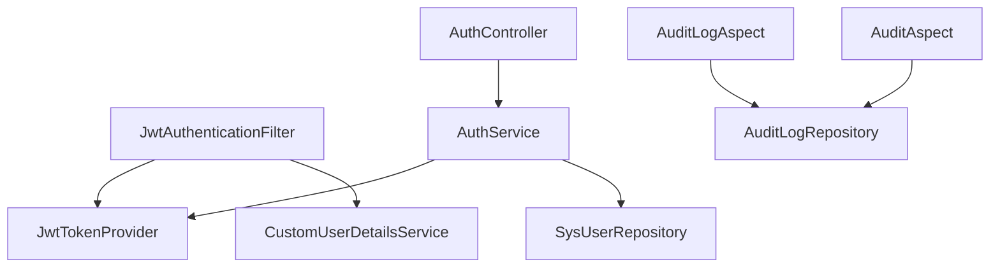

# 安全架构设计

<cite>
**本文档引用的文件**
- [SecurityConfig.java](file://backend/src/main/java/com/fieldcheck/config/SecurityConfig.java)
- [JwtTokenProvider.java](file://backend/src/main/java/com/fieldcheck/security/JwtTokenProvider.java)
- [JwtAuthenticationFilter.java](file://backend/src/main/java/com/fieldcheck/security/JwtAuthenticationFilter.java)
- [CustomUserDetailsService.java](file://backend/src/main/java/com/fieldcheck/security/CustomUserDetailsService.java)
- [CorsConfig.java](file://backend/src/main/java/com/fieldcheck/config/CorsConfig.java)
- [AuthController.java](file://backend/src/main/java/com/fieldcheck/controller/AuthController.java)
- [AuthService.java](file://backend/src/main/java/com/fieldcheck/service/AuthService.java)
- [SysUser.java](file://backend/src/main/java/com/fieldcheck/entity/SysUser.java)
- [UserRole.java](file://backend/src/main/java/com/fieldcheck/entity/UserRole.java)
- [AESUtil.java](file://backend/src/main/java/com/fieldcheck/util/AESUtil.java)
- [AuditAspect.java](file://backend/src/main/java/com/fieldcheck/aspect/AuditAspect.java)
- [AuditLogAspect.java](file://backend/src/main/java/com/fieldcheck/aspect/AuditLogAspect.java)
- [Auditable.java](file://backend/src/main/java/com/fieldcheck/aspect/Auditable.java)
- [application.yml](file://backend/src/main/resources/application.yml)
- [GlobalExceptionHandler.java](file://backend/src/main/java/com/fieldcheck/config/GlobalExceptionHandler.java)
</cite>

## 目录
1. [引言](#引言)
2. [项目结构](#项目结构)
3. [核心组件](#核心组件)
4. [架构总览](#架构总览)
5. [详细组件分析](#详细组件分析)
6. [依赖关系分析](#依赖关系分析)
7. [性能考虑](#性能考虑)
8. [故障排除指南](#故障排除指南)
9. [结论](#结论)
10. [附录](#附录)

## 引言
本文件面向系统安全架构设计，围绕身份认证、授权控制、数据加密与审计日志等核心安全机制进行深入解析。重点阐述基于 JWT 的令牌认证工作原理与安全策略（生成、验证、过期处理），RBAC 权限模型与角色粒度设计，密码加密与敏感数据保护，审计日志记录与合规要求，并提供安全架构图与威胁模型分析，以及跨域资源共享（CORS）与网络安全策略建议。

## 项目结构
后端采用 Spring Boot + Spring Security 架构，安全相关模块分布于以下包：
- 配置层：SecurityConfig、CorsConfig、GlobalExceptionHandler
- 安全过滤与令牌：JwtAuthenticationFilter、JwtTokenProvider、CustomUserDetailsService
- 控制器与服务：AuthController、AuthService
- 实体与枚举：SysUser、UserRole
- 工具与审计：AESUtil、AuditAspect、AuditLogAspect、Auditable
- 配置文件：application.yml

**图表来源**
- [SecurityConfig.java](file://backend/src/main/java/com/fieldcheck/config/SecurityConfig.java#L23-L58)
- [CorsConfig.java](file://backend/src/main/java/com/fieldcheck/config/CorsConfig.java#L12-L28)
- [GlobalExceptionHandler.java](file://backend/src/main/java/com/fieldcheck/config/GlobalExceptionHandler.java#L17-L54)
- [JwtAuthenticationFilter.java](file://backend/src/main/java/com/fieldcheck/security/JwtAuthenticationFilter.java#L22-L49)
- [JwtTokenProvider.java](file://backend/src/main/java/com/fieldcheck/security/JwtTokenProvider.java#L17-L94)
- [CustomUserDetailsService.java](file://backend/src/main/java/com/fieldcheck/security/CustomUserDetailsService.java#L17-L36)
- [AuthController.java](file://backend/src/main/java/com/fieldcheck/controller/AuthController.java#L20-L55)
- [AuthService.java](file://backend/src/main/java/com/fieldcheck/service/AuthService.java#L23-L79)
- [SysUser.java](file://backend/src/main/java/com/fieldcheck/entity/SysUser.java#L19-L43)
- [UserRole.java](file://backend/src/main/java/com/fieldcheck/entity/UserRole.java#L3-L7)
- [AESUtil.java](file://backend/src/main/java/com/fieldcheck/util/AESUtil.java#L10-L53)
- [AuditAspect.java](file://backend/src/main/java/com/fieldcheck/aspect/AuditAspect.java#L25-L66)
- [AuditLogAspect.java](file://backend/src/main/java/com/fieldcheck/aspect/AuditLogAspect.java#L28-L115)
- [Auditable.java](file://backend/src/main/java/com/fieldcheck/aspect/Auditable.java#L12-L38)

**章节来源**
- [SecurityConfig.java](file://backend/src/main/java/com/fieldcheck/config/SecurityConfig.java#L23-L58)
- [CorsConfig.java](file://backend/src/main/java/com/fieldcheck/config/CorsConfig.java#L12-L28)
- [application.yml](file://backend/src/main/resources/application.yml#L55-L62)

## 核心组件
- 身份认证与会话策略：Spring Security 配置禁用 CSRF 和会话，采用无状态 JWT 认证。
- JWT 令牌：生成、签名、解析与过期校验；支持角色声明。
- 用户详情服务：加载用户并映射角色为权限。
- CORS：允许凭据、通配符来源与常用方法头。
- 全局异常处理：统一返回 401/403/400/500 错误码。
- 审计日志：注解式与环绕式双轨审计，覆盖登录登出与业务操作。
- 数据加密：AES 对称加密用于敏感数据保护（如数据库连接密码）。

**章节来源**
- [SecurityConfig.java](file://backend/src/main/java/com/fieldcheck/config/SecurityConfig.java#L44-L58)
- [JwtTokenProvider.java](file://backend/src/main/java/com/fieldcheck/security/JwtTokenProvider.java#L17-L94)
- [CustomUserDetailsService.java](file://backend/src/main/java/com/fieldcheck/security/CustomUserDetailsService.java#L17-L36)
- [CorsConfig.java](file://backend/src/main/java/com/fieldcheck/config/CorsConfig.java#L12-L28)
- [GlobalExceptionHandler.java](file://backend/src/main/java/com/fieldcheck/config/GlobalExceptionHandler.java#L17-L54)
- [AuditLogAspect.java](file://backend/src/main/java/com/fieldcheck/aspect/AuditLogAspect.java#L28-L115)
- [AESUtil.java](file://backend/src/main/java/com/fieldcheck/util/AESUtil.java#L10-L53)

## 架构总览
下图展示从客户端到后端的安全交互流程，包括认证、授权、令牌验证与审计记录。

**图表来源**
- [AuthController.java](file://backend/src/main/java/com/fieldcheck/controller/AuthController.java#L25-L36)
- [AuthService.java](file://backend/src/main/java/com/fieldcheck/service/AuthService.java#L51-L73)
- [JwtTokenProvider.java](file://backend/src/main/java/com/fieldcheck/security/JwtTokenProvider.java#L32-L41)
- [JwtAuthenticationFilter.java](file://backend/src/main/java/com/fieldcheck/security/JwtAuthenticationFilter.java#L27-L49)
- [CustomUserDetailsService.java](file://backend/src/main/java/com/fieldcheck/security/CustomUserDetailsService.java#L21-L35)

## 详细组件分析

### JWT 令牌认证工作原理与安全策略
- 令牌生成：基于 HS256 签名算法，包含签发时间、过期时间与角色声明，密钥来自配置文件。
- 令牌验证：解析签名、检查过期与用户名一致性；异常时返回无效。
- 刷新机制：当前实现未提供专用刷新接口，建议在生产环境引入刷新令牌与黑名单策略。
- 传输安全：通过 HTTPS 传输，Authorization 头以 Bearer 方式携带。

**图表来源**
- [JwtTokenProvider.java](file://backend/src/main/java/com/fieldcheck/security/JwtTokenProvider.java#L32-L54)
- [JwtTokenProvider.java](file://backend/src/main/java/com/fieldcheck/security/JwtTokenProvider.java#L81-L93)
- [JwtAuthenticationFilter.java](file://backend/src/main/java/com/fieldcheck/security/JwtAuthenticationFilter.java#L30-L43)

**章节来源**
- [JwtTokenProvider.java](file://backend/src/main/java/com/fieldcheck/security/JwtTokenProvider.java#L17-L94)
- [application.yml](file://backend/src/main/resources/application.yml#L55-L58)

### 基于角色的访问控制（RBAC）实现与权限粒度设计
- 角色定义：ADMIN（管理员）、USER（普通用户）、READONLY（只读用户）。
- 权限映射：用户详情服务将角色转换为 ROLE_ 前缀的权限。
- 授权策略：SecurityConfig 中对 /api/auth/** 放行，其余 /api/** 需认证；方法级注解启用 prePostEnabled 支持细粒度控制（需配合 @PreAuthorize/@PostAuthorize 使用）。

**图表来源**
- [SysUser.java](file://backend/src/main/java/com/fieldcheck/entity/SysUser.java#L19-L43)
- [UserRole.java](file://backend/src/main/java/com/fieldcheck/entity/UserRole.java#L3-L7)
- [CustomUserDetailsService.java](file://backend/src/main/java/com/fieldcheck/security/CustomUserDetailsService.java#L17-L36)

**章节来源**
- [UserRole.java](file://backend/src/main/java/com/fieldcheck/entity/UserRole.java#L3-L7)
- [CustomUserDetailsService.java](file://backend/src/main/java/com/fieldcheck/security/CustomUserDetailsService.java#L21-L35)
- [SecurityConfig.java](file://backend/src/main/java/com/fieldcheck/config/SecurityConfig.java#L50-L55)

### 密码加密存储策略与敏感数据保护
- 密码加密：使用 BCryptPasswordEncoder 进行不可逆加密，注册与初始化均采用该策略。
- 敏感数据保护：AESUtil 提供对称加解密能力，可用于存储数据库连接密码等敏感信息；密钥来源于配置文件。

**图表来源**
- [SecurityConfig.java](file://backend/src/main/java/com/fieldcheck/config/SecurityConfig.java#L39-L42)
- [AuthService.java](file://backend/src/main/java/com/fieldcheck/service/AuthService.java#L30-L49)
- [AESUtil.java](file://backend/src/main/java/com/fieldcheck/util/AESUtil.java#L15-L45)
- [application.yml](file://backend/src/main/resources/application.yml#L60-L62)

**章节来源**
- [SecurityConfig.java](file://backend/src/main/java/com/fieldcheck/config/SecurityConfig.java#L39-L42)
- [AuthService.java](file://backend/src/main/java/com/fieldcheck/service/AuthService.java#L30-L49)
- [AESUtil.java](file://backend/src/main/java/com/fieldcheck/util/AESUtil.java#L10-L53)
- [application.yml](file://backend/src/main/resources/application.yml#L60-L62)

### 审计日志记录机制与合规性要求
- 注解式审计：@Auditable 标记方法，自动提取目标 ID/名称与描述，异步记录。
- 环绕式审计：对控制器方法进行 Around 切面，自动识别操作类型、目标类型、IP、UA、耗时与结果。
- 登录审计：AuthController 在登录成功/失败时记录审计日志。
- 合规要点：保留足够审计证据（操作人、时间、资源、结果、IP、UA），满足可追溯性与取证需求。

**图表来源**
- [AuditAspect.java](file://backend/src/main/java/com/fieldcheck/aspect/AuditAspect.java#L29-L66)
- [AuditLogAspect.java](file://backend/src/main/java/com/fieldcheck/aspect/AuditLogAspect.java#L33-L115)
- [AuthController.java](file://backend/src/main/java/com/fieldcheck/controller/AuthController.java#L25-L36)

**章节来源**
- [AuditAspect.java](file://backend/src/main/java/com/fieldcheck/aspect/AuditAspect.java#L25-L147)
- [AuditLogAspect.java](file://backend/src/main/java/com/fieldcheck/aspect/AuditLogAspect.java#L28-L241)
- [Auditable.java](file://backend/src/main/java/com/fieldcheck/aspect/Auditable.java#L12-L38)
- [AuthController.java](file://backend/src/main/java/com/fieldcheck/controller/AuthController.java#L25-L36)

### 跨域资源共享（CORS）配置与网络安全策略
- CORS 配置：允许凭据、通配来源与常用方法头，暴露 Authorization 与 Content-Disposition。
- 网络安全建议：生产环境应限制 AllowOrigin 为受信域名；启用 HTTPS、HSTS、CSP；对 /actuator/** 端点进行访问控制。

**图表来源**
- [CorsConfig.java](file://backend/src/main/java/com/fieldcheck/config/CorsConfig.java#L14-L27)

**章节来源**
- [CorsConfig.java](file://backend/src/main/java/com/fieldcheck/config/CorsConfig.java#L12-L28)

### 安全漏洞防护与应急响应机制
- 输入验证与异常处理：全局异常处理器统一返回 400/401/403/500，避免泄露内部细节。
- 认证失败与权限不足：分别返回相应状态码与提示信息。
- 应急响应建议：建立告警阈值（失败登录次数、异常响应码）、封禁策略、审计日志留存与备份、定期渗透测试与漏洞扫描。

**章节来源**
- [GlobalExceptionHandler.java](file://backend/src/main/java/com/fieldcheck/config/GlobalExceptionHandler.java#L17-L54)

## 依赖关系分析
- 组件耦合：JwtAuthenticationFilter 依赖 JwtTokenProvider 与 CustomUserDetailsService；AuthService 依赖 AuthenticationManager、JwtTokenProvider 与 SysUserRepository。
- 权限控制：SecurityConfig 作为入口，结合方法级注解实现细粒度授权。
- 审计覆盖：AuditAspect 与 AuditLogAspect 分别负责注解式与环绕式审计，确保关键操作可追溯。

**图表来源**
- [JwtAuthenticationFilter.java](file://backend/src/main/java/com/fieldcheck/security/JwtAuthenticationFilter.java#L22-L25)
- [JwtTokenProvider.java](file://backend/src/main/java/com/fieldcheck/security/JwtTokenProvider.java#L17-L30)
- [AuthService.java](file://backend/src/main/java/com/fieldcheck/service/AuthService.java#L25-L28)
- [AuthController.java](file://backend/src/main/java/com/fieldcheck/controller/AuthController.java#L22-L23)
- [AuditLogAspect.java](file://backend/src/main/java/com/fieldcheck/aspect/AuditLogAspect.java#L30-L31)
- [AuditAspect.java](file://backend/src/main/java/com/fieldcheck/aspect/AuditAspect.java#L27)

**章节来源**
- [JwtAuthenticationFilter.java](file://backend/src/main/java/com/fieldcheck/security/JwtAuthenticationFilter.java#L22-L25)
- [AuthService.java](file://backend/src/main/java/com/fieldcheck/service/AuthService.java#L25-L28)
- [AuditLogAspect.java](file://backend/src/main/java/com/fieldcheck/aspect/AuditLogAspect.java#L30-L31)

## 性能考虑
- 无状态认证：JWT 减少服务端会话存储开销，适合水平扩展。
- 密钥与算法：HS256 签名计算开销低；建议使用硬件安全模块（HSM）管理密钥。
- 审计异步化：AuditAspect 使用异步记录，避免阻塞主业务流程。
- 数据库连接池：合理配置连接池大小与超时，防止并发高峰下的连接争用。

## 故障排除指南
- 登录失败：检查用户名密码、账户状态与认证管理器配置；查看全局异常处理器返回的 401/400 信息。
- 权限不足：确认用户角色与权限映射，检查方法级授权注解是否正确配置。
- 令牌无效：核对密钥与过期时间配置，确认客户端 Authorization 头格式正确。
- 审计缺失：检查 AOP 切面是否生效、注解是否正确标注、异步线程池是否正常。

**章节来源**
- [GlobalExceptionHandler.java](file://backend/src/main/java/com/fieldcheck/config/GlobalExceptionHandler.java#L20-L53)
- [JwtTokenProvider.java](file://backend/src/main/java/com/fieldcheck/security/JwtTokenProvider.java#L81-L93)
- [AuditAspect.java](file://backend/src/main/java/com/fieldcheck/aspect/AuditAspect.java#L32-L48)

## 结论
本系统采用无状态 JWT 认证与 RBAC 权限模型，结合 BCrypt 密码加密与 AES 敏感数据保护，辅以注解式与环绕式双重审计机制，形成完整的安全防护体系。建议在生产环境中完善令牌刷新、CORS 白名单、端点访问控制与安全监控告警，持续提升系统安全性与合规性。

## 附录
- 配置要点：JWT 密钥长度与过期时间、AES 密钥、CORS 允许范围、日志级别与输出路径。
- 最佳实践：最小权限原则、零信任网络、多因素认证（MFA）、定期轮换密钥与补丁更新。

**章节来源**
- [application.yml](file://backend/src/main/resources/application.yml#L55-L75)