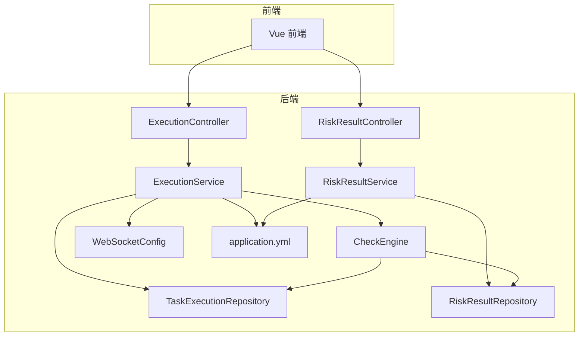
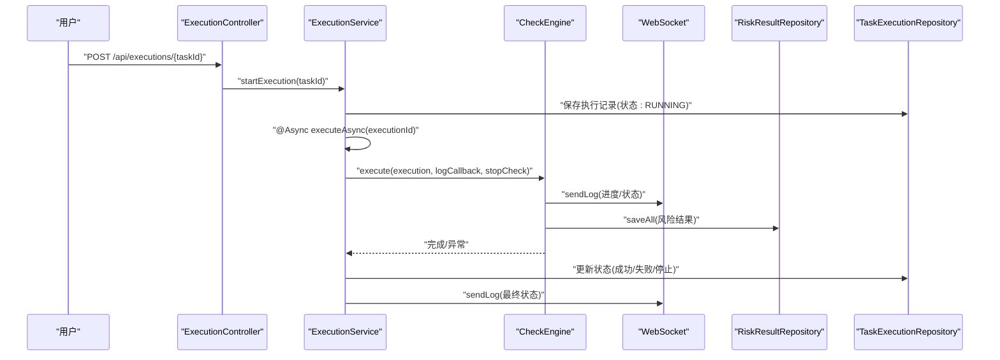
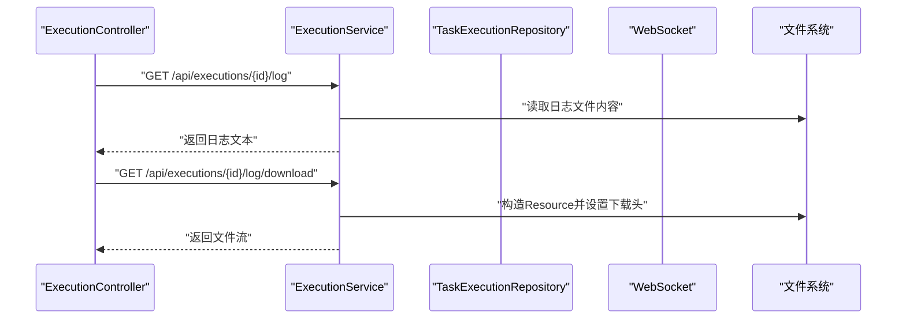
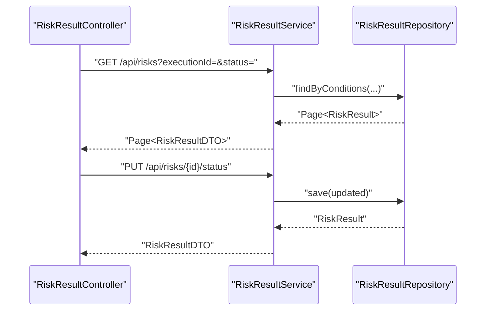
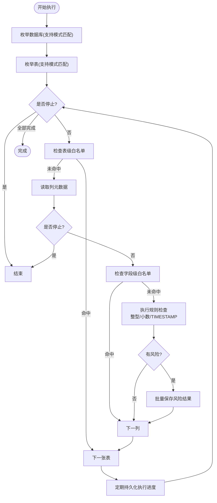
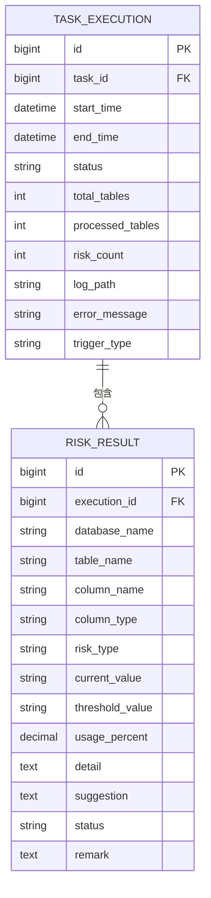
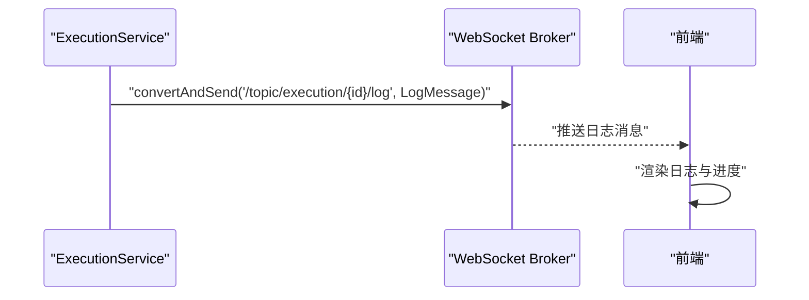
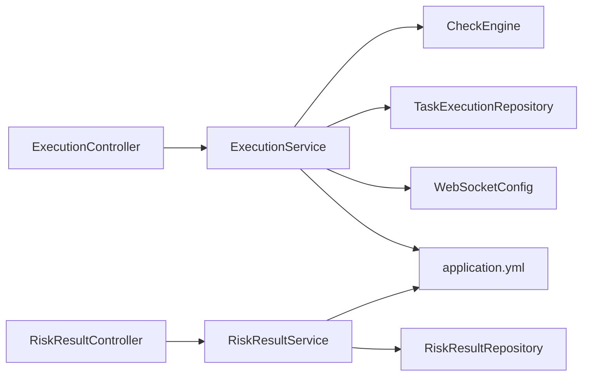

# 数据流设计

<cite>
**本文引用的文件**
- [backend/src/main/java/com/fieldcheck/engine/CheckEngine.java](file://backend/src/main/java/com/fieldcheck/engine/CheckEngine.java)
- [backend/src/main/java/com/fieldcheck/service/ExecutionService.java](file://backend/src/main/java/com/fieldcheck/service/ExecutionService.java)
- [backend/src/main/java/com/fieldcheck/service/RiskResultService.java](file://backend/src/main/java/com/fieldcheck/service/RiskResultService.java)
- [backend/src/main/java/com/fieldcheck/controller/ExecutionController.java](file://backend/src/main/java/com/fieldcheck/controller/ExecutionController.java)
- [backend/src/main/java/com/fieldcheck/controller/RiskResultController.java](file://backend/src/main/java/com/fieldcheck/controller/RiskResultController.java)
- [backend/src/main/java/com/fieldcheck/entity/TaskExecution.java](file://backend/src/main/java/com/fieldcheck/entity/TaskExecution.java)
- [backend/src/main/java/com/fieldcheck/entity/RiskResult.java](file://backend/src/main/java/com/fieldcheck/entity/RiskResult.java)
- [backend/src/main/java/com/fieldcheck/dto/ExecutionDTO.java](file://backend/src/main/java/com/fieldcheck/dto/ExecutionDTO.java)
- [backend/src/main/java/com/fieldcheck/dto/RiskResultDTO.java](file://backend/src/main/java/com/fieldcheck/dto/RiskResultDTO.java)
- [backend/src/main/java/com/fieldcheck/repository/TaskExecutionRepository.java](file://backend/src/main/java/com/fieldcheck/repository/TaskExecutionRepository.java)
- [backend/src/main/java/com/fieldcheck/repository/RiskResultRepository.java](file://backend/src/main/java/com/fieldcheck/repository/RiskResultRepository.java)
- [backend/src/main/java/com/fieldcheck/config/WebSocketConfig.java](file://backend/src/main/java/com/fieldcheck/config/WebSocketConfig.java)
- [backend/src/main/java/com/fieldcheck/util/AESUtil.java](file://backend/src/main/java/com/fieldcheck/util/AESUtil.java)
- [backend/src/main/resources/application.yml](file://backend/src/main/resources/application.yml)
</cite>

## 目录
1. [引言](#引言)
2. [项目结构](#项目结构)
3. [核心组件](#核心组件)
4. [架构总览](#架构总览)
5. [详细组件分析](#详细组件分析)
6. [依赖分析](#依赖分析)
7. [性能考量](#性能考量)
8. [故障排查指南](#故障排查指南)
9. [结论](#结论)
10. [附录](#附录)

## 引言
本文件面向系统数据流设计，聚焦于以下目标：
- 用户输入数据的处理流程：从任务触发到执行记录创建与日志推送。
- 风险检测数据的计算过程：整型溢出、Y2038、小数溢出等规则的扫描与阈值判断。
- 执行结果的数据传递与存储机制：风险结果入库、统计聚合与导出。
- 实时数据流与批处理数据流的区别与场景：通过WebSocket推送日志与进度，以及后台异步执行。
- 数据格式转换与序列化机制：DTO映射、JSON响应、Excel导出。
- 数据流图与时序图：关键数据节点的状态变化与交互。
- 缓存策略与性能优化：连接池、批量写入、采样与阈值控制。
- 一致性保证与事务策略：数据库事务模板与乐观更新。
- 数据安全与隐私保护：密码加密与传输安全。

## 项目结构
后端采用Spring Boot分层架构：
- 控制器层：接收HTTP请求，返回统一响应包装。
- 服务层：编排业务流程，协调引擎与仓库。
- 引擎层：执行具体的风险检测算法与SQL扫描。
- 仓储层：JPA访问数据库，提供查询与聚合接口。
- 配置层：WebSocket消息代理、安全、异步线程池、JPA/HikariCP等。
- 实体与DTO：定义持久化模型与对外传输对象。
- 工具类：AES加解密用于数据库连接密码。

图表来源
- [backend/src/main/java/com/fieldcheck/controller/ExecutionController.java](file://backend/src/main/java/com/fieldcheck/controller/ExecutionController.java#L20-L79)
- [backend/src/main/java/com/fieldcheck/controller/RiskResultController.java](file://backend/src/main/java/com/fieldcheck/controller/RiskResultController.java#L31-L146)
- [backend/src/main/java/com/fieldcheck/service/ExecutionService.java](file://backend/src/main/java/com/fieldcheck/service/ExecutionService.java#L34-L307)
- [backend/src/main/java/com/fieldcheck/service/RiskResultService.java](file://backend/src/main/java/com/fieldcheck/service/RiskResultService.java#L21-L124)
- [backend/src/main/java/com/fieldcheck/engine/CheckEngine.java](file://backend/src/main/java/com/fieldcheck/engine/CheckEngine.java#L26-L454)
- [backend/src/main/java/com/fieldcheck/config/WebSocketConfig.java](file://backend/src/main/java/com/fieldcheck/config/WebSocketConfig.java#L9-L26)
- [backend/src/main/resources/application.yml](file://backend/src/main/resources/application.yml#L1-L75)

章节来源
- [backend/src/main/java/com/fieldcheck/controller/ExecutionController.java](file://backend/src/main/java/com/fieldcheck/controller/ExecutionController.java#L20-L79)
- [backend/src/main/java/com/fieldcheck/controller/RiskResultController.java](file://backend/src/main/java/com/fieldcheck/controller/RiskResultController.java#L31-L146)
- [backend/src/main/java/com/fieldcheck/service/ExecutionService.java](file://backend/src/main/java/com/fieldcheck/service/ExecutionService.java#L34-L307)
- [backend/src/main/java/com/fieldcheck/service/RiskResultService.java](file://backend/src/main/java/com/fieldcheck/service/RiskResultService.java#L21-L124)
- [backend/src/main/java/com/fieldcheck/engine/CheckEngine.java](file://backend/src/main/java/com/fieldcheck/engine/CheckEngine.java#L26-L454)
- [backend/src/main/java/com/fieldcheck/config/WebSocketConfig.java](file://backend/src/main/java/com/fieldcheck/config/WebSocketConfig.java#L9-L26)
- [backend/src/main/resources/application.yml](file://backend/src/main/resources/application.yml#L1-L75)

## 核心组件
- 执行控制器与服务：负责执行记录的创建、进度与日志的实时推送、停止与告警。
- 风险结果控制器与服务：负责风险结果的查询、状态更新、统计与导出。
- 检查引擎：扫描数据库信息架构，按规则计算风险并落库。
- 仓储层：提供条件查询、聚合统计与趋势分析。
- WebSocket配置：启用STOMP消息代理，向客户端推送日志与进度。
- 应用配置：数据源、连接池、JPA、Quartz、JWT、AES密钥等。

章节来源
- [backend/src/main/java/com/fieldcheck/service/ExecutionService.java](file://backend/src/main/java/com/fieldcheck/service/ExecutionService.java#L34-L307)
- [backend/src/main/java/com/fieldcheck/service/RiskResultService.java](file://backend/src/main/java/com/fieldcheck/service/RiskResultService.java#L21-L124)
- [backend/src/main/java/com/fieldcheck/engine/CheckEngine.java](file://backend/src/main/java/com/fieldcheck/engine/CheckEngine.java#L26-L454)
- [backend/src/main/java/com/fieldcheck/config/WebSocketConfig.java](file://backend/src/main/java/com/fieldcheck/config/WebSocketConfig.java#L9-L26)
- [backend/src/main/resources/application.yml](file://backend/src/main/resources/application.yml#L1-L75)

## 架构总览
系统采用“请求-异步执行-实时推送-持久化”的数据流模式：
- 请求入口：REST API接收任务启动、查询与导出请求。
- 异步执行：服务层创建执行记录并开启异步任务，避免阻塞请求线程。
- 实时推送：引擎执行过程中通过回调将日志与进度推送到WebSocket主题。
- 结果落库：风险结果与执行进度写入数据库，支持分页与聚合查询。
- 安全与配置：JWT鉴权、AES加密、连接池参数、Quartz调度等。

图表来源
- [backend/src/main/java/com/fieldcheck/controller/ExecutionController.java](file://backend/src/main/java/com/fieldcheck/controller/ExecutionController.java#L20-L79)
- [backend/src/main/java/com/fieldcheck/service/ExecutionService.java](file://backend/src/main/java/com/fieldcheck/service/ExecutionService.java#L107-L210)
- [backend/src/main/java/com/fieldcheck/engine/CheckEngine.java](file://backend/src/main/java/com/fieldcheck/engine/CheckEngine.java#L57-L139)
- [backend/src/main/java/com/fieldcheck/repository/RiskResultRepository.java](file://backend/src/main/java/com/fieldcheck/repository/RiskResultRepository.java#L16-L70)
- [backend/src/main/java/com/fieldcheck/repository/TaskExecutionRepository.java](file://backend/src/main/java/com/fieldcheck/repository/TaskExecutionRepository.java#L16-L41)

## 详细组件分析

### 执行服务与控制器（实时数据流）
- 启动流程：创建执行记录并立即置为运行态；通过自调用开启异步执行，避免代理失效。
- 进度与日志：引擎回调统一通过服务层发送日志消息至WebSocket主题，同时写入本地文件；前端订阅对应主题实时显示。
- 停止流程：基于内存标记位与数据库状态双重控制，确保幂等与一致性。
- 统计与导出：控制器提供日志下载与风险结果导出接口。

图表来源
- [backend/src/main/java/com/fieldcheck/controller/ExecutionController.java](file://backend/src/main/java/com/fieldcheck/controller/ExecutionController.java#L52-L77)
- [backend/src/main/java/com/fieldcheck/service/ExecutionService.java](file://backend/src/main/java/com/fieldcheck/service/ExecutionService.java#L270-L282)

章节来源
- [backend/src/main/java/com/fieldcheck/controller/ExecutionController.java](file://backend/src/main/java/com/fieldcheck/controller/ExecutionController.java#L20-L79)
- [backend/src/main/java/com/fieldcheck/service/ExecutionService.java](file://backend/src/main/java/com/fieldcheck/service/ExecutionService.java#L107-L210)

### 风险结果服务与控制器（批处理数据流）
- 查询与过滤：支持按执行记录、数据库、表名、风险类型、状态进行分页查询。
- 状态更新：管理员可更新风险状态与备注，驱动后续告警与报表。
- 统计与导出：提供风险分布、趋势与全量导出为Excel，便于离线分析。

图表来源
- [backend/src/main/java/com/fieldcheck/controller/RiskResultController.java](file://backend/src/main/java/com/fieldcheck/controller/RiskResultController.java#L38-L78)
- [backend/src/main/java/com/fieldcheck/service/RiskResultService.java](file://backend/src/main/java/com/fieldcheck/service/RiskResultService.java#L27-L50)
- [backend/src/main/java/com/fieldcheck/repository/RiskResultRepository.java](file://backend/src/main/java/com/fieldcheck/repository/RiskResultRepository.java#L27-L50)

章节来源
- [backend/src/main/java/com/fieldcheck/controller/RiskResultController.java](file://backend/src/main/java/com/fieldcheck/controller/RiskResultController.java#L31-L146)
- [backend/src/main/java/com/fieldcheck/service/RiskResultService.java](file://backend/src/main/java/com/fieldcheck/service/RiskResultService.java#L21-L124)
- [backend/src/main/java/com/fieldcheck/repository/RiskResultRepository.java](file://backend/src/main/java/com/fieldcheck/repository/RiskResultRepository.java#L16-L70)

### 检查引擎（风险检测与数据计算）
- 数据源准备：根据任务关联的数据库连接信息拼接JDBC URL，使用解密后的密码建立连接。
- 元数据扫描：从information_schema读取数据库、表、列元数据，支持通配符匹配。
- 规则计算：
  - 整型溢出：比较当前最大/最小值与类型上限，结合阈值百分比判定。
  - Y2038：对TIMESTAMP列取最大值，超过阈值年份即告警。
  - 小数溢出：基于精度与标度计算允许的最大绝对值，比较当前最大绝对值。
- 采样与阈值：大表默认采样，可配置全量扫描与样本大小。
- 进度与风险落库：每处理若干张表持久化一次执行进度，风险结果批量保存。

图表来源
- [backend/src/main/java/com/fieldcheck/engine/CheckEngine.java](file://backend/src/main/java/com/fieldcheck/engine/CheckEngine.java#L57-L139)
- [backend/src/main/java/com/fieldcheck/engine/CheckEngine.java](file://backend/src/main/java/com/fieldcheck/engine/CheckEngine.java#L216-L385)

章节来源
- [backend/src/main/java/com/fieldcheck/engine/CheckEngine.java](file://backend/src/main/java/com/fieldcheck/engine/CheckEngine.java#L26-L454)

### 数据模型与DTO映射
- 执行记录实体：包含任务关联、起止时间、状态、表总数/已处理数、风险数、日志路径、错误信息与触发类型。
- 风险结果实体：包含数据库/表/字段名、类型、风险类型、当前值/阈值、使用率、详情、建议、状态、备注。
- DTO映射：服务层将实体转换为对外传输对象，统一字段与格式。

图表来源
- [backend/src/main/java/com/fieldcheck/entity/TaskExecution.java](file://backend/src/main/java/com/fieldcheck/entity/TaskExecution.java#L12-L58)
- [backend/src/main/java/com/fieldcheck/entity/RiskResult.java](file://backend/src/main/java/com/fieldcheck/entity/RiskResult.java#L12-L68)

章节来源
- [backend/src/main/java/com/fieldcheck/entity/TaskExecution.java](file://backend/src/main/java/com/fieldcheck/entity/TaskExecution.java#L12-L58)
- [backend/src/main/java/com/fieldcheck/entity/RiskResult.java](file://backend/src/main/java/com/fieldcheck/entity/RiskResult.java#L12-L68)
- [backend/src/main/java/com/fieldcheck/dto/ExecutionDTO.java](file://backend/src/main/java/com/fieldcheck/dto/ExecutionDTO.java#L11-L30)
- [backend/src/main/java/com/fieldcheck/dto/RiskResultDTO.java](file://backend/src/main/java/com/fieldcheck/dto/RiskResultDTO.java#L13-L35)

### WebSocket与实时推送
- 消息代理：启用简单代理与应用前缀，订阅/topic前缀的主题。
- 日志推送：服务层将日志按级别与内容封装为消息，推送到“/topic/execution/{id}/log”。
- 前端订阅：前端通过SockJS连接/ws，订阅对应主题以获得实时日志与进度。

图表来源
- [backend/src/main/java/com/fieldcheck/service/ExecutionService.java](file://backend/src/main/java/com/fieldcheck/service/ExecutionService.java#L237-L268)
- [backend/src/main/java/com/fieldcheck/config/WebSocketConfig.java](file://backend/src/main/java/com/fieldcheck/config/WebSocketConfig.java#L13-L24)

章节来源
- [backend/src/main/java/com/fieldcheck/service/ExecutionService.java](file://backend/src/main/java/com/fieldcheck/service/ExecutionService.java#L237-L268)
- [backend/src/main/java/com/fieldcheck/config/WebSocketConfig.java](file://backend/src/main/java/com/fieldcheck/config/WebSocketConfig.java#L9-L26)

### 数据格式转换与序列化
- JSON响应：统一的API响应包装，控制器返回分页DTO集合。
- DTO映射：服务层将实体映射为DTO，避免直接暴露实体细节。
- Excel导出：风险结果导出为XLSX，包含标题行与自动列宽。

章节来源
- [backend/src/main/java/com/fieldcheck/controller/ExecutionController.java](file://backend/src/main/java/com/fieldcheck/controller/ExecutionController.java#L27-L38)
- [backend/src/main/java/com/fieldcheck/controller/RiskResultController.java](file://backend/src/main/java/com/fieldcheck/controller/RiskResultController.java#L80-L144)
- [backend/src/main/java/com/fieldcheck/service/ExecutionService.java](file://backend/src/main/java/com/fieldcheck/service/ExecutionService.java#L284-L305)
- [backend/src/main/java/com/fieldcheck/service/RiskResultService.java](file://backend/src/main/java/com/fieldcheck/service/RiskResultService.java#L92-L111)

### 数据缓存策略与性能优化
- 连接池：HikariCP配置最大池大小、空闲超时、连接超时、最大生存时间等，提升并发与稳定性。
- 批量写入：执行进度与风险结果采用批量保存，减少数据库往返。
- 采样策略：大表默认采样，降低扫描成本；可配置全量扫描。
- 异步执行：使用@Async与线程池，避免阻塞请求线程。
- 索引优化：风险结果表针对执行记录、风险类型、状态建立索引，加速查询与统计。

章节来源
- [backend/src/main/resources/application.yml](file://backend/src/main/resources/application.yml#L13-L22)
- [backend/src/main/java/com/fieldcheck/engine/CheckEngine.java](file://backend/src/main/java/com/fieldcheck/engine/CheckEngine.java#L125-L131)
- [backend/src/main/java/com/fieldcheck/entity/RiskResult.java](file://backend/src/main/java/com/fieldcheck/entity/RiskResult.java#L17-L21)

### 一致性保证与事务策略
- 事务模板：执行进度保存使用TransactionTemplate，确保乐观更新与一致性。
- 乐观锁：实体继承基类，依赖JPA/Hibernate的版本控制（若启用）。
- 并发控制：内存Map维护运行中任务，避免重复执行；数据库查询清理异常运行态。

章节来源
- [backend/src/main/java/com/fieldcheck/engine/CheckEngine.java](file://backend/src/main/java/com/fieldcheck/engine/CheckEngine.java#L141-L153)
- [backend/src/main/java/com/fieldcheck/service/ExecutionService.java](file://backend/src/main/java/com/fieldcheck/service/ExecutionService.java#L111-L131)

### 数据安全与隐私保护
- 密码加密：数据库连接密码使用AES/CBC/PKCS5Padding加密存储，运行时解密使用。
- 传输安全：JWT用于鉴权，WebSocket通过SockJS提供跨域支持；生产环境建议启用TLS。
- 配置管理：敏感配置集中于application.yml，建议使用环境变量或密钥管理服务。

章节来源
- [backend/src/main/java/com/fieldcheck/util/AESUtil.java](file://backend/src/main/java/com/fieldcheck/util/AESUtil.java#L10-L54)
- [backend/src/main/resources/application.yml](file://backend/src/main/resources/application.yml#L55-L67)

## 依赖分析
- 控制器依赖服务：控制器仅依赖服务接口，保持薄层职责。
- 服务依赖引擎与仓库：服务编排业务逻辑，引擎专注规则计算，仓库专注数据访问。
- WebSocket依赖消息代理：服务层通过消息模板发布消息，前端订阅主题。
- 配置依赖外部系统：数据源、连接池、Quartz、邮件等由配置文件集中管理。

图表来源
- [backend/src/main/java/com/fieldcheck/controller/ExecutionController.java](file://backend/src/main/java/com/fieldcheck/controller/ExecutionController.java#L20-L79)
- [backend/src/main/java/com/fieldcheck/controller/RiskResultController.java](file://backend/src/main/java/com/fieldcheck/controller/RiskResultController.java#L31-L146)
- [backend/src/main/java/com/fieldcheck/service/ExecutionService.java](file://backend/src/main/java/com/fieldcheck/service/ExecutionService.java#L34-L67)
- [backend/src/main/java/com/fieldcheck/service/RiskResultService.java](file://backend/src/main/java/com/fieldcheck/service/RiskResultService.java#L21-L25)
- [backend/src/main/java/com/fieldcheck/config/WebSocketConfig.java](file://backend/src/main/java/com/fieldcheck/config/WebSocketConfig.java#L9-L26)
- [backend/src/main/resources/application.yml](file://backend/src/main/resources/application.yml#L1-L75)

章节来源
- [backend/src/main/java/com/fieldcheck/controller/ExecutionController.java](file://backend/src/main/java/com/fieldcheck/controller/ExecutionController.java#L20-L79)
- [backend/src/main/java/com/fieldcheck/controller/RiskResultController.java](file://backend/src/main/java/com/fieldcheck/controller/RiskResultController.java#L31-L146)
- [backend/src/main/java/com/fieldcheck/service/ExecutionService.java](file://backend/src/main/java/com/fieldcheck/service/ExecutionService.java#L34-L67)
- [backend/src/main/java/com/fieldcheck/service/RiskResultService.java](file://backend/src/main/java/com/fieldcheck/service/RiskResultService.java#L21-L25)
- [backend/src/main/java/com/fieldcheck/config/WebSocketConfig.java](file://backend/src/main/java/com/fieldcheck/config/WebSocketConfig.java#L9-L26)
- [backend/src/main/resources/application.yml](file://backend/src/main/resources/application.yml#L1-L75)

## 性能考量
- 连接池参数：合理设置最大池大小与空闲超时，避免连接争用与泄露。
- 扫描策略：大表默认采样，降低I/O与CPU开销；必要时开启全量扫描。
- 写入优化：批量保存风险结果与进度，减少事务提交次数。
- 查询优化：利用索引与分页，避免全表扫描；复杂统计通过原生查询实现。
- 异步执行：将耗时操作移至后台线程，提升响应速度。

## 故障排查指南
- 执行失败：查看执行记录的错误信息与日志文件，定位SQL异常或权限问题。
- 日志不显示：确认WebSocket连接正常，前端已订阅对应主题；检查消息代理配置。
- 风险结果缺失：核对白名单配置与规则阈值；检查采样比例与全量扫描开关。
- 导出异常：确认Excel依赖可用，导出接口返回的文件名编码正确。

章节来源
- [backend/src/main/java/com/fieldcheck/service/ExecutionService.java](file://backend/src/main/java/com/fieldcheck/service/ExecutionService.java#L183-L210)
- [backend/src/main/java/com/fieldcheck/service/ExecutionService.java](file://backend/src/main/java/com/fieldcheck/service/ExecutionService.java#L270-L282)
- [backend/src/main/java/com/fieldcheck/controller/RiskResultController.java](file://backend/src/main/java/com/fieldcheck/controller/RiskResultController.java#L141-L144)

## 结论
本系统通过清晰的分层与职责划分，实现了从任务触发到实时日志推送、再到风险结果持久化的完整数据流闭环。检查引擎以规则为中心，结合采样与阈值控制，兼顾准确性与性能；服务层通过异步与WebSocket实现高并发下的良好用户体验；仓储层提供灵活的查询与统计能力。配合连接池、批量写入与索引优化，系统在大数据量场景下具备良好的扩展性与稳定性。

## 附录
- 关键配置项参考：
  - 数据源与连接池：maximum-pool-size、minimum-idle、idle-timeout、connection-timeout、max-lifetime。
  - Jackson日期格式与时区：date-format、time-zone。
  - JWT与AES密钥：jwt.secret、encryption.aes-key。
  - 日志路径与并发任务数：app.log-path、app.max-concurrent-tasks。

章节来源
- [backend/src/main/resources/application.yml](file://backend/src/main/resources/application.yml#L8-L67)