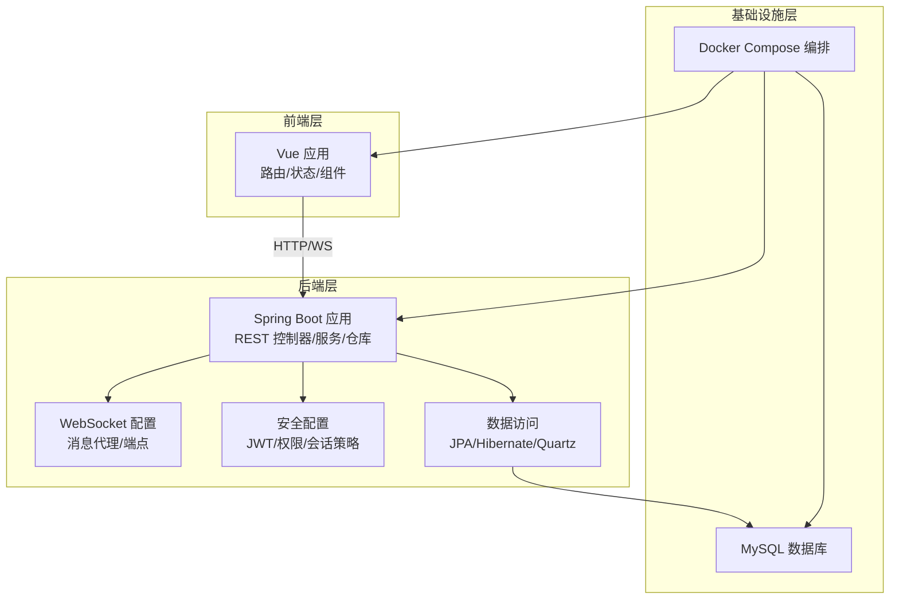
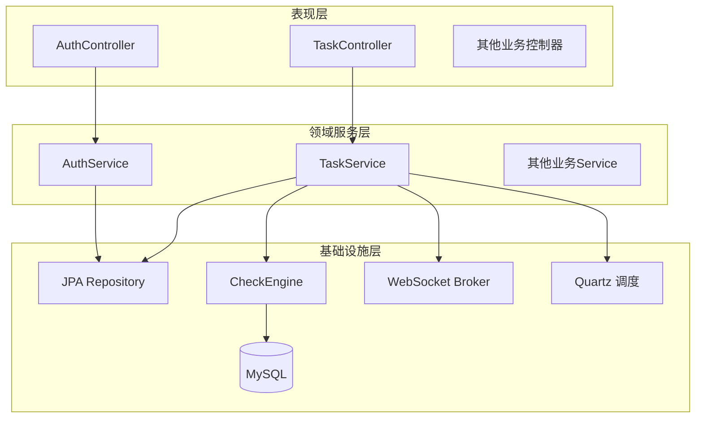
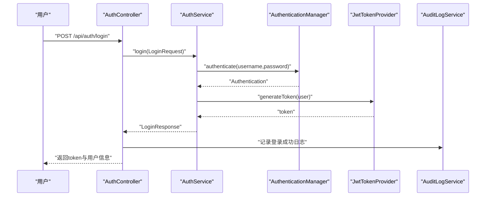
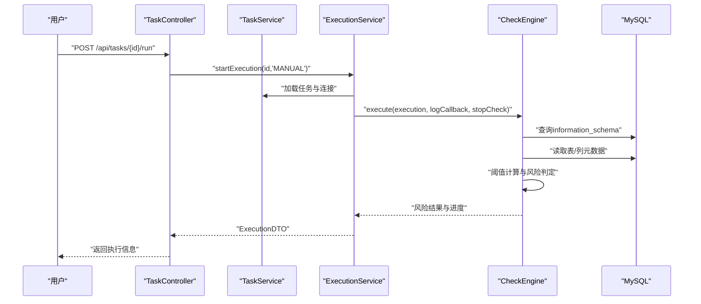
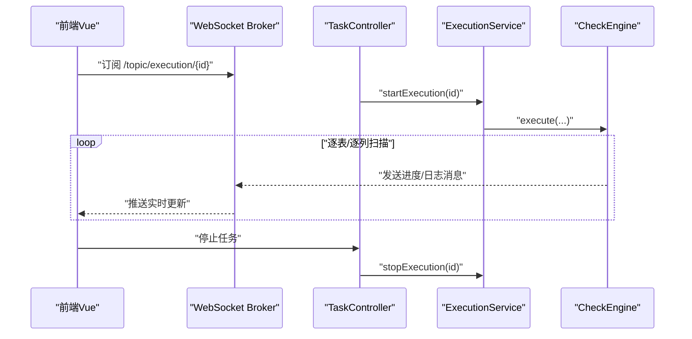
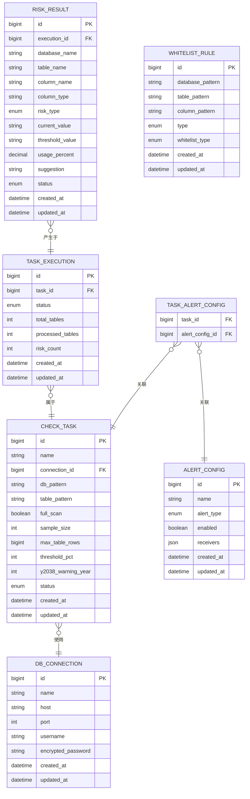
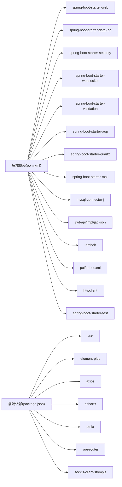

# 整体架构设计

<cite>
**本文引用的文件**
- [FieldCheckApplication.java](file://backend/src/main/java/com/fieldcheck/FieldCheckApplication.java)
- [pom.xml](file://backend/pom.xml)
- [application.yml](file://backend/src/main/resources/application.yml)
- [SecurityConfig.java](file://backend/src/main/java/com/fieldcheck/config/SecurityConfig.java)
- [WebSocketConfig.java](file://backend/src/main/java/com/fieldcheck/config/WebSocketConfig.java)
- [JpaConfig.java](file://backend/src/main/java/com/fieldcheck/config/JpaConfig.java)
- [CheckEngine.java](file://backend/src/main/java/com/fieldcheck/engine/CheckEngine.java)
- [AuthController.java](file://backend/src/main/java/com/fieldcheck/controller/AuthController.java)
- [AuthService.java](file://backend/src/main/java/com/fieldcheck/service/AuthService.java)
- [TaskController.java](file://backend/src/main/java/com/fieldcheck/controller/TaskController.java)
- [TaskService.java](file://backend/src/main/java/com/fieldcheck/service/TaskService.java)
- [main.ts](file://frontend/src/main.ts)
- [package.json](file://frontend/package.json)
- [index.ts](file://frontend/src/router/index.ts)
- [docker-compose.yml](file://docker-compose.yml)
</cite>

## 目录
1. [引言](#引言)
2. [项目结构](#项目结构)
3. [核心组件](#核心组件)
4. [架构总览](#架构总览)
5. [详细组件分析](#详细组件分析)
6. [依赖分析](#依赖分析)
7. [性能考虑](#性能考虑)
8. [故障排查指南](#故障排查指南)
9. [结论](#结论)
10. [附录](#附录)

## 引言
本项目是一个MySQL风险字段检查平台，旨在对数据库中的整型溢出、Y2038问题以及小数精度溢出等风险进行自动化扫描与评估。系统采用前后端分离架构，后端基于Spring Boot（Java 8），前端基于Vue 3 + TypeScript，通过REST API与WebSocket实现交互；同时结合JPA/Hibernate、Quartz调度、JWT鉴权与统一异常处理等技术栈，形成一套可扩展、可观测且具备告警能力的完整解决方案。

## 项目结构
系统由三层构成：前端（Vue 3）、后端（Spring Boot）、数据库（MySQL）。容器编排通过Docker Compose实现，包含MySQL、后端应用与前端Nginx镜像，三者在同一桥接网络内通信。

图表来源
- [docker-compose.yml](file://docker-compose.yml#L1-L91)
- [main.ts](file://frontend/src/main.ts#L1-L23)
- [SecurityConfig.java](file://backend/src/main/java/com/fieldcheck/config/SecurityConfig.java#L1-L60)
- [WebSocketConfig.java](file://backend/src/main/java/com/fieldcheck/config/WebSocketConfig.java#L1-L26)
- [JpaConfig.java](file://backend/src/main/java/com/fieldcheck/config/JpaConfig.java#L1-L10)
- [application.yml](file://backend/src/main/resources/application.yml#L1-L75)

章节来源
- [docker-compose.yml](file://docker-compose.yml#L1-L91)
- [main.ts](file://frontend/src/main.ts#L1-L23)
- [SecurityConfig.java](file://backend/src/main/java/com/fieldcheck/config/SecurityConfig.java#L1-L60)
- [WebSocketConfig.java](file://backend/src/main/java/com/fieldcheck/config/WebSocketConfig.java#L1-L26)
- [JpaConfig.java](file://backend/src/main/java/com/fieldcheck/config/JpaConfig.java#L1-L10)
- [application.yml](file://backend/src/main/resources/application.yml#L1-L75)

## 核心组件
- 后端入口与启动
  - Spring Boot应用入口启用异步与定时任务，作为整个后端服务的启动器。
- 安全与鉴权
  - 基于JWT的无状态认证，禁用会话，开放特定路径（认证、WebSocket、健康检查）。
- 数据访问与持久化
  - JPA/Hibernate负责实体映射与SQL执行；Quartz用于任务调度；HikariCP连接池优化数据库连接。
- 业务引擎
  - 检查引擎负责扫描数据库、解析列元数据、计算阈值与风险并生成结果。
- 前端应用
  - Vue 3 + TypeScript + Element Plus + Pinia + Vue Router，提供仪表盘、任务管理、风险列表、白名单、告警与系统管理等功能页面。

章节来源
- [FieldCheckApplication.java](file://backend/src/main/java/com/fieldcheck/FieldCheckApplication.java#L1-L17)
- [SecurityConfig.java](file://backend/src/main/java/com/fieldcheck/config/SecurityConfig.java#L1-L60)
- [application.yml](file://backend/src/main/resources/application.yml#L1-L75)
- [CheckEngine.java](file://backend/src/main/java/com/fieldcheck/engine/CheckEngine.java#L1-L454)
- [main.ts](file://frontend/src/main.ts#L1-L23)

## 架构总览
系统采用“前后端分离 + MVC分层 + 事件驱动”的混合架构模式：
- 前后端分离：前端通过REST接口与WebSocket与后端交互，实现状态同步与实时通知。
- MVC分层：后端按控制器（Controller）-服务（Service）-仓库（Repository）分层，职责清晰。
- 事件驱动：结合WebSocket与定时任务（Quartz），实现任务执行进度推送与周期性检查。

图表来源
- [AuthController.java](file://backend/src/main/java/com/fieldcheck/controller/AuthController.java#L1-L56)
- [TaskController.java](file://backend/src/main/java/com/fieldcheck/controller/TaskController.java#L1-L99)
- [AuthService.java](file://backend/src/main/java/com/fieldcheck/service/AuthService.java#L1-L80)
- [TaskService.java](file://backend/src/main/java/com/fieldcheck/service/TaskService.java#L1-L177)
- [CheckEngine.java](file://backend/src/main/java/com/fieldcheck/engine/CheckEngine.java#L1-L454)
- [WebSocketConfig.java](file://backend/src/main/java/com/fieldcheck/config/WebSocketConfig.java#L1-L26)
- [application.yml](file://backend/src/main/resources/application.yml#L33-L37)

## 详细组件分析

### 后端启动与配置
- 启动类启用异步与定时任务注解，确保任务调度与并发处理能力。
- 应用配置涵盖数据源、JPA方言、Quartz JDBC存储、邮件配置、Jackson时区与日期格式、JWT密钥与加密密钥、日志路径与并发任务上限等。

章节来源
- [FieldCheckApplication.java](file://backend/src/main/java/com/fieldcheck/FieldCheckApplication.java#L1-L17)
- [application.yml](file://backend/src/main/resources/application.yml#L1-L75)

### 安全与鉴权
- 使用BCrypt密码编码器与JWT令牌生成，登录成功后返回Bearer Token。
- Web安全配置禁用CSRF与Session，开启跨域与WebSocket路径放行，基于注解控制接口访问权限。

图表来源
- [AuthController.java](file://backend/src/main/java/com/fieldcheck/controller/AuthController.java#L1-L56)
- [AuthService.java](file://backend/src/main/java/com/fieldcheck/service/AuthService.java#L1-L80)
- [SecurityConfig.java](file://backend/src/main/java/com/fieldcheck/config/SecurityConfig.java#L1-L60)

章节来源
- [AuthController.java](file://backend/src/main/java/com/fieldcheck/controller/AuthController.java#L1-L56)
- [AuthService.java](file://backend/src/main/java/com/fieldcheck/service/AuthService.java#L1-L80)
- [SecurityConfig.java](file://backend/src/main/java/com/fieldcheck/config/SecurityConfig.java#L1-L60)

### 任务管理与执行流程
- 任务控制器提供任务的增删改查、手动运行与停止、执行历史查询等接口。
- 任务服务负责任务创建、更新、关联告警配置与校验执行状态，避免在执行中删除任务。
- 执行引擎根据任务配置扫描数据库，支持白名单过滤、采样与阈值判断，生成风险结果并持久化。

图表来源
- [TaskController.java](file://backend/src/main/java/com/fieldcheck/controller/TaskController.java#L1-L99)
- [TaskService.java](file://backend/src/main/java/com/fieldcheck/service/TaskService.java#L1-L177)
- [CheckEngine.java](file://backend/src/main/java/com/fieldcheck/engine/CheckEngine.java#L1-L454)

章节来源
- [TaskController.java](file://backend/src/main/java/com/fieldcheck/controller/TaskController.java#L1-L99)
- [TaskService.java](file://backend/src/main/java/com/fieldcheck/service/TaskService.java#L1-L177)
- [CheckEngine.java](file://backend/src/main/java/com/fieldcheck/engine/CheckEngine.java#L1-L454)

### 实时通信与进度推送
- WebSocket配置启用简单消息代理与SockJS回退，前端通过STOMP订阅主题以接收执行进度与日志。
- 后端在执行过程中通过回调函数向WebSocket发送实时日志，前端路由守卫保障鉴权与导航。

图表来源
- [WebSocketConfig.java](file://backend/src/main/java/com/fieldcheck/config/WebSocketConfig.java#L1-L26)
- [TaskController.java](file://backend/src/main/java/com/fieldcheck/controller/TaskController.java#L1-L99)
- [CheckEngine.java](file://backend/src/main/java/com/fieldcheck/engine/CheckEngine.java#L1-L454)
- [index.ts](file://frontend/src/router/index.ts#L1-L116)

章节来源
- [WebSocketConfig.java](file://backend/src/main/java/com/fieldcheck/config/WebSocketConfig.java#L1-L26)
- [index.ts](file://frontend/src/router/index.ts#L1-L116)

### 数据模型与实体关系
系统围绕任务、连接、执行、风险结果、白名单与告警配置等实体展开，采用JPA Auditing自动维护创建/更新时间。

图表来源
- [TaskService.java](file://backend/src/main/java/com/fieldcheck/service/TaskService.java#L1-L177)
- [CheckEngine.java](file://backend/src/main/java/com/fieldcheck/engine/CheckEngine.java#L1-L454)

章节来源
- [TaskService.java](file://backend/src/main/java/com/fieldcheck/service/TaskService.java#L1-L177)
- [CheckEngine.java](file://backend/src/main/java/com/fieldcheck/engine/CheckEngine.java#L1-L454)

### 技术选型与架构优势
- Spring Boot + Vue.js组合
  - 后端：快速开发、自动配置、完善的生态（安全、数据、消息、调度、邮件、测试）。
  - 前端：组件化开发、TypeScript类型安全、路由与状态管理完善。
- 分层与模块划分
  - 控制器层：暴露REST接口与WebSocket端点。
  - 服务层：封装业务规则与事务边界。
  - 仓库层：数据访问抽象。
  - 引擎层：核心算法与扫描逻辑。
- 事件驱动
  - WebSocket实现实时进度推送；Quartz实现周期性任务调度。
- 可观测性与安全性
  - 统一异常处理、审计日志、JWT无状态鉴权、跨域与会话策略配置。

章节来源
- [pom.xml](file://backend/pom.xml#L28-L142)
- [package.json](file://frontend/package.json#L11-L31)
- [SecurityConfig.java](file://backend/src/main/java/com/fieldcheck/config/SecurityConfig.java#L1-L60)
- [WebSocketConfig.java](file://backend/src/main/java/com/fieldcheck/config/WebSocketConfig.java#L1-L26)
- [application.yml](file://backend/src/main/resources/application.yml#L33-L37)

## 依赖分析
后端依赖涵盖Web、JPA、安全、WebSocket、验证、AOP、Quartz、邮件、POI、HTTP客户端与测试等；前端依赖Vue 3、Element Plus、Axios、ECharts、Pinia、Vue Router与SockJS/STOMP。

图表来源
- [pom.xml](file://backend/pom.xml#L28-L142)
- [package.json](file://frontend/package.json#L11-L31)

章节来源
- [pom.xml](file://backend/pom.xml#L28-L142)
- [package.json](file://frontend/package.json#L11-L31)

## 性能考虑
- 连接池与超时
  - HikariCP连接池参数（最大池大小、空闲超时、连接超时、最大生命周期、校验超时）保证连接复用与健康检查。
- 扫描策略
  - 大表采样与阈值百分比控制，降低全量扫描成本；进度批量保存减少写入压力。
- 并发与限流
  - 应用配置最大并发任务数，避免资源争用；WebSocket推送按需触发，避免频繁刷新。
- 存储与索引
  - information_schema查询配合模式匹配，建议在目标库建立必要索引以提升查询效率。
- 日志与报告
  - 日志路径与报告目录独立挂载，便于运维与审计。

章节来源
- [application.yml](file://backend/src/main/resources/application.yml#L13-L22)
- [CheckEngine.java](file://backend/src/main/java/com/fieldcheck/engine/CheckEngine.java#L274-L277)
- [CheckEngine.java](file://backend/src/main/java/com/fieldcheck/engine/CheckEngine.java#L125-L130)

## 故障排查指南
- 登录失败
  - 检查用户名密码是否正确，确认JWT密钥配置与BCrypt编码一致；查看审计日志定位失败原因。
- 任务执行中断
  - 确认任务未处于“运行中”状态；检查数据库连接信息与密码解密；查看执行进度与日志推送。
- WebSocket无法接收实时更新
  - 检查WebSocket端点与允许的来源；确认前端已正确订阅对应主题；查看后端日志是否存在异常。
- 数据库连接异常
  - 校验MySQL容器健康状态、网络连通性与凭据；检查HikariCP连接池参数与超时设置。
- 前端路由与鉴权
  - 确认登录状态与Token有效性；检查路由守卫逻辑与角色权限。

章节来源
- [AuthController.java](file://backend/src/main/java/com/fieldcheck/controller/AuthController.java#L25-L36)
- [TaskController.java](file://backend/src/main/java/com/fieldcheck/controller/TaskController.java#L74-L86)
- [WebSocketConfig.java](file://backend/src/main/java/com/fieldcheck/config/WebSocketConfig.java#L20-L24)
- [index.ts](file://frontend/src/router/index.ts#L102-L113)
- [docker-compose.yml](file://docker-compose.yml#L22-L26)

## 结论
该系统通过Spring Boot与Vue.js的成熟技术栈，构建了高可用、可扩展的MySQL风险字段检查平台。前后端分离与MVC分层确保了职责清晰与可维护性；结合JWT鉴权、WebSocket实时推送与Quartz调度，满足了生产环境对可观测性与自动化的需求。未来可在微服务拆分、缓存优化与分布式任务队列等方面进一步演进。

## 附录
- 部署与编排
  - 使用Docker Compose一键拉起MySQL、后端与前端Nginx，配置健康检查与环境变量。
- 开发与构建
  - 后端使用Maven构建，前端使用Vite与TypeScript；支持本地开发与产物构建。

章节来源
- [docker-compose.yml](file://docker-compose.yml#L1-L91)
- [pom.xml](file://backend/pom.xml#L144-L159)
- [package.json](file://frontend/package.json#L6-L10)