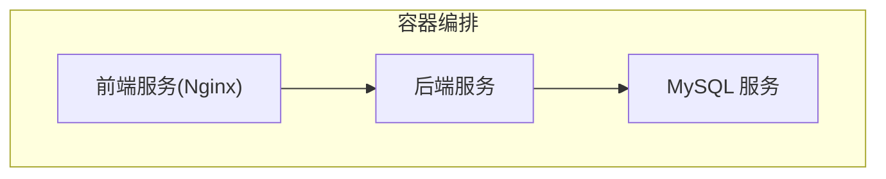
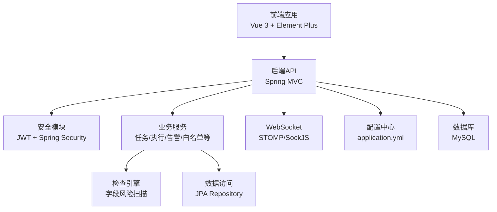
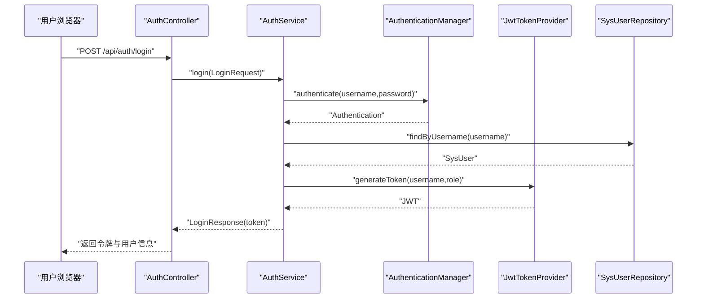
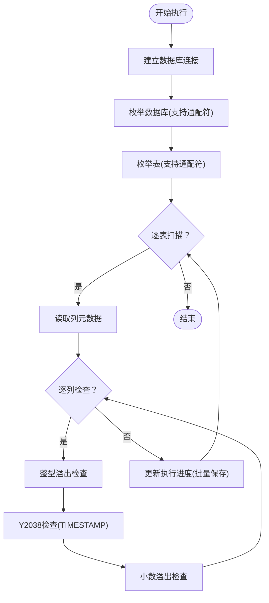
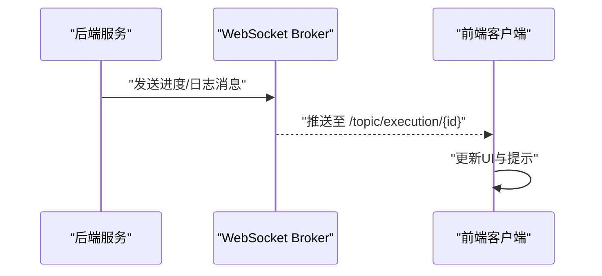
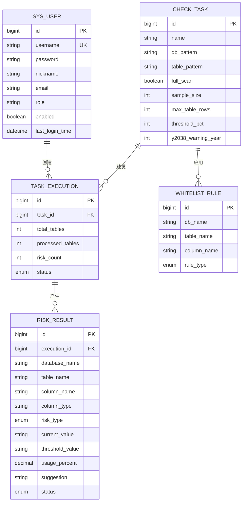
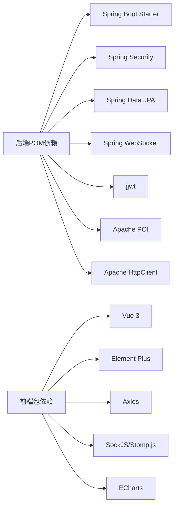

# 系统架构设计

<cite>
**本文档引用的文件**
- [FieldCheckApplication.java](file://backend/src/main/java/com/fieldcheck/FieldCheckApplication.java)
- [pom.xml](file://backend/pom.xml)
- [application.yml](file://backend/src/main/resources/application.yml)
- [docker-compose.yml](file://docker-compose.yml)
- [SecurityConfig.java](file://backend/src/main/java/com/fieldcheck/config/SecurityConfig.java)
- [WebSocketConfig.java](file://backend/src/main/java/com/fieldcheck/config/WebSocketConfig.java)
- [JwtAuthenticationFilter.java](file://backend/src/main/java/com/fieldcheck/security/JwtAuthenticationFilter.java)
- [CheckEngine.java](file://backend/src/main/java/com/fieldcheck/engine/CheckEngine.java)
- [AuthController.java](file://backend/src/main/java/com/fieldcheck/controller/AuthController.java)
- [AuthService.java](file://backend/src/main/java/com/fieldcheck/service/AuthService.java)
- [SysUser.java](file://backend/src/main/java/com/fieldcheck/entity/SysUser.java)
- [SysUserRepository.java](file://backend/src/main/java/com/fieldcheck/repository/SysUserRepository.java)
- [LoginRequest.java](file://backend/src/main/java/com/fieldcheck/dto/LoginRequest.java)
- [package.json](file://frontend/package.json)
</cite>

## 目录
1. [引言](#引言)
2. [项目结构](#项目结构)
3. [核心组件](#核心组件)
4. [架构总览](#架构总览)
5. [详细组件分析](#详细组件分析)
6. [依赖关系分析](#依赖关系分析)
7. [性能考虑](#性能考虑)
8. [故障排除指南](#故障排除指南)
9. [结论](#结论)
10. [附录](#附录)

## 引言
本文件面向MySQL风险字段检查平台，提供系统架构设计文档。该平台采用前后端分离架构，后端基于Spring Boot微服务化设计，前端基于Vue 3构建，并通过Docker Compose实现容器化部署。系统核心职责是扫描MySQL数据库中的字段容量与类型风险（如整型溢出、Y2038问题、小数溢出），并提供可视化管理界面与实时通知能力。

## 项目结构
系统由三个主要部分组成：
- 后端服务：Spring Boot应用，提供REST API、安全认证、任务调度、WebSocket推送、数据库访问等能力。
- 前端应用：Vue 3单页应用，负责用户界面展示、路由导航、状态管理与WebSocket消息订阅。
- 部署编排：Docker Compose统一编排MySQL、后端、前端（Nginx）三类服务，形成完整的运行环境。

图表来源
- [docker-compose.yml](file://docker-compose.yml#L1-L91)

章节来源
- [docker-compose.yml](file://docker-compose.yml#L1-L91)
- [FieldCheckApplication.java](file://backend/src/main/java/com/fieldcheck/FieldCheckApplication.java#L1-L17)
- [pom.xml](file://backend/pom.xml#L1-L161)
- [package.json](file://frontend/package.json#L1-L33)

## 核心组件
- 应用入口与启动
  - 后端通过Spring Boot启动类启用异步与定时任务能力，作为微服务的核心入口。
- 安全与认证
  - 基于Spring Security + JWT实现无状态认证；全局拦截器校验请求头中的Bearer Token。
- 业务引擎
  - 检查引擎负责连接目标数据库、枚举库表、逐列扫描并识别风险类型，支持白名单过滤与采样策略。
- 数据访问
  - 使用Spring Data JPA + Hibernate进行实体持久化与查询。
- 实时通信
  - WebSocket + STOMP用于向前端推送任务执行进度与结果。
- 配置中心
  - application.yml集中管理数据库连接、JPA、Quartz、邮件、日志等配置项。
- 前后端交互
  - 前端通过Axios调用后端REST接口，使用SockJS+STOMP订阅WebSocket主题。

章节来源
- [FieldCheckApplication.java](file://backend/src/main/java/com/fieldcheck/FieldCheckApplication.java#L1-L17)
- [SecurityConfig.java](file://backend/src/main/java/com/fieldcheck/config/SecurityConfig.java#L1-L60)
- [JwtAuthenticationFilter.java](file://backend/src/main/java/com/fieldcheck/security/JwtAuthenticationFilter.java#L1-L59)
- [CheckEngine.java](file://backend/src/main/java/com/fieldcheck/engine/CheckEngine.java#L1-L454)
- [application.yml](file://backend/src/main/resources/application.yml#L1-L75)
- [package.json](file://frontend/package.json#L1-L33)

## 架构总览
系统采用分层架构与MVC模式：
- 表现层（前端Vue）：路由、视图组件、状态管理、WebSocket订阅。
- 控制层（后端REST）：控制器接收请求，参数校验，调用服务层处理业务。
- 业务层（服务与引擎）：封装领域逻辑，协调数据访问与外部资源。
- 数据访问层（JPA/Hibernate）：实体映射与数据库操作。
- 基础设施层（WebSocket、Quartz、邮件、加密工具）：提供通用能力支撑。

图表来源
- [AuthController.java](file://backend/src/main/java/com/fieldcheck/controller/AuthController.java#L1-L56)
- [AuthService.java](file://backend/src/main/java/com/fieldcheck/service/AuthService.java#L1-L80)
- [CheckEngine.java](file://backend/src/main/java/com/fieldcheck/engine/CheckEngine.java#L1-L454)
- [application.yml](file://backend/src/main/resources/application.yml#L1-L75)
- [docker-compose.yml](file://docker-compose.yml#L1-L91)

## 详细组件分析

### 安全架构与认证流程
- 认证机制
  - 用户登录时，后端验证凭据并签发JWT令牌；后续请求在Authorization头中携带Bearer Token。
  - 过滤器链在每次请求进入前解析并校验Token，设置SecurityContext以供授权与方法级鉴权使用。
- 授权策略
  - 基于Ant路径匹配的URL放行规则，开放认证、WebSocket与监控端点；其余API均需认证。
- 密钥与加密
  - JWT密钥与AES加密密钥通过环境变量注入，避免硬编码在配置文件中。

图表来源
- [AuthController.java](file://backend/src/main/java/com/fieldcheck/controller/AuthController.java#L1-L56)
- [AuthService.java](file://backend/src/main/java/com/fieldcheck/service/AuthService.java#L1-L80)
- [SysUserRepository.java](file://backend/src/main/java/com/fieldcheck/repository/SysUserRepository.java#L1-L19)
- [LoginRequest.java](file://backend/src/main/java/com/fieldcheck/dto/LoginRequest.java#L1-L15)

章节来源
- [SecurityConfig.java](file://backend/src/main/java/com/fieldcheck/config/SecurityConfig.java#L1-L60)
- [JwtAuthenticationFilter.java](file://backend/src/main/java/com/fieldcheck/security/JwtAuthenticationFilter.java#L1-L59)
- [application.yml](file://backend/src/main/resources/application.yml#L55-L63)

### 字段风险检查引擎
- 扫描范围与策略
  - 支持按数据库/表名通配符筛选；对大表采用采样策略降低开销。
- 风险检测类型
  - 整型溢出：比较当前最大值与类型上限，计算使用率阈值。
  - Y2038问题：针对TIMESTAMP类型检查最大时间是否接近限制。
  - 小数溢出：根据精度与标度计算允许的最大绝对值并评估使用率。
- 结果存储与进度
  - 每处理若干张表批量保存执行进度，减少写入压力；风险结果入库并附带建议与状态。

图表来源
- [CheckEngine.java](file://backend/src/main/java/com/fieldcheck/engine/CheckEngine.java#L57-L139)

章节来源
- [CheckEngine.java](file://backend/src/main/java/com/fieldcheck/engine/CheckEngine.java#L1-L454)

### WebSocket实时推送
- 主题与端点
  - 后端注册/ws端点并启用SockJS，消息代理前缀为/app，广播主题为/topic。
- 使用场景
  - 任务执行过程中的日志与进度通过WebSocket推送到前端，提升用户体验。

图表来源
- [WebSocketConfig.java](file://backend/src/main/java/com/fieldcheck/config/WebSocketConfig.java#L1-L26)

章节来源
- [WebSocketConfig.java](file://backend/src/main/java/com/fieldcheck/config/WebSocketConfig.java#L1-L26)

### 数据模型与实体关系
- 关键实体
  - 用户：SysUser，包含用户名、密码、角色、启用状态与最近登录时间。
  - 其他实体涵盖任务、执行、风险结果、白名单规则、审计日志等（详见实体目录）。
- 关系说明
  - 用户与任务/执行存在一对多关系；风险结果与执行关联；白名单规则与任务关联。

图表来源
- [SysUser.java](file://backend/src/main/java/com/fieldcheck/entity/SysUser.java#L1-L44)
- [SysUserRepository.java](file://backend/src/main/java/com/fieldcheck/repository/SysUserRepository.java#L1-L19)
- [CheckEngine.java](file://backend/src/main/java/com/fieldcheck/engine/CheckEngine.java#L28-L32)

章节来源
- [SysUser.java](file://backend/src/main/java/com/fieldcheck/entity/SysUser.java#L1-L44)
- [SysUserRepository.java](file://backend/src/main/java/com/fieldcheck/repository/SysUserRepository.java#L1-L19)

## 依赖关系分析
- 技术栈与框架
  - 后端：Spring Boot、Spring MVC、Spring Security、Spring Data JPA、Spring WebSocket、Quartz、Apache HttpClient、POI、H2测试库等。
  - 前端：Vue 3、Element Plus、Pinia、Vue Router、SockJS、Stomp.js、ECharts等。
- 外部依赖
  - MySQL数据库、Nginx（前端静态服务）、JWT库、邮件服务（可选）。
- 组件耦合
  - 控制器仅依赖服务接口；服务层依赖仓库与工具；引擎独立性强，便于扩展与替换。

图表来源
- [pom.xml](file://backend/pom.xml#L28-L142)
- [package.json](file://frontend/package.json#L11-L31)

章节来源
- [pom.xml](file://backend/pom.xml#L1-L161)
- [package.json](file://frontend/package.json#L1-L33)

## 性能考虑
- 数据库连接池
  - HikariCP连接池参数已优化，包括最大池大小、空闲超时、连接超时与生命周期等，确保高并发下的稳定性。
- 查询与扫描策略
  - 对大表采用采样策略与阈值控制，避免全量扫描造成性能瓶颈。
- 写入优化
  - 执行进度批量保存，降低数据库写入频率。
- 并发与异步
  - 启用异步与调度能力，结合线程池与任务队列，提升吞吐量。
- 缓存与索引
  - 建议在高频查询的维度列上建立索引，减少information_schema查询成本。
- 前端渲染
  - 使用虚拟滚动与懒加载，减少大数据量列表的渲染压力。

章节来源
- [application.yml](file://backend/src/main/resources/application.yml#L13-L22)
- [CheckEngine.java](file://backend/src/main/java/com/fieldcheck/engine/CheckEngine.java#L274-L277)

## 故障排除指南
- 登录失败
  - 检查用户名/密码是否正确；确认用户已被启用；查看认证日志与异常堆栈。
- JWT无效
  - 确认请求头中Authorization格式为Bearer Token；核对JWT密钥与签名算法；检查Token是否过期。
- 数据库连接异常
  - 核对数据库地址、端口、账号与密码；确认网络连通性与防火墙策略；查看MySQL健康检查状态。
- WebSocket无法接收消息
  - 确认前端已正确订阅主题；检查后端WebSocket配置与端点暴露；查看浏览器控制台与后端日志。
- 执行任务卡住或进度不更新
  - 检查任务是否被用户中断；确认采样大小与阈值设置；查看执行记录与风险结果表状态。

章节来源
- [AuthController.java](file://backend/src/main/java/com/fieldcheck/controller/AuthController.java#L25-L36)
- [SecurityConfig.java](file://backend/src/main/java/com/fieldcheck/config/SecurityConfig.java#L44-L58)
- [JwtAuthenticationFilter.java](file://backend/src/main/java/com/fieldcheck/security/JwtAuthenticationFilter.java#L27-L49)
- [application.yml](file://backend/src/main/resources/application.yml#L8-L22)

## 结论
本平台通过前后端分离与容器化部署，实现了高内聚低耦合的微服务架构。安全方面采用JWT无状态认证，结合白名单与采样策略保障性能与准确性。系统具备良好的扩展性与可观测性，适合在生产环境中持续演进与运维。

## 附录
- 部署要点
  - 使用Docker Compose一键拉起MySQL、后端与前端服务；通过环境变量注入敏感配置。
- 开发与测试
  - 后端使用H2内存数据库进行单元测试；前端通过Vite进行开发与构建。
- 可视化与报表
  - 前端集成ECharts用于统计图表展示；后端支持导出Excel报告（依赖Apache POI）。

章节来源
- [docker-compose.yml](file://docker-compose.yml#L1-L91)
- [pom.xml](file://backend/pom.xml#L136-L142)
- [package.json](file://frontend/package.json#L1-L33)