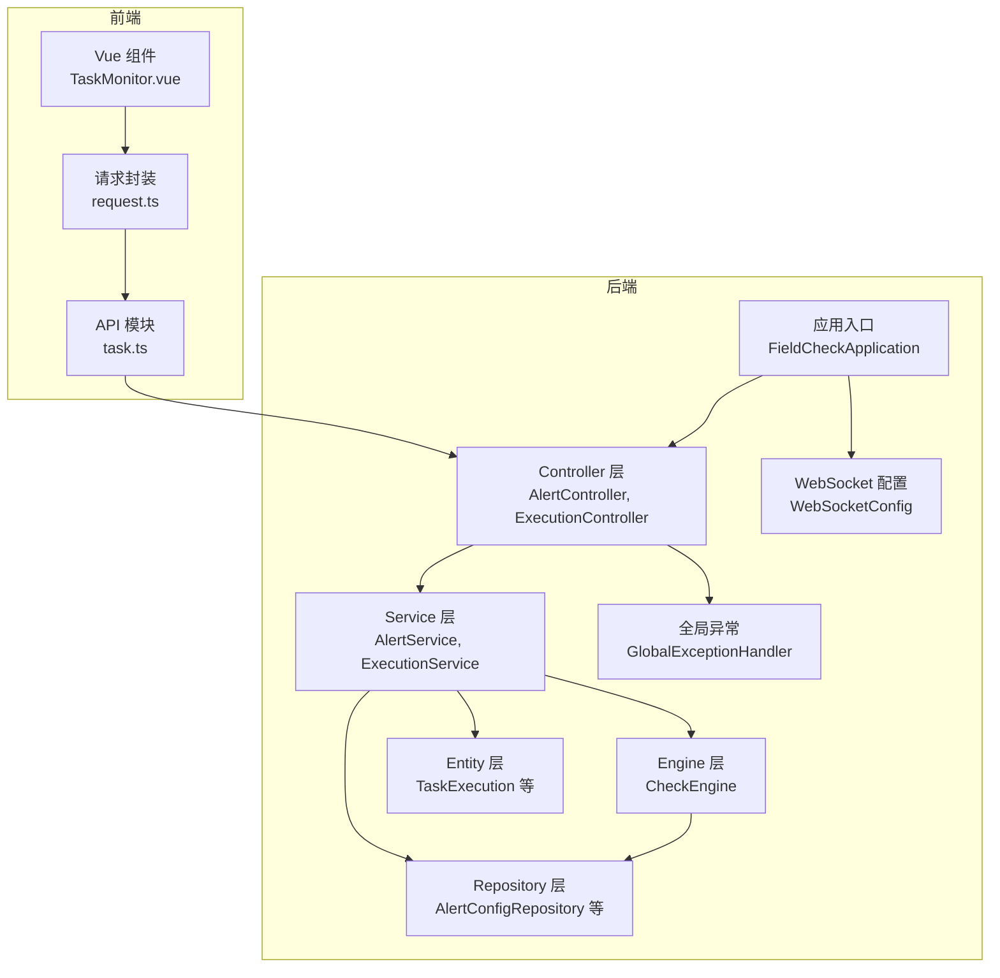
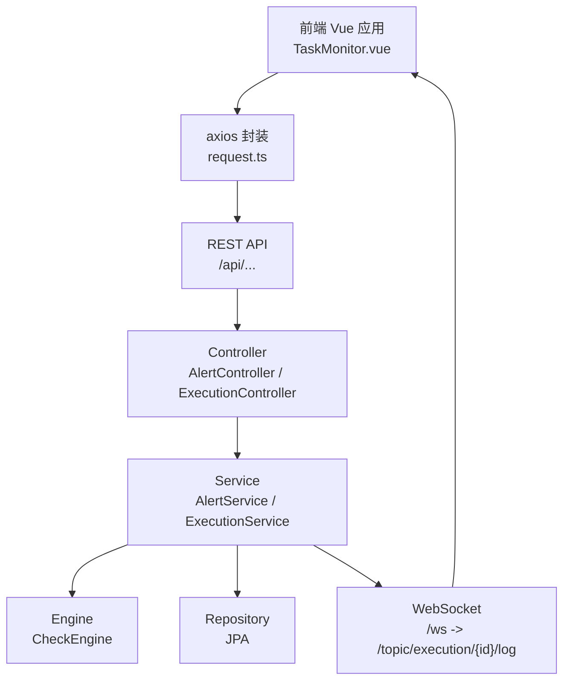
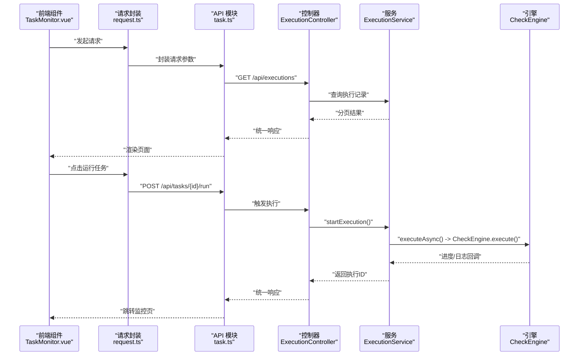
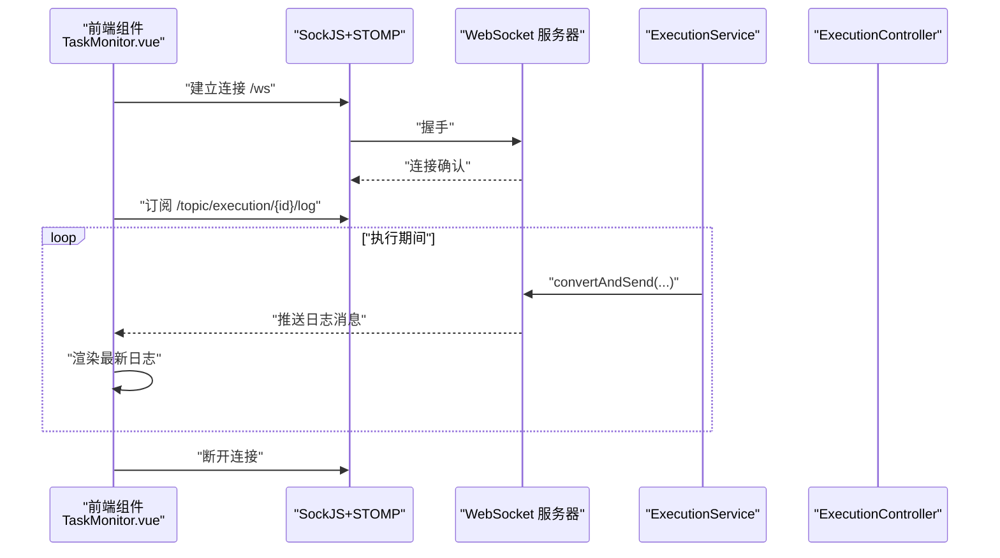
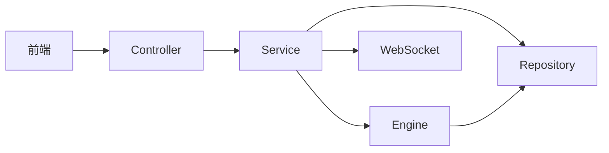

# 组件交互关系

<cite>
**本文引用的文件**
- [FieldCheckApplication.java](file://backend/src/main/java/com/fieldcheck/FieldCheckApplication.java)
- [AlertController.java](file://backend/src/main/java/com/fieldcheck/controller/AlertController.java)
- [AlertService.java](file://backend/src/main/java/com/fieldcheck/service/AlertService.java)
- [AlertConfigRepository.java](file://backend/src/main/java/com/fieldcheck/repository/AlertConfigRepository.java)
- [ExecutionController.java](file://backend/src/main/java/com/fieldcheck/controller/ExecutionController.java)
- [ExecutionService.java](file://backend/src/main/java/com/fieldcheck/service/ExecutionService.java)
- [CheckEngine.java](file://backend/src/main/java/com/fieldcheck/engine/CheckEngine.java)
- [TaskExecution.java](file://backend/src/main/java/com/fieldcheck/entity/TaskExecution.java)
- [WebSocketConfig.java](file://backend/src/main/java/com/fieldcheck/config/WebSocketConfig.java)
- [GlobalExceptionHandler.java](file://backend/src/main/java/com/fieldcheck/config/GlobalExceptionHandler.java)
- [application.yml](file://backend/src/main/resources/application.yml)
- [task.ts](file://frontend/src/api/task.ts)
- [request.ts](file://frontend/src/utils/request.ts)
- [TaskMonitor.vue](file://frontend/src/views/task/TaskMonitor.vue)
</cite>

## 目录
1. [引言](#引言)
2. [项目结构](#项目结构)
3. [核心组件](#核心组件)
4. [架构总览](#架构总览)
5. [详细组件分析](#详细组件分析)
6. [依赖分析](#依赖分析)
7. [性能考量](#性能考量)
8. [故障排查指南](#故障排查指南)
9. [结论](#结论)
10. [附录](#附录)

## 引言
本文件聚焦于系统组件交互关系的深入解析，覆盖 Controller 层、Service 层、Engine 层与 Repository 层的职责划分与调用链；阐述依赖注入与生命周期管理；详解前端与后端通过 RESTful API 与 WebSocket 的交互流程；给出组件时序图与调用链路图；说明异步处理与事件驱动模式；总结错误传播与异常处理策略；并总结组件解耦与接口抽象原则。

## 项目结构
后端采用 Spring Boot 标准分层：controller（控制器）、service（业务）、engine（引擎）、repository（持久化）、entity（实体）、config（配置）、websocket（消息）、security（安全）等。前端采用 Vue 3 + TypeScript + Element Plus，通过 axios 封装的请求工具与后端交互，使用 SockJS+STOMP 实现实时日志推送。

图表来源
- [FieldCheckApplication.java](file://backend/src/main/java/com/fieldcheck/FieldCheckApplication.java#L1-L17)
- [AlertController.java](file://backend/src/main/java/com/fieldcheck/controller/AlertController.java#L1-L67)
- [ExecutionController.java](file://backend/src/main/java/com/fieldcheck/controller/ExecutionController.java#L1-L79)
- [AlertService.java](file://backend/src/main/java/com/fieldcheck/service/AlertService.java#L1-L274)
- [ExecutionService.java](file://backend/src/main/java/com/fieldcheck/service/ExecutionService.java#L1-L307)
- [CheckEngine.java](file://backend/src/main/java/com/fieldcheck/engine/CheckEngine.java#L1-L454)
- [AlertConfigRepository.java](file://backend/src/main/java/com/fieldcheck/repository/AlertConfigRepository.java#L1-L19)
- [TaskExecution.java](file://backend/src/main/java/com/fieldcheck/entity/TaskExecution.java#L1-L58)
- [WebSocketConfig.java](file://backend/src/main/java/com/fieldcheck/config/WebSocketConfig.java#L1-L26)
- [GlobalExceptionHandler.java](file://backend/src/main/java/com/fieldcheck/config/GlobalExceptionHandler.java#L1-L55)
- [task.ts](file://frontend/src/api/task.ts#L1-L88)
- [request.ts](file://frontend/src/utils/request.ts#L1-L47)
- [TaskMonitor.vue](file://frontend/src/views/task/TaskMonitor.vue#L1-L266)

章节来源
- [FieldCheckApplication.java](file://backend/src/main/java/com/fieldcheck/FieldCheckApplication.java#L1-L17)
- [application.yml](file://backend/src/main/resources/application.yml#L1-L75)

## 核心组件
- Controller 层：负责 HTTP 接口暴露与参数校验，返回统一响应包装对象。
- Service 层：编排业务逻辑，协调 Engine 与 Repository，处理事务与异步。
- Engine 层：执行具体检查算法，直接访问数据库，产出风险结果。
- Repository 层：基于 JPA 的数据访问接口，提供查询与条件方法。
- WebSocket 配置：启用 STOMP 消息代理，向客户端推送实时日志。
- 全局异常：集中捕获与转换异常为统一响应格式。
- 前端：通过 axios 请求后端 REST API，使用 SockJS+STOMP 订阅日志主题。

章节来源
- [AlertController.java](file://backend/src/main/java/com/fieldcheck/controller/AlertController.java#L1-L67)
- [ExecutionController.java](file://backend/src/main/java/com/fieldcheck/controller/ExecutionController.java#L1-L79)
- [AlertService.java](file://backend/src/main/java/com/fieldcheck/service/AlertService.java#L1-L274)
- [ExecutionService.java](file://backend/src/main/java/com/fieldcheck/service/ExecutionService.java#L1-L307)
- [CheckEngine.java](file://backend/src/main/java/com/fieldcheck/engine/CheckEngine.java#L1-L454)
- [AlertConfigRepository.java](file://backend/src/main/java/com/fieldcheck/repository/AlertConfigRepository.java#L1-L19)
- [WebSocketConfig.java](file://backend/src/main/java/com/fieldcheck/config/WebSocketConfig.java#L1-L26)
- [GlobalExceptionHandler.java](file://backend/src/main/java/com/fieldcheck/config/GlobalExceptionHandler.java#L1-L55)
- [task.ts](file://frontend/src/api/task.ts#L1-L88)
- [request.ts](file://frontend/src/utils/request.ts#L1-L47)
- [TaskMonitor.vue](file://frontend/src/views/task/TaskMonitor.vue#L1-L266)

## 架构总览
系统采用“控制器-服务-引擎-仓库”的分层架构，结合 Spring 异步与 WebSocket 实现实时日志推送。前端通过 REST API 获取历史日志与执行信息，通过 WebSocket 订阅实时日志流。

图表来源
- [TaskMonitor.vue](file://frontend/src/views/task/TaskMonitor.vue#L99-L119)
- [request.ts](file://frontend/src/utils/request.ts#L1-L47)
- [ExecutionController.java](file://backend/src/main/java/com/fieldcheck/controller/ExecutionController.java#L1-L79)
- [AlertController.java](file://backend/src/main/java/com/fieldcheck/controller/AlertController.java#L1-L67)
- [ExecutionService.java](file://backend/src/main/java/com/fieldcheck/service/ExecutionService.java#L165-L210)
- [WebSocketConfig.java](file://backend/src/main/java/com/fieldcheck/config/WebSocketConfig.java#L1-L26)

## 详细组件分析

### 控制器层（Controller）
- 职责：暴露 REST 接口，接收参数，调用 Service，返回统一响应包装。
- 关键点：
  - 执行相关接口：分页查询执行记录、按 ID 查询、进度查询、日志读取与下载。
  - 告警相关接口：分页查询告警配置、启用查询、详情、创建、更新、删除、测试。
  - 权限控制：部分接口使用注解鉴权。
- 数据传递：Controller 仅负责参数与响应，不直接操作数据，避免职责不清。

章节来源
- [ExecutionController.java](file://backend/src/main/java/com/fieldcheck/controller/ExecutionController.java#L1-L79)
- [AlertController.java](file://backend/src/main/java/com/fieldcheck/controller/AlertController.java#L1-L67)

### 服务层（Service）
- ExecutionService
  - 职责：启动/停止执行、异步执行调度、进度与日志推送、告警触发、DTO 转换。
  - 异步与自引用：通过 @Async 与 @Lazy 自引用实现异步代理，避免同进程内方法调用绕过代理。
  - WebSocket：使用 SimpMessagingTemplate 向 /topic/execution/{id}/log 广播日志。
  - 进度保存：定期持久化执行进度，减少频繁写入。
  - 告警集成：在执行完成后根据任务关联的告警配置发送通知。
- AlertService
  - 职责：告警配置 CRUD、测试告警、执行告警发送（钉钉、邮件）。
  - 外部集成：HTTP 调用钉钉 Webhook，动态构建 JavaMailSender 发送邮件。
  - 过滤与聚合：支持按名称、类型、启用状态过滤配置。

章节来源
- [ExecutionService.java](file://backend/src/main/java/com/fieldcheck/service/ExecutionService.java#L1-L307)
- [AlertService.java](file://backend/src/main/java/com/fieldcheck/service/AlertService.java#L1-L274)

### 引擎层（Engine）
- CheckEngine
  - 职责：执行数据库扫描与字段风险检测，支持白名单跳过、采样与阈值判断。
  - 算法要点：整型溢出、Y2038 时间戳风险、小数精度溢出；对大表进行采样以提升性能。
  - 进度回调：通过 BiConsumer 回调传入日志与停止信号，实现可中断的进度推进。
  - 事务与并发：使用 TransactionTemplate 保证进度更新一致性；ConcurrentHashMap 保护运行中的任务。

章节来源
- [CheckEngine.java](file://backend/src/main/java/com/fieldcheck/engine/CheckEngine.java#L1-L454)

### 仓储层（Repository）
- 使用 Spring Data JPA 提供基础 CRUD 与条件查询方法，如按启用状态查询、按名称存在性检查等。
- 与 Service/Engine 协作，屏蔽 SQL 细节，提供类型安全的数据访问。

章节来源
- [AlertConfigRepository.java](file://backend/src/main/java/com/fieldcheck/repository/AlertConfigRepository.java#L1-L19)

### 实体模型（Entity）
- TaskExecution：记录一次任务执行的起止时间、状态、表数量、风险计数、日志路径等。
- 作为 Service/Engine 与数据库交互的核心载体，支撑进度与结果持久化。

章节来源
- [TaskExecution.java](file://backend/src/main/java/com/fieldcheck/entity/TaskExecution.java#L1-L58)

### WebSocket 与实时日志
- 后端：启用简单消息代理，订阅前缀 /topic，应用前缀 /app；注册 /ws 端点。
- 前端：使用 SockJS+STOMP 订阅 /topic/execution/{id}/log，渲染实时日志；同时拉取历史日志文件内容。
- 流程：执行过程中，ExecutionService 将日志推送到 WebSocket 主题，前端即时展示。

章节来源
- [WebSocketConfig.java](file://backend/src/main/java/com/fieldcheck/config/WebSocketConfig.java#L1-L26)
- [ExecutionService.java](file://backend/src/main/java/com/fieldcheck/service/ExecutionService.java#L237-L268)
- [TaskMonitor.vue](file://frontend/src/views/task/TaskMonitor.vue#L99-L119)

### 前后端交互流程

#### RESTful API 调用序列

图表来源
- [TaskMonitor.vue](file://frontend/src/views/task/TaskMonitor.vue#L136-L180)
- [request.ts](file://frontend/src/utils/request.ts#L1-L47)
- [task.ts](file://frontend/src/api/task.ts#L58-L64)
- [ExecutionController.java](file://backend/src/main/java/com/fieldcheck/controller/ExecutionController.java#L1-L79)
- [ExecutionService.java](file://backend/src/main/java/com/fieldcheck/service/ExecutionService.java#L107-L163)
- [CheckEngine.java](file://backend/src/main/java/com/fieldcheck/engine/CheckEngine.java#L57-L139)

#### WebSocket 实时日志序列

图表来源
- [TaskMonitor.vue](file://frontend/src/views/task/TaskMonitor.vue#L99-L119)
- [WebSocketConfig.java](file://backend/src/main/java/com/fieldcheck/config/WebSocketConfig.java#L13-L24)
- [ExecutionService.java](file://backend/src/main/java/com/fieldcheck/service/ExecutionService.java#L254-L255)

### 异步处理与事件驱动
- 异步执行：ExecutionService 使用 @Async("taskExecutor") 在独立线程池中执行任务，避免阻塞主线程。
- 自引用代理：通过 @Lazy 注入自身，确保 @Async 生效，实现跨方法调用的异步代理。
- 事件驱动：WebSocket 主题驱动前端实时刷新，日志事件由服务端主动推送。

章节来源
- [ExecutionService.java](file://backend/src/main/java/com/fieldcheck/service/ExecutionService.java#L44-L47)
- [ExecutionService.java](file://backend/src/main/java/com/fieldcheck/service/ExecutionService.java#L165-L169)
- [WebSocketConfig.java](file://backend/src/main/java/com/fieldcheck/config/WebSocketConfig.java#L13-L17)

### 错误传播与异常处理
- 全局异常：统一捕获校验异常、凭证错误、权限不足、运行时异常与通用异常，返回标准化响应。
- 控制器与服务：抛出运行时异常，由全局异常处理器转换为 HTTP 状态码与错误信息。
- 前端拦截：axios 拦截器根据状态码处理 401/403 与通用错误提示。

章节来源
- [GlobalExceptionHandler.java](file://backend/src/main/java/com/fieldcheck/config/GlobalExceptionHandler.java#L1-L55)
- [request.ts](file://frontend/src/utils/request.ts#L23-L44)

### 组件解耦与接口抽象
- 分层解耦：Controller 不直接访问数据库，Service 不直接操作引擎细节，Engine 专注算法与数据库访问。
- 接口抽象：Repository 以接口形式暴露查询能力，Service 通过接口与 Engine 解耦。
- 依赖注入：Spring 自动装配各组件，减少硬编码耦合。
- 配置抽象：WebSocket、JPA、邮件、加密等配置集中在 application.yml，便于横向扩展。

章节来源
- [application.yml](file://backend/src/main/resources/application.yml#L1-L75)

## 依赖分析
- 组件耦合
  - Controller 依赖 Service；
  - Service 依赖 Engine 与 Repository；
  - Engine 依赖 Service（密码解密）、Repository（持久化）、TransactionTemplate（事务）；
  - 前端通过 axios 与后端 REST API 解耦，通过 WebSocket 与消息代理解耦。
- 可能的循环依赖
  - 当前结构清晰，未见显式循环依赖；Service 对自身使用 @Lazy 自引用以规避代理问题。
- 外部依赖
  - 数据库连接池、JPA/Hibernate、Quartz（定时）、WebSocket、Apache HttpClient（钉钉）、JavaMailSender（邮件）。

图表来源
- [ExecutionController.java](file://backend/src/main/java/com/fieldcheck/controller/ExecutionController.java#L1-L79)
- [ExecutionService.java](file://backend/src/main/java/com/fieldcheck/service/ExecutionService.java#L1-L307)
- [CheckEngine.java](file://backend/src/main/java/com/fieldcheck/engine/CheckEngine.java#L1-L454)
- [AlertConfigRepository.java](file://backend/src/main/java/com/fieldcheck/repository/AlertConfigRepository.java#L1-L19)
- [WebSocketConfig.java](file://backend/src/main/java/com/fieldcheck/config/WebSocketConfig.java#L1-L26)
- [TaskMonitor.vue](file://frontend/src/views/task/TaskMonitor.vue#L1-L266)

## 性能考量
- 异步执行：避免阻塞主线程，提高吞吐。
- 事务批量：进度保存每 N 次写入一次，降低数据库压力。
- 采样检查：大表随机采样，平衡准确性与性能。
- 日志写入：历史日志文件读取，实时日志通过 WebSocket 推送，避免阻塞 IO。
- 数据库连接池：合理配置连接池大小与超时，避免资源争用。

## 故障排查指南
- 常见问题
  - WebSocket 连接失败：检查 /ws 端点与允许的源；确认前端连接地址与后端一致。
  - 执行日志为空：确认日志文件路径存在且可写；检查 ExecutionService 是否正确写入。
  - 告警发送失败：核对钉钉 webhook 与签名、邮箱 SMTP 配置；查看服务端错误日志。
  - 权限不足：确认用户角色与接口权限注解；检查 JWT Token 是否有效。
- 定位手段
  - 查看后端日志级别与输出格式；
  - 使用 GET /api/executions 下载日志文件辅助定位；
  - 前端控制台观察 WebSocket 连接与订阅状态。

章节来源
- [GlobalExceptionHandler.java](file://backend/src/main/java/com/fieldcheck/config/GlobalExceptionHandler.java#L1-L55)
- [ExecutionController.java](file://backend/src/main/java/com/fieldcheck/controller/ExecutionController.java#L58-L77)
- [ExecutionService.java](file://backend/src/main/java/com/fieldcheck/service/ExecutionService.java#L257-L267)
- [TaskMonitor.vue](file://frontend/src/views/task/TaskMonitor.vue#L116-L118)

## 结论
该系统通过清晰的分层架构与依赖注入，实现了前后端分离、异步执行与实时日志推送。Controller 层薄化、Service 层编排、Engine 层专注算法、Repository 层抽象数据访问，配合 WebSocket 与全局异常处理，形成高内聚、低耦合的交互体系。建议后续在监控与可观测性方面进一步增强，以提升运维效率。

## 附录
- 配置要点
  - 数据源与连接池、JPA 方言与 SQL 输出、Quartz 存储类型、邮件 SMTP、JWT 密钥与过期时间、AES 加密密钥、应用日志目录等。
- 前端注意事项
  - SockJS 地址需与后端 /ws 端点一致；
  - axios 默认携带 Authorization 头，注意跨域与预检；
  - 历史日志与实时日志结合展示，提升用户体验。

章节来源
- [application.yml](file://backend/src/main/resources/application.yml#L1-L75)
- [request.ts](file://frontend/src/utils/request.ts#L1-L47)
- [TaskMonitor.vue](file://frontend/src/views/task/TaskMonitor.vue#L99-L119)