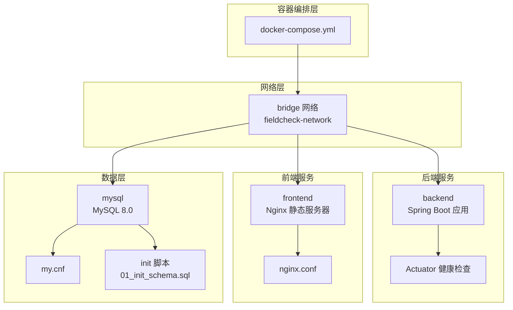
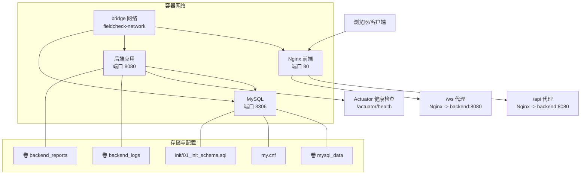
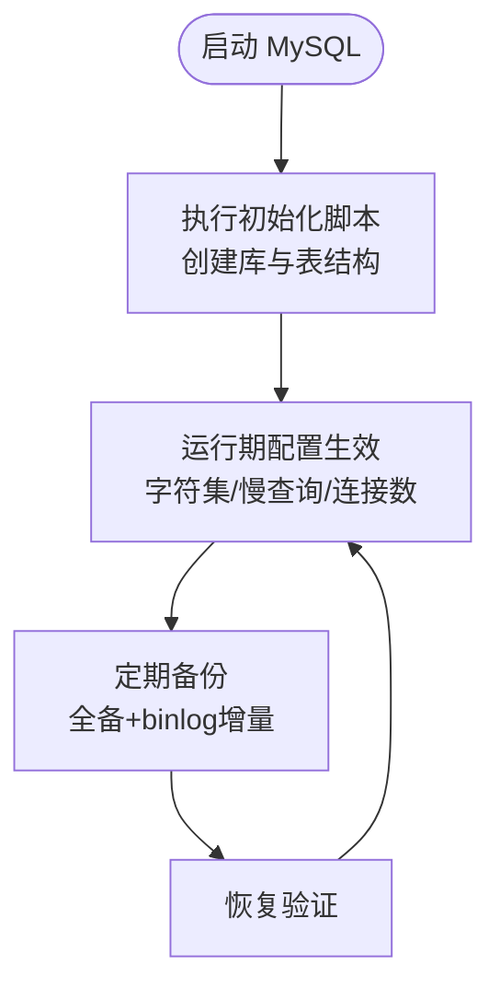
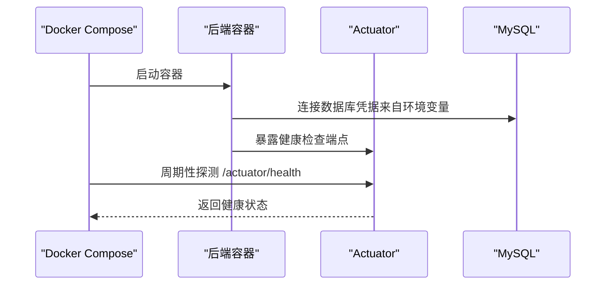
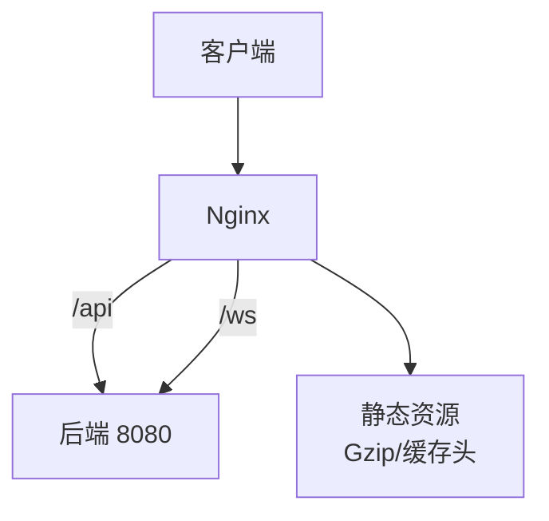
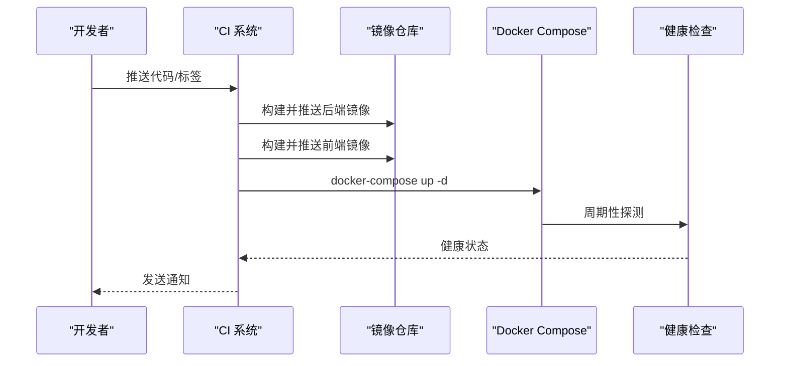
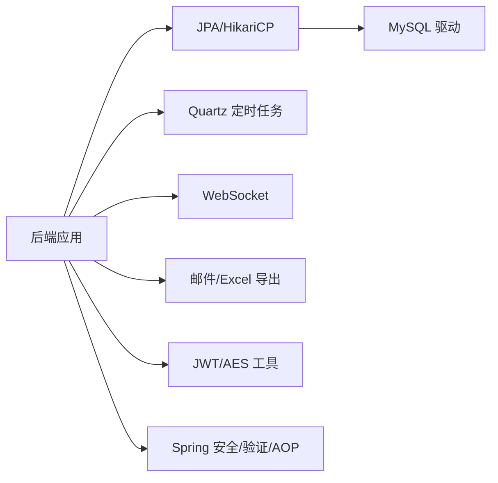

# 部署架构设计

<cite>
**本文引用的文件**
- [docker-compose.yml](file://docker-compose.yml)
- [application.yml](file://backend/src/main/resources/application.yml)
- [application-docker.yml](file://backend/src/main/resources/application-docker.yml)
- [Dockerfile（后端）](file://backend/Dockerfile)
- [Dockerfile（前端）](file://frontend/Dockerfile)
- [my.cnf](file://mysql/conf/my.cnf)
- [01_init_schema.sql](file://mysql/init/01_init_schema.sql)
- [start.sh](file://start.sh)
- [pom.xml](file://backend/pom.xml)
- [package.json](file://frontend/package.json)
- [vite.config.ts](file://frontend/vite.config.ts)
- [nginx.conf](file://frontend/nginx.conf)
- [FieldCheckApplication.java](file://backend/src/main/java/com/fieldcheck/FieldCheckApplication.java)
</cite>

## 目录
1. [引言](#引言)
2. [项目结构](#项目结构)
3. [核心组件](#核心组件)
4. [架构总览](#架构总览)
5. [详细组件分析](#详细组件分析)
6. [依赖关系分析](#依赖关系分析)
7. [性能考虑](#性能考虑)
8. [故障排查指南](#故障排查指南)
9. [结论](#结论)
10. [附录](#附录)

## 引言
本文件面向系统部署与运维工程师，提供该 MySQL 字段容量风险检查平台的容器化部署架构设计与实施指南。内容涵盖容器编排、服务发现与负载均衡、多环境配置策略、微服务治理与监控、数据库高可用与备份、静态资源与 CDN 优化、自动化部署与 CI/CD 设计、性能监控与日志收集、以及灾难恢复策略等。

## 项目结构
该项目采用前后端分离与数据库独立部署的容器化方案，通过 Docker Compose 在单机或容器集群中一键拉起 MySQL、后端 Spring Boot 应用与前端 Nginx 服务，并通过自定义网络实现服务间通信。

图表来源
- [docker-compose.yml](file://docker-compose.yml#L1-L91)
- [nginx.conf](file://frontend/nginx.conf#L1-L69)
- [my.cnf](file://mysql/conf/my.cnf#L1-L31)
- [01_init_schema.sql](file://mysql/init/01_init_schema.sql#L1-L185)

章节来源
- [docker-compose.yml](file://docker-compose.yml#L1-L91)
- [start.sh](file://start.sh#L1-L80)

## 核心组件
- MySQL 数据库
  - 版本：8.0
  - 初始化：通过挂载的 SQL 脚本执行建库建表与默认用户插入
  - 配置：字符集、连接数、慢查询日志、时区、大小写不敏感等
  - 存储：本地卷持久化，便于备份与迁移
- 后端 Spring Boot 应用
  - 框架：Spring Boot 2.7.x + Java 8
  - 功能：鉴权、定时任务、WebSocket、JPA、邮件、Excel 导出等
  - 配置：开发与容器环境双配置文件，Actuator 健康检查
  - 容器：多阶段构建，非 root 用户运行，JVM 参数调优
- 前端 Nginx
  - 构建：基于 Node.js 的 Vite 构建产物
  - 代理：将 /api 与 /ws 代理至后端，支持 WebSocket
  - 安全与缓存：Gzip、安全响应头、静态资源强缓存
- 自动化脚本
  - start.sh：封装 docker-compose 常用操作，支持 up/down/restart/logs/status/clean

章节来源
- [application.yml](file://backend/src/main/resources/application.yml#L1-L75)
- [application-docker.yml](file://backend/src/main/resources/application-docker.yml#L1-L46)
- [Dockerfile（后端）](file://backend/Dockerfile#L1-L44)
- [Dockerfile（前端）](file://frontend/Dockerfile#L1-L35)
- [my.cnf](file://mysql/conf/my.cnf#L1-L31)
- [01_init_schema.sql](file://mysql/init/01_init_schema.sql#L1-L185)
- [pom.xml](file://backend/pom.xml#L1-L161)
- [package.json](file://frontend/package.json#L1-L33)
- [vite.config.ts](file://frontend/vite.config.ts#L1-L31)
- [nginx.conf](file://frontend/nginx.conf#L1-L69)
- [start.sh](file://start.sh#L1-L80)

## 架构总览
下图展示容器化部署的整体拓扑与交互路径，包括服务发现、负载均衡（由 Docker 内部网络与 Nginx 代理承担）、健康检查与依赖顺序。

图表来源
- [docker-compose.yml](file://docker-compose.yml#L1-L91)
- [nginx.conf](file://frontend/nginx.conf#L33-L57)
- [application-docker.yml](file://backend/src/main/resources/application-docker.yml#L38-L46)

## 详细组件分析

### 数据库部署与高可用设计
- 单实例部署
  - 使用官方 MySQL 8.0 镜像，设置字符集、慢查询日志、最大连接数、时区等
  - 通过卷持久化数据目录，初始化脚本在首次启动时执行
- 主从复制与故障转移（扩展建议）
  - 扩展为三节点组播或使用 MySQL Group Replication 实现高可用
  - 使用只读副本分担查询压力；故障时通过 VIP 或 DNS 切换实现自动故障转移
- 备份策略
  - 定时逻辑备份（mysqldump）+ 增量 binlog，结合远程归档与校验
  - 备份窗口避开业务高峰，验证恢复流程

图表来源
- [01_init_schema.sql](file://mysql/init/01_init_schema.sql#L1-L185)
- [my.cnf](file://mysql/conf/my.cnf#L1-L31)

章节来源
- [docker-compose.yml](file://docker-compose.yml#L5-L27)
- [my.cnf](file://mysql/conf/my.cnf#L1-L31)
- [01_init_schema.sql](file://mysql/init/01_init_schema.sql#L1-L185)

### 后端服务治理与监控
- 健康检查
  - 后端通过 Actuator 暴露健康检查端点，Compose 中以 curl 方式探测
  - 前端通过 wget/spider 探测 /health
- 配置管理
  - 开发环境与容器环境分离：application.yml 与 application-docker.yml
  - 容器环境通过环境变量注入数据库连接、JWT 秘钥、AES 秘钥等
- 安全与合规
  - 非 root 用户运行，限制权限
  - 日志输出到 /app/logs，容器内集中采集

图表来源
- [docker-compose.yml](file://docker-compose.yml#L30-L58)
- [application-docker.yml](file://backend/src/main/resources/application-docker.yml#L38-L46)

章节来源
- [application.yml](file://backend/src/main/resources/application.yml#L1-L75)
- [application-docker.yml](file://backend/src/main/resources/application-docker.yml#L1-L46)
- [Dockerfile（后端）](file://backend/Dockerfile#L27-L44)

### 前端静态资源与 CDN 优化
- 构建与运行
  - 基于 Node.js 的多阶段构建，产物拷贝至 Nginx
  - Nginx 提供静态资源服务，开启 Gzip 压缩与安全响应头
- 反向代理
  - /api 代理至后端 8080，支持超时与头部透传
  - /ws 代理至后端 8080，启用 WebSocket 升级
- CDN 与缓存
  - 对 JS/CSS/字体/图片等静态资源设置一年缓存与 immutable
  - 建议生产环境接入 CDN，边缘缓存提升全球访问性能

图表来源
- [frontend/Dockerfile](file://frontend/Dockerfile#L1-L35)
- [nginx.conf](file://frontend/nginx.conf#L1-L69)

章节来源
- [frontend/Dockerfile](file://frontend/Dockerfile#L1-L35)
- [vite.config.ts](file://frontend/vite.config.ts#L1-L31)
- [nginx.conf](file://frontend/nginx.conf#L1-L69)

### 多环境部署策略
- 开发环境
  - 使用 application.yml，本地直连 MySQL（localhost），日志级别较高，便于调试
- 容器环境
  - 使用 application-docker.yml，通过环境变量注入数据库连接、JWT/AES 秘钥
  - Actuator 暴露 health/info，日志输出到 /app/logs
- 生产环境建议
  - 使用外部密钥管理（如 KMS/Vault）注入敏感信息
  - 将日志与指标统一接入集中化平台（ELK/EFK 或云可观测性）
  - 前端静态资源交由 CDN 分发，后端启用限流与熔断

章节来源
- [application.yml](file://backend/src/main/resources/application.yml#L1-L75)
- [application-docker.yml](file://backend/src/main/resources/application-docker.yml#L1-L46)
- [docker-compose.yml](file://docker-compose.yml#L37-L43)

### 自动化部署与 CI/CD 设计
- 本地快速启动
  - start.sh 封装常用命令：up/down/restart/logs/status/clean
  - 自动检测 Docker 与 docker-compose，必要时提示安装
- CI/CD 建议流水线
  - 触发条件：push 到主分支或打标签
  - 步骤：代码检出 → 单元测试（可选）→ 构建后端镜像 → 构建前端镜像 → docker-compose up -d → 健康检查 → 发送通知
  - 回滚：记录镜像版本，失败时回滚至上一稳定版本
- 部署策略
  - 蓝绿/金丝雀发布：逐步替换容器，配合健康检查与灰度流量
  - 配置热更新：仅对非敏感配置进行热加载，敏感配置通过滚动重启生效

图表来源
- [start.sh](file://start.sh#L32-L57)
- [docker-compose.yml](file://docker-compose.yml#L30-L78)

章节来源
- [start.sh](file://start.sh#L1-L80)
- [docker-compose.yml](file://docker-compose.yml#L1-L91)

### 性能监控与日志收集
- 指标与日志
  - 后端：Actuator 暴露健康与基础指标；日志输出到 /app/logs
  - 前端：Nginx 访问/错误日志；静态资源缓存与压缩
  - 数据库：慢查询日志、连接数、缓冲池等
- 建议方案
  - 日志：Filebeat 收集容器日志，发送至 ELK/EFK 或云日志服务
  - 指标：Prometheus 抓取 Actuator 指标，Grafana 可视化
  - 链路追踪：OpenTelemetry 或云 APM，覆盖 API 与数据库调用

章节来源
- [application-docker.yml](file://backend/src/main/resources/application-docker.yml#L38-L46)
- [my.cnf](file://mysql/conf/my.cnf#L16-L18)
- [nginx.conf](file://frontend/nginx.conf#L1-L69)

### 灾难恢复与备份策略
- 备份
  - 全量备份：周期性 mysqldump
  - 增量备份：binlog 定期归档
  - 前端静态资源：版本化对象存储，保留多个历史版本
- 恢复演练
  - 定期进行离线恢复演练，验证备份完整性与恢复时间目标
- 故障切换
  - 数据库：主从切换或集群故障转移
  - 应用：多副本滚动重启，确保服务可用性

章节来源
- [my.cnf](file://mysql/conf/my.cnf#L16-L18)
- [01_init_schema.sql](file://mysql/init/01_init_schema.sql#L1-L185)

## 依赖关系分析

图表来源
- [pom.xml](file://backend/pom.xml#L28-L142)

章节来源
- [pom.xml](file://backend/pom.xml#L1-L161)
- [FieldCheckApplication.java](file://backend/src/main/java/com/fieldcheck/FieldCheckApplication.java#L1-L17)

## 性能考虑
- 数据库
  - 合理设置最大连接数与缓冲池大小，开启慢查询日志定位热点
  - 使用 UTF8MB4 字符集，避免存储与传输中的编码问题
- 应用
  - 后端 JVM 参数按内存与 GC 需求调整，避免频繁 Full GC
  - HikariCP 连接池参数与数据库最大连接数匹配
- 前端
  - 静态资源长缓存与 Gzip 压缩，减少带宽与延迟
  - CDN 边缘缓存与就近分发，降低首屏时间

章节来源
- [my.cnf](file://mysql/conf/my.cnf#L6-L13)
- [application.yml](file://backend/src/main/resources/application.yml#L13-L22)
- [Dockerfile（后端）](file://backend/Dockerfile#L36-L40)
- [nginx.conf](file://frontend/nginx.conf#L7-L30)

## 故障排查指南
- 常见问题定位
  - 数据库不可达：检查容器网络、初始化脚本是否成功、端口映射与防火墙
  - 后端 5xx：查看 Actuator 健康状态、日志卷、数据库连接参数
  - 前端 404/白屏：确认 Nginx 代理配置、静态资源路径、history 模式回退
- 快速操作
  - 使用 start.sh 的 logs/status/clean 命令快速定位问题
  - docker-compose logs -f 实时查看容器日志
- 建议工具
  - Postman/浏览器 Network 面板检查 /api 与 /ws
  - MySQL 客户端连接验证初始化数据与权限

章节来源
- [start.sh](file://start.sh#L52-L57)
- [docker-compose.yml](file://docker-compose.yml#L52-L76)
- [nginx.conf](file://frontend/nginx.conf#L33-L62)

## 结论
本部署架构以 Docker Compose 为核心，实现了前后端与数据库的一键编排与健康守护。通过环境隔离与配置注入，满足开发、测试与生产的差异化需求。建议在生产环境中引入外部密钥管理、集中化监控与日志、CDN 加速、数据库高可用与灾备演练，以进一步提升稳定性与可维护性。

## 附录
- 关键端口
  - 前端：80（HTTP）
  - 后端：8080（HTTP/WS）
  - 数据库：3306（MySQL）
- 关键卷
  - mysql_data：数据库持久化
  - backend_logs：后端日志
  - backend_reports：报告导出目录
- 关键环境变量（示例）
  - SPRING_DATASOURCE_URL/USERNAME/PASSWORD
  - JWT_SECRET、AES_SECRET
  - TZ（时区）

章节来源
- [docker-compose.yml](file://docker-compose.yml#L8-L43)
- [application-docker.yml](file://backend/src/main/resources/application-docker.yml#L4-L29)