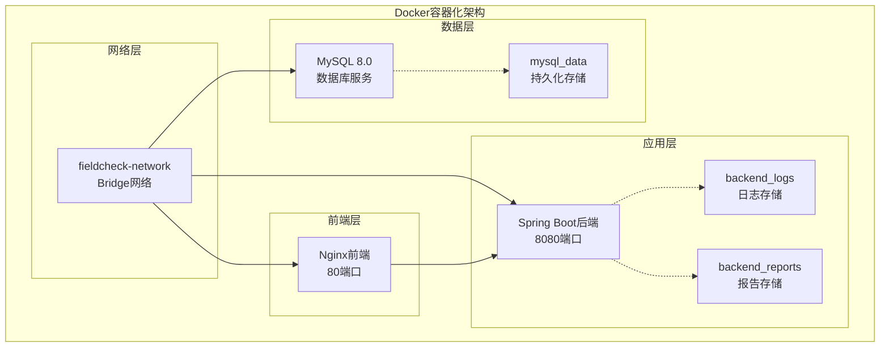
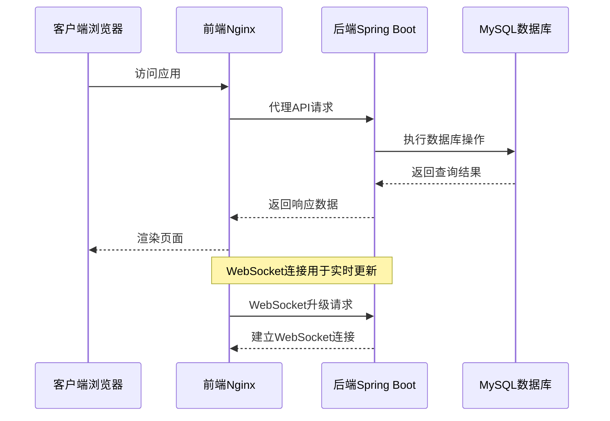
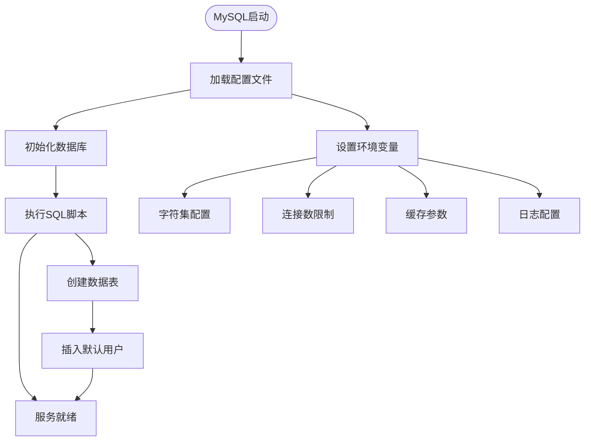
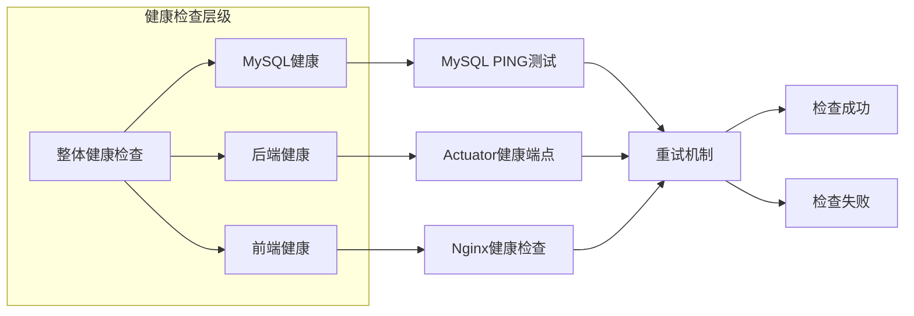
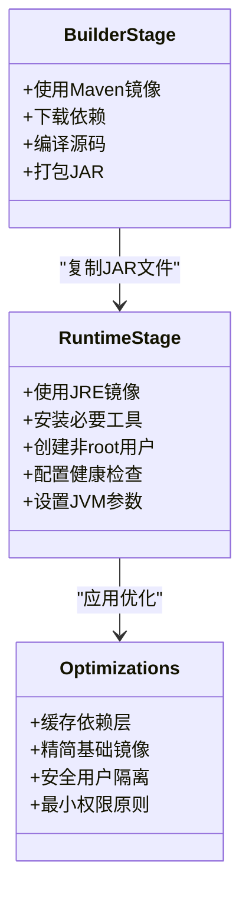
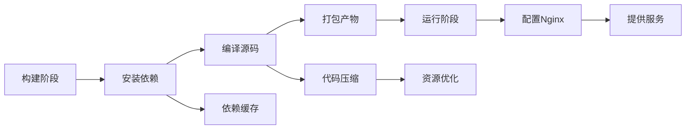
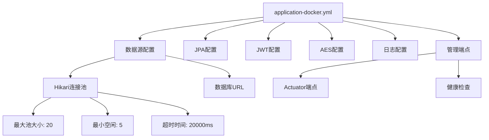
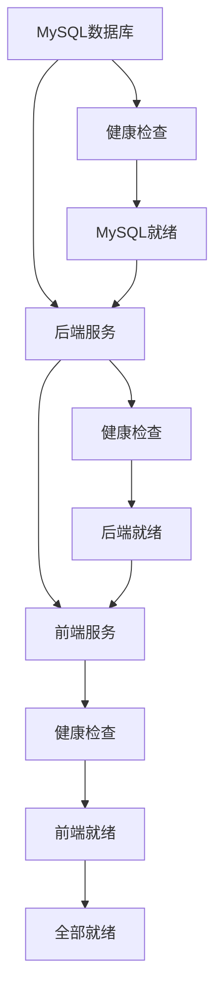
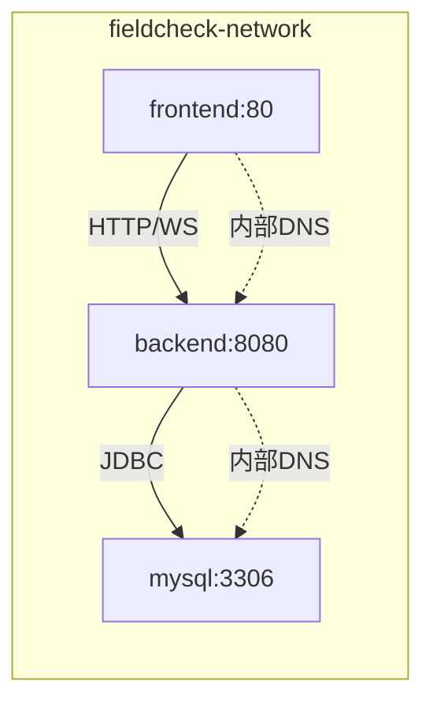

# Docker容器化部署

<cite>
**本文档引用的文件**
- [docker-compose.yml](file://docker-compose.yml)
- [backend/Dockerfile](file://backend/Dockerfile)
- [frontend/Dockerfile](file://frontend/Dockerfile)
- [mysql/conf/my.cnf](file://mysql/conf/my.cnf)
- [backend/src/main/resources/application-docker.yml](file://backend/src/main/resources/application-docker.yml)
- [mysql/init/01_init_schema.sql](file://mysql/init/01_init_schema.sql)
- [frontend/nginx.conf](file://frontend/nginx.conf)
- [start.sh](file://start.sh)
- [backend/pom.xml](file://backend/pom.xml)
- [frontend/package.json](file://frontend/package.json)
</cite>

## 目录
1. [简介](#简介)
2. [项目结构](#项目结构)
3. [核心组件](#核心组件)
4. [架构概览](#架构概览)
5. [详细组件分析](#详细组件分析)
6. [依赖关系分析](#依赖关系分析)
7. [性能考虑](#性能考虑)
8. [故障排除指南](#故障排除指南)
9. [部署步骤](#部署步骤)
10. [结论](#结论)

## 简介

这是一个基于Docker容器化的MySQL字段容量风险检查平台的完整部署方案。该系统采用微服务架构，包含三个主要组件：MySQL数据库、Spring Boot后端服务和Vue前端应用。通过docker-compose编排，实现了服务间的自动发现、健康检查和依赖管理。

该平台提供了字段容量风险检查功能，包括数据库连接管理、定时任务执行、风险结果分析和告警通知等核心业务功能。系统设计注重可扩展性和可维护性，采用多阶段构建优化镜像大小，并提供完整的监控和日志管理机制。

## 项目结构

该项目采用分层的微服务架构，每个组件都有独立的Docker配置和构建流程：



**图表来源**
- [docker-compose.yml](file://docker-compose.yml#L1-L91)

**章节来源**
- [docker-compose.yml](file://docker-compose.yml#L1-L91)
- [backend/Dockerfile](file://backend/Dockerfile#L1-L44)
- [frontend/Dockerfile](file://frontend/Dockerfile#L1-L35)

## 核心组件

### MySQL数据库服务

MySQL服务使用官方8.0镜像，配置了完整的字符集支持和性能优化参数：

- **基础镜像**: mysql:8.0
- **容器名称**: fieldcheck-mysql
- **端口映射**: 3306:3306
- **环境变量**: 
  - ROOT密码: root123456 (可配置)
  - 数据库名: fieldcheck
  - 用户名: fieldcheck
  - 密码: fieldcheck123 (可配置)
  - 时区: Asia/Shanghai

**章节来源**
- [docker-compose.yml](file://docker-compose.yml#L5-L28)
- [mysql/conf/my.cnf](file://mysql/conf/my.cnf#L1-L31)

### Spring Boot后端服务

后端采用多阶段构建，优化镜像大小和安全性：

- **构建阶段**: Maven + OpenJDK 8
- **运行阶段**: OpenJDK 8 JRE slim
- **容器名称**: fieldcheck-backend
- **端口映射**: 8080:8080
- **环境变量**:
  - 数据源连接: jdbc:mysql://mysql:3306/fieldcheck
  - JWT密钥: 可配置的安全密钥
  - AES密钥: fieldcheck-aes-key

**章节来源**
- [backend/Dockerfile](file://backend/Dockerfile#L1-L44)
- [backend/src/main/resources/application-docker.yml](file://backend/src/main/resources/application-docker.yml#L1-L46)

### Vue前端服务

前端使用Nginx作为静态服务器，提供高性能的静态资源服务：

- **构建阶段**: Node.js 18 Alpine
- **运行阶段**: Nginx Alpine
- **容器名称**: fieldcheck-frontend
- **端口映射**: 80:80
- **配置**: 支持Vue Router历史模式和WebSocket代理

**章节来源**
- [frontend/Dockerfile](file://frontend/Dockerfile#L1-L35)
- [frontend/nginx.conf](file://frontend/nginx.conf#L1-L69)

## 架构概览

系统采用三层次架构，通过Docker网络实现服务间通信：



**图表来源**
- [docker-compose.yml](file://docker-compose.yml#L30-L78)
- [frontend/nginx.conf](file://frontend/nginx.conf#L45-L57)

**章节来源**
- [docker-compose.yml](file://docker-compose.yml#L1-L91)

## 详细组件分析

### Docker Compose配置详解

#### MySQL服务配置

MySQL服务配置了完整的生产级参数：



**图表来源**
- [docker-compose.yml](file://docker-compose.yml#L5-L28)
- [mysql/init/01_init_schema.sql](file://mysql/init/01_init_schema.sql#L1-L185)

#### 健康检查机制

系统实现了多层次的健康检查：



**图表来源**
- [docker-compose.yml](file://docker-compose.yml#L22-L26)
- [docker-compose.yml](file://docker-compose.yml#L52-L57)
- [docker-compose.yml](file://docker-compose.yml#L72-L76)

**章节来源**
- [docker-compose.yml](file://docker-compose.yml#L1-L91)

### Dockerfile构建优化

#### 后端多阶段构建

后端采用了标准的多阶段构建策略：



**图表来源**
- [backend/Dockerfile](file://backend/Dockerfile#L1-L44)

#### 前端多阶段构建

前端同样采用多阶段构建优化：



**图表来源**
- [frontend/Dockerfile](file://frontend/Dockerfile#L1-L35)

**章节来源**
- [backend/Dockerfile](file://backend/Dockerfile#L1-L44)
- [frontend/Dockerfile](file://frontend/Dockerfile#L1-L35)

### 数据库配置优化

MySQL配置文件包含了生产环境的关键参数：

| 配置项 | 值 | 用途 |
|--------|-----|------|
| character-set-server | utf8mb4 | 支持完整UTF-8字符集 |
| max_connections | 500 | 最大连接数限制 |
| innodb_buffer_pool_size | 256M | InnoDB缓冲池大小 |
| slow_query_log | 1 | 启用慢查询日志 |
| lower_case_table_names | 1 | 表名大小写不敏感 |

**章节来源**
- [mysql/conf/my.cnf](file://mysql/conf/my.cnf#L1-L31)

### 应用配置详解

#### Spring Boot Docker配置

后端应用在Docker环境下使用专门的配置文件：



**图表来源**
- [backend/src/main/resources/application-docker.yml](file://backend/src/main/resources/application-docker.yml#L1-L46)

**章节来源**
- [backend/src/main/resources/application-docker.yml](file://backend/src/main/resources/application-docker.yml#L1-L46)

## 依赖关系分析

### 服务启动顺序

系统通过依赖关系确保正确的启动顺序：



**图表来源**
- [docker-compose.yml](file://docker-compose.yml#L49-L51)
- [docker-compose.yml](file://docker-compose.yml#L70-L71)

### 网络通信

系统使用自定义桥接网络实现服务间通信：



**图表来源**
- [docker-compose.yml](file://docker-compose.yml#L27-L28)
- [docker-compose.yml](file://docker-compose.yml#L58-L59)
- [docker-compose.yml](file://docker-compose.yml#L77-L78)

**章节来源**
- [docker-compose.yml](file://docker-compose.yml#L1-L91)

## 性能考虑

### 镜像优化策略

系统采用了多种镜像优化技术：

1. **多阶段构建**: 减少最终镜像大小
2. **Alpine Linux**: 使用轻量级基础镜像
3. **依赖缓存**: 利用Docker层缓存机制
4. **非root用户**: 提升容器安全性

### JVM性能调优

后端JVM参数经过精心配置：

- **初始堆大小**: 512MB
- **最大堆大小**: 1024MB  
- **垃圾回收器**: CMS收集器
- **内存分配**: 平衡性能和资源使用

### 数据库性能优化

MySQL配置针对高并发场景优化：

- **连接池**: HikariCP提供高性能连接管理
- **缓冲池**: 256MB InnoDB缓冲池
- **慢查询**: 启用慢查询日志便于性能分析
- **字符集**: 使用utf8mb4支持完整的Unicode字符

## 故障排除指南

### 常见启动问题

#### 数据库连接失败

**症状**: 后端服务启动时报数据库连接错误

**可能原因**:
1. MySQL容器未完全启动
2. 数据库凭据配置错误
3. 网络连接问题

**解决步骤**:
1. 检查MySQL健康状态
2. 验证数据库凭据
3. 确认网络连通性

#### 健康检查失败

**症状**: 容器显示未健康状态

**诊断方法**:
1. 查看容器日志
2. 检查端口占用情况
3. 验证配置文件

**章节来源**
- [docker-compose.yml](file://docker-compose.yml#L22-L26)
- [docker-compose.yml](file://docker-compose.yml#L52-L57)
- [docker-compose.yml](file://docker-compose.yml#L72-L76)

### 日志分析

#### 后端日志查看

```bash
# 查看后端服务日志
docker-compose logs -f backend

# 查看特定时间段的日志
docker-compose logs --since "2024-01-01" backend

# 实时跟踪日志
docker-compose logs -f --tail 100 backend
```

#### 前端日志查看

```bash
# 查看Nginx访问日志
docker-compose exec frontend cat /var/log/nginx/access.log

# 查看Nginx错误日志
docker-compose exec frontend cat /var/log/nginx/error.log
```

### 环境变量配置

系统支持以下关键环境变量：

| 变量名 | 默认值 | 用途 |
|--------|--------|------|
| MYSQL_ROOT_PASSWORD | root123456 | MySQL root密码 |
| MYSQL_PASSWORD | fieldcheck123 | 应用数据库用户密码 |
| JWT_SECRET | your-super-secret-key | JWT令牌密钥 |
| AES_SECRET | fieldcheck-aes-key | AES加密密钥 |

**章节来源**
- [docker-compose.yml](file://docker-compose.yml#L9-L14)
- [docker-compose.yml](file://docker-compose.yml#L37-L43)

## 部署步骤

### 环境准备

1. **安装Docker和Docker Compose**
```bash
# 检查Docker安装
docker --version

# 检查Docker Compose安装
docker-compose --version
```

2. **创建环境配置文件**
```bash
# 复制示例配置文件
cp .env.example .env

# 编辑环境变量
nano .env
```

### 启动服务

1. **完整启动**
```bash
# 启动所有服务（包含构建）
./start.sh up

# 或者使用docker-compose
docker-compose up -d --build
```

2. **服务验证**
```bash
# 查看服务状态
docker-compose ps

# 查看服务日志
docker-compose logs -f

# 验证健康状态
docker-compose ps
```

### 停止和清理

1. **停止服务**
```bash
# 停止所有服务
./start.sh down

# 或者使用docker-compose
docker-compose down
```

2. **清理数据**
```bash
# 清理所有数据（包括数据库）
./start.sh clean
```

### 验证部署

1. **前端访问**
   - 地址: http://localhost
   - 默认登录: admin/admin123

2. **后端API**
   - 地址: http://localhost:8080
   - 健康检查: http://localhost:8080/actuator/health

3. **数据库连接**
   - 主机: localhost
   - 端口: 3306
   - 数据库: fieldcheck
   - 用户: fieldcheck

**章节来源**
- [start.sh](file://start.sh#L1-L80)
- [docker-compose.yml](file://docker-compose.yml#L35-L41)

## 结论

本Docker容器化部署方案提供了完整的MySQL字段容量风险检查平台的自动化部署能力。通过精心设计的多阶段构建、健康检查机制和服务依赖管理，确保了系统的稳定性、可维护性和可扩展性。

### 主要优势

1. **模块化设计**: 每个组件独立部署，便于维护和扩展
2. **生产级配置**: 包含完整的性能优化和安全配置
3. **自动化管理**: 通过docker-compose实现一键部署
4. **可观测性**: 完整的健康检查和日志记录机制
5. **安全性**: 非root用户运行、环境变量配置等安全措施

### 未来改进方向

1. **监控集成**: 添加Prometheus和Grafana监控
2. **负载均衡**: 考虑添加Nginx反向代理
3. **CI/CD**: 集成自动化构建和部署流水线
4. **备份策略**: 实现定期数据库备份机制
5. **扩展性**: 支持水平扩展和集群部署

该部署方案为类似的企业级应用提供了良好的参考模板，可以根据具体需求进行定制和扩展。