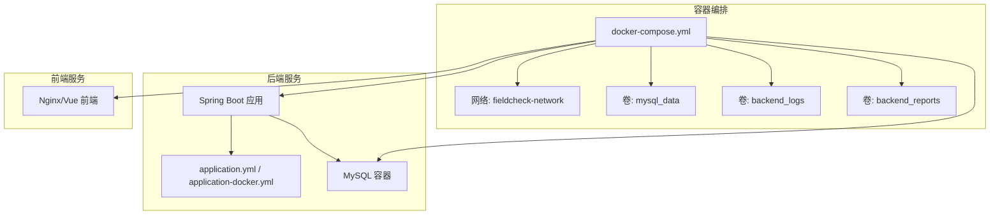
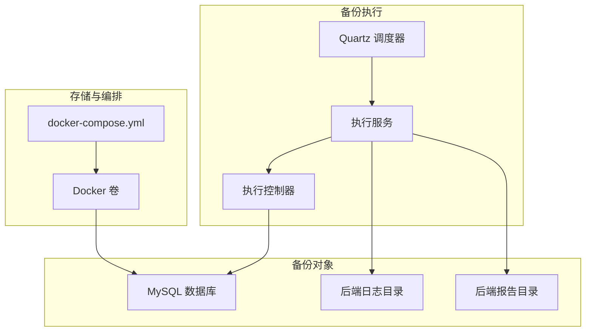
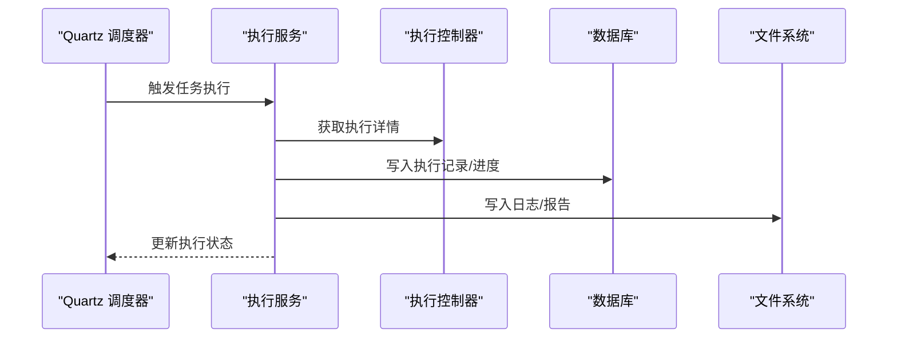
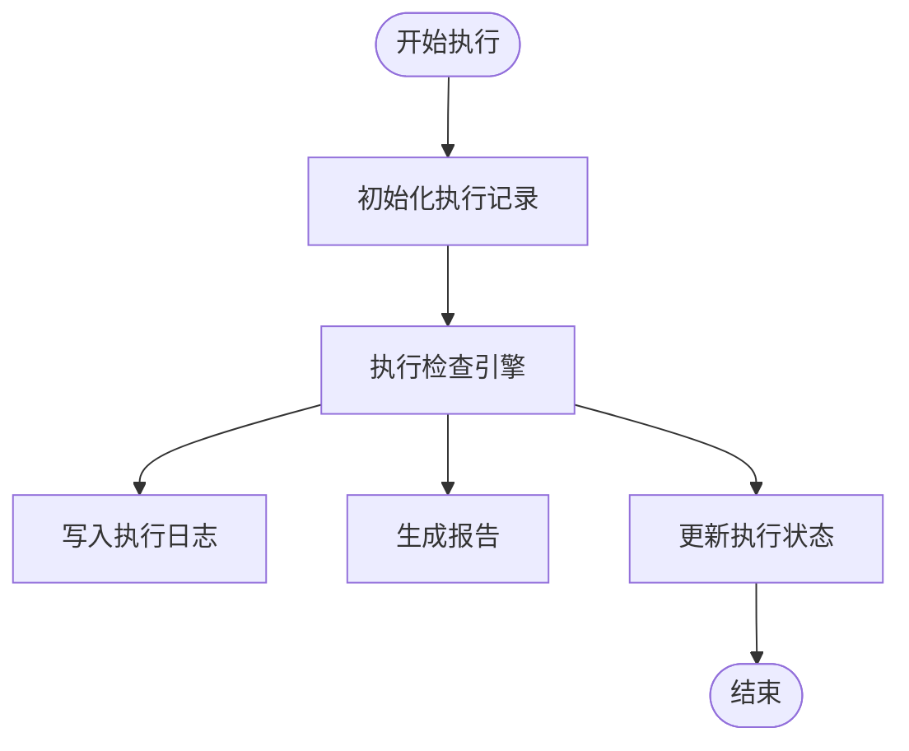

# 备份与恢复

<cite>
**本文引用的文件**
- [application.yml](file://backend/src/main/resources/application.yml)
- [application-docker.yml](file://backend/src/main/resources/application-docker.yml)
- [my.cnf](file://mysql/conf/my.cnf)
- [docker-compose.yml](file://docker-compose.yml)
- [start.sh](file://start.sh)
- [TaskSchedulerConfig.java](file://backend/src/main/java/com/fieldcheck/scheduler/TaskSchedulerConfig.java)
- [ExecutionService.java](file://backend/src/main/java/com/fieldcheck/service/ExecutionService.java)
- [ExecutionController.java](file://backend/src/main/java/com/fieldcheck/controller/ExecutionController.java)
- [TaskExecution.java](file://backend/src/main/java/com/fieldcheck/entity/TaskExecution.java)
- [TaskExecutionRepository.java](file://backend/src/main/java/com/fieldcheck/repository/TaskExecutionRepository.java)
- [CheckTask.java](file://backend/src/main/java/com/fieldcheck/entity/CheckTask.java)
- [ExecutionStatus.java](file://backend/src/main/java/com/fieldcheck/entity/ExecutionStatus.java)
- [ReportService.java](file://backend/src/main/java/com/fieldcheck/service/ReportService.java)
- [AuditLog.java](file://backend/src/main/java/com/fieldcheck/entity/AuditLog.java)
- [CheckEngine.java](file://backend/src/main/java/com/fieldcheck/engine/CheckEngine.java)
- [LogMessage.java](file://backend/src/main/java/com/fieldcheck/dto/LogMessage.java)
- [AESUtil.java](file://backend/src/main/java/com/fieldcheck/util/AESUtil.java)
</cite>

## 目录
1. [引言](#引言)
2. [项目结构](#项目结构)
3. [核心组件](#核心组件)
4. [架构总览](#架构总览)
5. [详细组件分析](#详细组件分析)
6. [依赖分析](#依赖分析)
7. [性能考虑](#性能考虑)
8. [故障排查指南](#故障排查指南)
9. [结论](#结论)
10. [附录](#附录)

## 引言
本指南面向MySQL风险检查平台的运维与开发团队，围绕“系统备份与恢复”主题，结合现有代码库中的数据库配置、容器编排与执行日志能力，给出可落地的备份策略、自动化脚本配置、数据快照与增量备份思路、灾难恢复计划（RTO/RPO）、数据迁移与升级流程、备份验证与恢复测试方法、数据一致性检查与修复机制、跨环境数据同步与复制策略、备份存储安全与生命周期管理，以及备份失败应急处理与演练方案。

## 项目结构
该系统采用前后端分离与容器化部署，数据库通过Docker卷持久化，后端通过JPA访问数据库，定时任务基于Quartz JDBC存储。执行过程产生的日志与报告路径在配置文件中定义，便于后续构建备份与恢复流程。

图表来源
- [docker-compose.yml](file://docker-compose.yml#L1-L91)
- [application.yml](file://backend/src/main/resources/application.yml#L1-L75)
- [application-docker.yml](file://backend/src/main/resources/application-docker.yml#L1-L46)

章节来源
- [docker-compose.yml](file://docker-compose.yml#L1-L91)
- [application.yml](file://backend/src/main/resources/application.yml#L1-L75)
- [application-docker.yml](file://backend/src/main/resources/application-docker.yml#L1-L46)

## 核心组件
- 数据库层：MySQL 8.0，字符集与慢查询日志等关键参数在配置文件中定义；数据持久化通过Docker卷挂载。
- 后端应用：Spring Boot + JPA + Quartz，执行记录与状态持久化至数据库；执行日志与报告落盘。
- 定时调度：Quartz JDBC存储，任务按Cron表达式自动触发。
- 前端：Vue + Nginx，提供任务与执行结果展示。

章节来源
- [my.cnf](file://mysql/conf/my.cnf#L1-L31)
- [TaskSchedulerConfig.java](file://backend/src/main/java/com/fieldcheck/scheduler/TaskSchedulerConfig.java#L1-L95)
- [ExecutionService.java](file://backend/src/main/java/com/fieldcheck/service/ExecutionService.java#L1-L120)
- [TaskExecution.java](file://backend/src/main/java/com/fieldcheck/entity/TaskExecution.java#L1-L58)
- [application.yml](file://backend/src/main/resources/application.yml#L1-L75)
- [application-docker.yml](file://backend/src/main/resources/application-docker.yml#L1-L46)

## 架构总览
下图展示了备份与恢复在系统中的位置与交互：数据库层是备份对象的核心；后端负责执行与日志；容器编排负责持久化与网络；Quartz负责自动化触发。

图表来源
- [TaskSchedulerConfig.java](file://backend/src/main/java/com/fieldcheck/scheduler/TaskSchedulerConfig.java#L1-L95)
- [ExecutionService.java](file://backend/src/main/java/com/fieldcheck/service/ExecutionService.java#L1-L120)
- [ExecutionController.java](file://backend/src/main/java/com/fieldcheck/controller/ExecutionController.java#L1-L79)
- [docker-compose.yml](file://docker-compose.yml#L1-L91)

## 详细组件分析

### 数据库备份策略与自动化
- 全量备份
  - 使用mysqldump进行逻辑备份，或使用物理备份工具如Percona XtraBackup以获得更短RTO。
  - 建议在业务低峰期执行，结合慢查询日志定位长事务窗口。
- 增量备份
  - 基于二进制日志（binlog）实现增量恢复，需开启binlog并定期归档。
  - 结合Quartz定时任务，将备份脚本纳入自动化流程。
- 快照备份
  - 对Docker卷进行文件系统级快照（如LVM或云盘快照），实现快速回滚。
- 备份保留与轮转
  - 采用“多级别保留”策略：频繁的短期保留（每日/每周）、较少的长期保留（月度/季度），并配合压缩与加密。

章节来源
- [my.cnf](file://mysql/conf/my.cnf#L1-L31)
- [docker-compose.yml](file://docker-compose.yml#L17-L21)

### 自动化备份脚本配置
- 脚本入口与参数
  - 可参考项目提供的启动脚本风格，编写独立的备份脚本，支持参数传入（目标卷、保留周期、是否压缩等）。
- 触发方式
  - 通过Quartz任务或系统crontab调用备份脚本，确保在固定时间点执行。
- 输出与归档
  - 统一输出到共享存储（本地目录映射或远端对象存储），并记录元数据（校验和、时间戳、大小）。

章节来源
- [start.sh](file://start.sh#L1-L80)
- [TaskSchedulerConfig.java](file://backend/src/main/java/com/fieldcheck/scheduler/TaskSchedulerConfig.java#L1-L95)

### 数据快照与增量备份实现
- 快照策略
  - 基于Docker卷快照（如使用卷驱动的快照能力）进行每日快照，保留多个版本以便回滚。
- 增量策略
  - 开启binlog并定期归档，结合全量+增量组合，缩短RPO。
- 校验与一致性
  - 备份完成后执行一致性校验（如导出部分数据进行校验），并记录校验结果。

章节来源
- [docker-compose.yml](file://docker-compose.yml#L84-L91)
- [my.cnf](file://mysql/conf/my.cnf#L15-L18)

### 灾难恢复计划与RTO/RPO指标
- RTO（恢复时间目标）
  - 全量+增量：RTO可控制在数分钟至数十分钟。
  - 物理快照：RTO可控制在分钟级。
- RPO（恢复点目标）
  - binlog增量：RPO可控制在秒级至分钟级。
- DR场景
  - 主备切换、跨区域容灾：结合binlog与GTID，实现主从复制与自动切换。

（本节为通用实践说明）

### 数据迁移与升级流程
- 迁移准备
  - 制定停机窗口与回滚预案；对业务进行影响评估。
- 在线迁移
  - 使用pt-online-schema-change或gh-ost进行DDL变更，避免锁表。
- 离线迁移
  - 全量备份+导入，适用于非在线场景。
- 验证与回归
  - 执行一致性校验与关键业务用例回归测试。

章节来源
- [ReportService.java](file://backend/src/main/java/com/fieldcheck/service/ReportService.java#L292-L322)

### 备份验证与恢复测试
- 验证清单
  - 校验备份文件完整性与可读性；验证关键表数据一致性；验证DDL变更后的兼容性。
- 恢复测试
  - 定期在隔离环境中执行恢复演练，记录RTO/RPO达成情况与改进点。
- 测试自动化
  - 将验证步骤封装为脚本，纳入CI/CD流水线。

（本节为通用实践说明）

### 数据一致性检查与修复机制
- 一致性检查
  - 基于校验和（如CRC32）或哈希值对比，定期检查备份与生产数据一致性。
- 修复机制
  - 发现不一致时，优先使用增量备份修复；若无法修复，则回退到最近一次成功的全量备份。
- 修复流程
  - 停止相关服务→回滚到备份→修复差异→重新启动服务→验证。

（本节为通用实践说明）

### 跨环境数据同步与复制策略
- 同步策略
  - 基于MySQL主从复制或组复制，实现跨环境数据同步。
- 过滤规则
  - 使用正则过滤（如任务配置中的db_pattern/table_pattern）减少同步开销。
- 冲突处理
  - 采用唯一键冲突处理或应用层合并策略。

章节来源
- [CheckTask.java](file://backend/src/main/java/com/fieldcheck/entity/CheckTask.java#L29-L33)

### 备份存储的安全管理与生命周期管理
- 安全管理
  - 备份文件加密存储；限制访问权限；对密钥进行安全分发与轮换。
- 生命周期管理
  - 设定保留期限与自动清理策略；定期审计与合规检查。

（本节为通用实践说明）

### 备份失败的应急处理与演练
- 应急响应
  - 快速识别失败原因（磁盘空间、权限、网络、binlog缺失等）；启动备用方案（快照回滚或上一次备份）。
- 演练计划
  - 定期组织备份与恢复演练，验证流程有效性与人员响应速度。

（本节为通用实践说明）

## 依赖分析
- 定时任务与执行链路
  - Quartz调度器加载启用的任务，触发执行服务开始执行；执行过程中写入执行记录与日志；最终生成报告。
- 数据持久化
  - 执行记录、任务配置、审计日志等均持久化至数据库；日志与报告落盘至后端卷。

图表来源
- [TaskSchedulerConfig.java](file://backend/src/main/java/com/fieldcheck/scheduler/TaskSchedulerConfig.java#L75-L94)
- [ExecutionService.java](file://backend/src/main/java/com/fieldcheck/service/ExecutionService.java#L33-L120)
- [ExecutionController.java](file://backend/src/main/java/com/fieldcheck/controller/ExecutionController.java#L1-L79)
- [TaskExecution.java](file://backend/src/main/java/com/fieldcheck/entity/TaskExecution.java#L1-L58)

章节来源
- [TaskSchedulerConfig.java](file://backend/src/main/java/com/fieldcheck/scheduler/TaskSchedulerConfig.java#L1-L95)
- [ExecutionService.java](file://backend/src/main/java/com/fieldcheck/service/ExecutionService.java#L1-L120)
- [ExecutionController.java](file://backend/src/main/java/com/fieldcheck/controller/ExecutionController.java#L1-L79)
- [TaskExecution.java](file://backend/src/main/java/com/fieldcheck/entity/TaskExecution.java#L1-L58)

## 性能考虑
- 备份窗口与资源占用
  - 全量备份应避开业务高峰期；合理设置并发与缓冲参数，避免对生产造成过大压力。
- 恢复效率
  - 采用并行恢复与预热策略，缩短RTO；对大表使用分区或分批导入。
- 日志与报告
  - 执行日志与报告路径在配置中定义，便于监控与定位问题。

章节来源
- [application.yml](file://backend/src/main/resources/application.yml#L65-L67)
- [application-docker.yml](file://backend/src/main/resources/application-docker.yml#L35-L36)

## 故障排查指南
- 执行失败与日志定位
  - 通过执行控制器下载日志文件，结合执行记录状态与错误信息定位问题。
- 数据库健康检查
  - 使用docker-compose的健康检查配置，确认数据库与后端服务状态。
- 密钥与加密
  - 若涉及密码加密，使用AES工具类进行解密与核对。

章节来源
- [ExecutionController.java](file://backend/src/main/java/com/fieldcheck/controller/ExecutionController.java#L52-L77)
- [TaskExecutionRepository.java](file://backend/src/main/java/com/fieldcheck/repository/TaskExecutionRepository.java#L1-L41)
- [docker-compose.yml](file://docker-compose.yml#L22-L26)
- [AESUtil.java](file://backend/src/main/java/com/fieldcheck/util/AESUtil.java#L1-L54)

## 结论
本指南基于现有代码库的数据库配置、容器编排与执行日志能力，提出了可操作的备份与恢复策略与流程。建议将上述策略与脚本纳入运维规范，并通过定期演练持续优化RTO/RPO指标与恢复效率。

## 附录

### 关键流程图：执行与日志流

图表来源
- [CheckEngine.java](file://backend/src/main/java/com/fieldcheck/engine/CheckEngine.java#L114-L131)
- [ExecutionService.java](file://backend/src/main/java/com/fieldcheck/service/ExecutionService.java#L33-L120)
- [ReportService.java](file://backend/src/main/java/com/fieldcheck/service/ReportService.java#L292-L348)