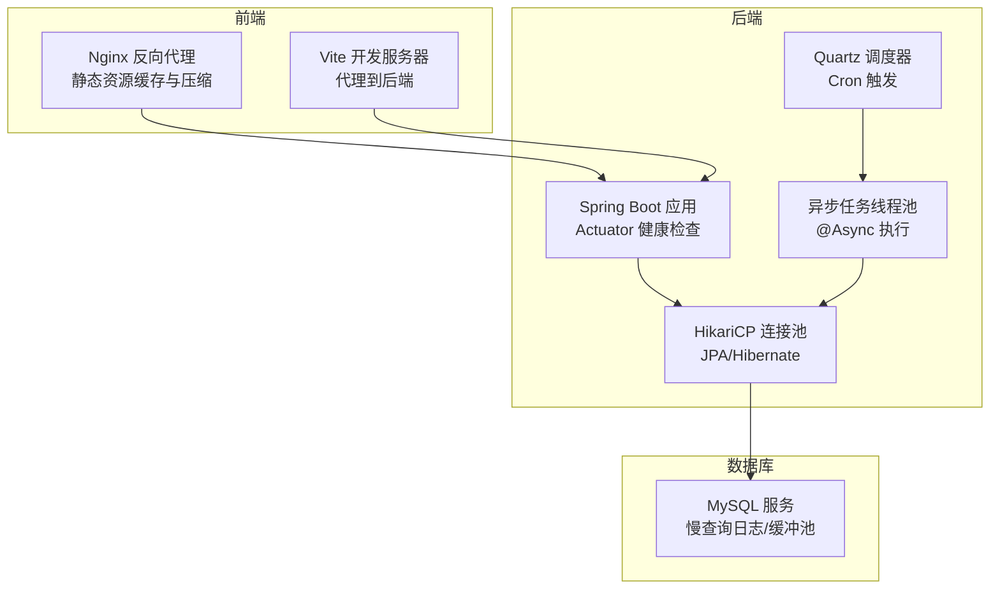
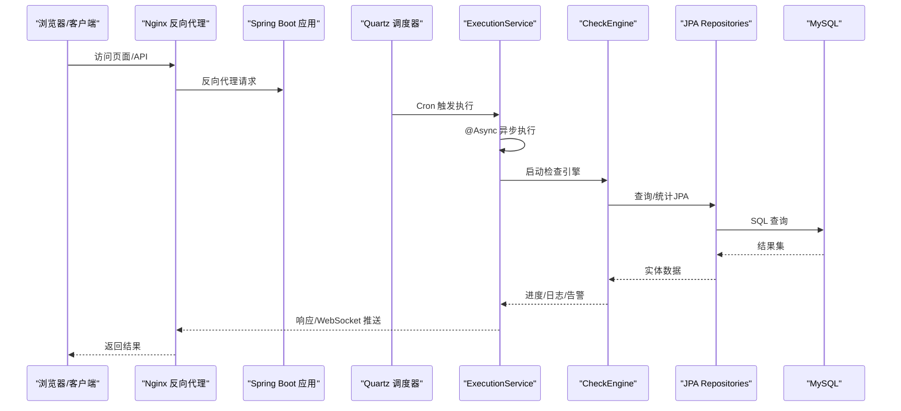
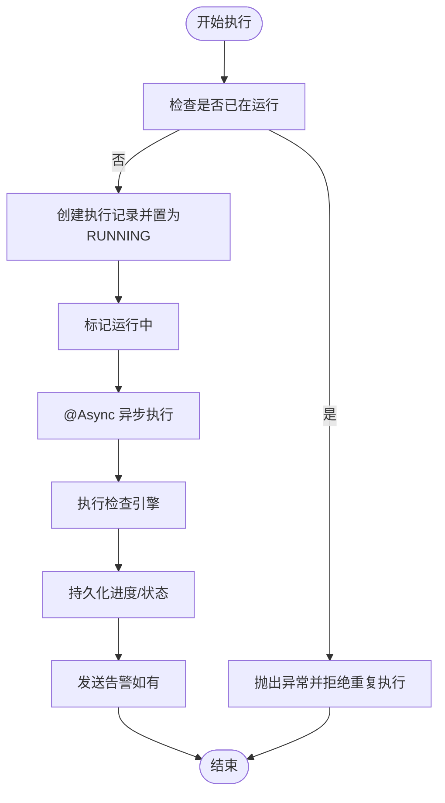
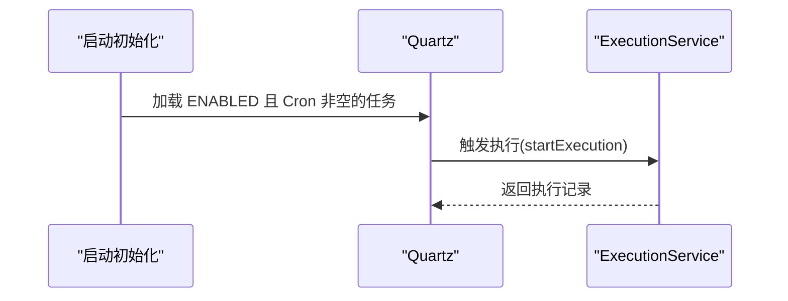
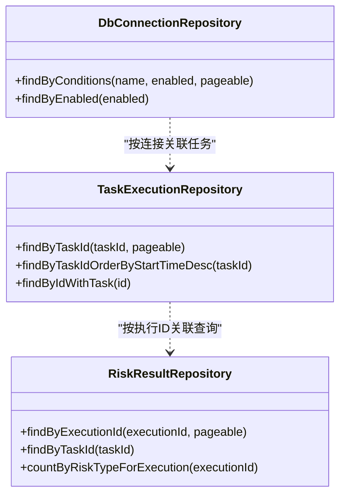
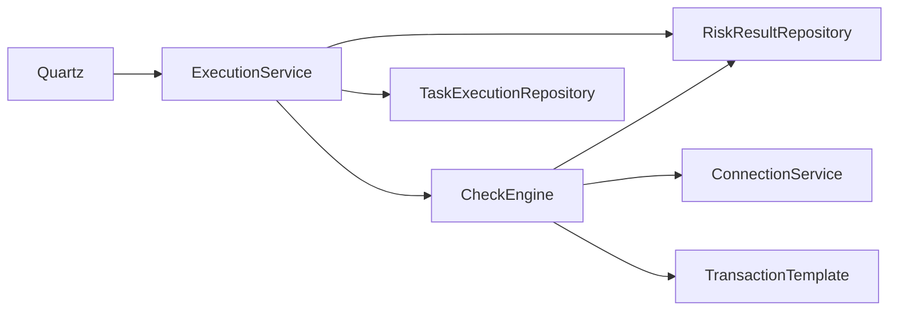

# 性能优化

<cite>
**本文引用的文件**
- [application.yml](file://backend/src/main/resources/application.yml)
- [application-docker.yml](file://backend/src/main/resources/application-docker.yml)
- [AsyncConfig.java](file://backend/src/main/java/com/fieldcheck/config/AsyncConfig.java)
- [JpaConfig.java](file://backend/src/main/java/com/fieldcheck/config/JpaConfig.java)
- [TaskSchedulerConfig.java](file://backend/src/main/java/com/fieldcheck/scheduler/TaskSchedulerConfig.java)
- [ExecutionService.java](file://backend/src/main/java/com/fieldcheck/service/ExecutionService.java)
- [CheckEngine.java](file://backend/src/main/java/com/fieldcheck/engine/CheckEngine.java)
- [RiskResultRepository.java](file://backend/src/main/java/com/fieldcheck/repository/RiskResultRepository.java)
- [TaskExecutionRepository.java](file://backend/src/main/java/com/fieldcheck/repository/TaskExecutionRepository.java)
- [DbConnectionRepository.java](file://backend/src/main/java/com/fieldcheck/repository/DbConnectionRepository.java)
- [vite.config.ts](file://frontend/vite.config.ts)
- [nginx.conf](file://frontend/nginx.conf)
- [my.cnf](file://mysql/conf/my.cnf)
- [docker-compose.yml](file://docker-compose.yml)
- [pom.xml](file://backend/pom.xml)
</cite>

## 目录
1. [引言](#引言)
2. [项目结构](#项目结构)
3. [核心组件](#核心组件)
4. [架构总览](#架构总览)
5. [详细组件分析](#详细组件分析)
6. [依赖分析](#依赖分析)
7. [性能考量与优化策略](#性能考量与优化策略)
8. [故障排查指南](#故障排查指南)
9. [结论](#结论)
10. [附录：基准测试与压测方法](#附录：基准测试与压测方法)

## 引言
本文件面向系统性能优化，围绕异步任务与线程池、JPA 查询与缓存、任务调度器并发控制、数据库连接池与连接复用、前端静态资源与缓存、内存与 GC 调优、以及性能监控与瓶颈分析方法展开。文档以仓库中的实际配置与实现为依据，提供可落地的优化建议与最佳实践。

## 项目结构
后端采用 Spring Boot + JPA + Quartz；前端基于 Vue + Vite/Nginx；数据库为 MySQL。整体通过 Docker Compose 组合部署，具备容器化健康检查与日志卷挂载。

图表来源
- [docker-compose.yml](file://docker-compose.yml#L1-L91)
- [nginx.conf](file://frontend/nginx.conf#L1-L69)
- [application.yml](file://backend/src/main/resources/application.yml#L1-L75)
- [application-docker.yml](file://backend/src/main/resources/application-docker.yml#L1-L46)

章节来源
- [docker-compose.yml](file://docker-compose.yml#L1-L91)
- [frontend/vite.config.ts](file://frontend/vite.config.ts#L1-L31)
- [frontend/nginx.conf](file://frontend/nginx.conf#L1-L69)
- [backend/src/main/resources/application.yml](file://backend/src/main/resources/application.yml#L1-L75)
- [backend/src/main/resources/application-docker.yml](file://backend/src/main/resources/application-docker.yml#L1-L46)

## 核心组件
- 异步任务与线程池：通过自定义线程池执行器承载高并发检查任务，避免阻塞主线程。
- 任务调度器：基于 Quartz 的 Cron 触发，按任务配置周期性调度。
- JPA/Hibernate：统一审计注解启用，SQL 输出关闭，方言适配 MySQL 5.7。
- 数据源与连接池：HikariCP 默认参数在开发与生产环境分别配置，具备连接超时、空闲回收、验证等能力。
- 前端：Nginx 提供静态资源缓存与压缩，Vite 本地开发代理后端接口与 WebSocket。

章节来源
- [AsyncConfig.java](file://backend/src/main/java/com/fieldcheck/config/AsyncConfig.java#L1-L31)
- [TaskSchedulerConfig.java](file://backend/src/main/java/com/fieldcheck/scheduler/TaskSchedulerConfig.java#L1-L95)
- [JpaConfig.java](file://backend/src/main/java/com/fieldcheck/config/JpaConfig.java#L1-L10)
- [application.yml](file://backend/src/main/resources/application.yml#L8-L31)
- [application-docker.yml](file://backend/src/main/resources/application-docker.yml#L4-L22)
- [vite.config.ts](file://frontend/vite.config.ts#L1-L31)
- [nginx.conf](file://frontend/nginx.conf#L1-L69)

## 架构总览
下图展示从调度到执行、数据库交互与前端访问的关键路径与性能相关配置点。

图表来源
- [TaskSchedulerConfig.java](file://backend/src/main/java/com/fieldcheck/scheduler/TaskSchedulerConfig.java#L75-L93)
- [ExecutionService.java](file://backend/src/main/java/com/fieldcheck/service/ExecutionService.java#L165-L210)
- [CheckEngine.java](file://backend/src/main/java/com/fieldcheck/engine/CheckEngine.java#L57-L139)
- [RiskResultRepository.java](file://backend/src/main/java/com/fieldcheck/repository/RiskResultRepository.java#L16-L61)
- [TaskExecutionRepository.java](file://backend/src/main/java/com/fieldcheck/repository/TaskExecutionRepository.java#L16-L40)
- [nginx.conf](file://frontend/nginx.conf#L32-L57)

## 详细组件分析

### 异步任务与线程池优化
- 线程池参数
  - 核心/最大线程数：由应用配置注入，核心线程数等于最大并发任务数，最大线程数为核心两倍，队列容量 100，拒绝策略为调用方运行策略，降低丢任务风险。
  - 线程命名：统一前缀便于定位与监控。
- 并发控制
  - 内存级运行状态 Map 用于防止重复执行，结合数据库状态清理与异常中断恢复，提升一致性。
  - 自调用 @Async 通过 @Lazy 注入代理生效，确保异步上下文正确传播。
- 关键路径
  - 启动执行：创建执行记录并立即标记运行中，随后触发异步执行。
  - 异步执行：加载任务实体并执行检查引擎，期间通过回调推送日志与进度，最终持久化状态并触发告警。
- 优化建议
  - 动态调整核心线程数与队列容量，结合任务耗时分布与 CPU 核心数评估。
  - 对长尾任务增加超时与重试策略，避免线程池饱和。
  - 监控拒绝次数与队列长度，作为扩容信号。

图表来源
- [ExecutionService.java](file://backend/src/main/java/com/fieldcheck/service/ExecutionService.java#L107-L210)
- [AsyncConfig.java](file://backend/src/main/java/com/fieldcheck/config/AsyncConfig.java#L16-L29)

章节来源
- [AsyncConfig.java](file://backend/src/main/java/com/fieldcheck/config/AsyncConfig.java#L1-L31)
- [ExecutionService.java](file://backend/src/main/java/com/fieldcheck/service/ExecutionService.java#L107-L210)

### 任务调度器性能调优与并发控制
- 初始化策略：启动时加载启用且配置了 Cron 的任务，逐个创建 Job 与 Trigger，并移除旧任务避免重复。
- 触发机制：CronTrigger 基于 Quartz，触发后委托 ExecutionService 启动执行。
- 并发控制：结合应用层运行状态 Map 与数据库状态，避免重复执行；异常中断时回写失败状态。
- 优化建议
  - Cron 设计遵循“均匀分布”，避免多个任务在同一时刻触发。
  - 对高频任务采用指数退避或去重策略，减少抖动。
  - 监控调度延迟与执行耗时，必要时拆分任务或引入外部消息队列削峰。

图表来源
- [TaskSchedulerConfig.java](file://backend/src/main/java/com/fieldcheck/scheduler/TaskSchedulerConfig.java#L25-L65)
- [ExecutionService.java](file://backend/src/main/java/com/fieldcheck/service/ExecutionService.java#L107-L163)

章节来源
- [TaskSchedulerConfig.java](file://backend/src/main/java/com/fieldcheck/scheduler/TaskSchedulerConfig.java#L1-L95)
- [ExecutionService.java](file://backend/src/main/java/com/fieldcheck/service/ExecutionService.java#L107-L163)

### JPA 查询优化与缓存配置
- SQL 输出：生产环境关闭 show-sql，避免日志开销。
- 方言与格式化：MySQL 5.7 方言，格式化 SQL 仅在开发环境开启。
- 审计注解：启用 JPA 审计，统一记录创建/更新时间与操作者。
- 查询优化要点
  - 使用 JOIN FETCH 预加载关联对象，避免 N+1 查询（示例：按 ID 获取执行记录并预加载任务与连接）。
  - 分页查询配合索引与覆盖查询，避免全表扫描。
  - 条件查询尽量使用精确匹配与合适的 LIKE 模式，必要时引入全文索引或二级索引。
  - 避免一次性加载大结果集，优先分页或流式处理。
- 缓存建议
  - 对只读或低频变更的数据使用二级缓存（需额外配置），注意缓存失效策略。
  - 对热点统计类查询，可引入 Redis 缓存聚合结果，定期刷新。

图表来源
- [TaskExecutionRepository.java](file://backend/src/main/java/com/fieldcheck/repository/TaskExecutionRepository.java#L16-L40)
- [RiskResultRepository.java](file://backend/src/main/java/com/fieldcheck/repository/RiskResultRepository.java#L16-L61)
- [DbConnectionRepository.java](file://backend/src/main/java/com/fieldcheck/repository/DbConnectionRepository.java#L14-L26)

章节来源
- [application.yml](file://backend/src/main/resources/application.yml#L24-L31)
- [JpaConfig.java](file://backend/src/main/java/com/fieldcheck/config/JpaConfig.java#L1-L10)
- [TaskExecutionRepository.java](file://backend/src/main/java/com/fieldcheck/repository/TaskExecutionRepository.java#L38-L40)
- [RiskResultRepository.java](file://backend/src/main/java/com/fieldcheck/repository/RiskResultRepository.java#L16-L61)
- [DbConnectionRepository.java](file://backend/src/main/java/com/fieldcheck/repository/DbConnectionRepository.java#L14-L26)

### 数据库连接池配置与连接复用
- HikariCP 参数
  - 最大池大小、最小空闲、空闲超时、连接超时、最大生存时间、连接测试查询、空闲/借用验证、验证超时。
  - 生产环境与 Docker 环境参数略有差异（如最大生存时间），以适应不同部署形态。
- 连接复用策略
  - 通过池化复用连接，减少握手与认证开销。
  - 合理设置连接超时与空闲回收，避免连接泄漏与资源占用。
- 优化建议
  - 结合业务 QPS 与平均事务时长估算池大小，观察连接池指标（活跃/空闲/等待）。
  - 对长事务与批处理场景，考虑专用数据源或连接池隔离。
  - 启用连接池监控（如 Actuator 指标）与慢查询日志联动分析。

章节来源
- [application.yml](file://backend/src/main/resources/application.yml#L13-L22)
- [application-docker.yml](file://backend/src/main/resources/application-docker.yml#L9-L14)
- [docker-compose.yml](file://docker-compose.yml#L37-L57)

### 前端资源优化与静态文件缓存
- Nginx 配置
  - Gzip 压缩：对文本与 JSON 等类型启用压缩，降低带宽。
  - 安全头：统一添加安全响应头，增强防护。
  - 静态资源缓存：JS/CSS/字体/图标等设置一年缓存与 immutable 标记，显著减少重复下载。
  - API 与 WebSocket 代理：设置合理的超时与头部透传。
- Vite 开发配置
  - 本地代理到后端 8080，WebSocket 代理支持。
- 优化建议
  - 构建产物开启内容哈希，结合缓存策略实现“版本化缓存”。
  - 图片与媒体资源采用现代格式（WebP/AVIF）并按需懒加载。
  - 使用 CDN 加速静态资源，结合 HTTPS 与缓存头。

章节来源
- [nginx.conf](file://frontend/nginx.conf#L7-L69)
- [vite.config.ts](file://frontend/vite.config.ts#L16-L30)

### 内存使用优化与垃圾回收调优
- Java 版本：项目使用 Java 8，适合稳定与兼容性要求高的场景。
- 建议
  - 在容器环境中设置 JVM 堆大小与元空间上限，避免 OOM。
  - 选择合适 GC 策略（如 G1GC），结合停顿目标与吞吐量需求进行调优。
  - 监控堆外内存（直接内存、线程栈、编译器）与第三方库（如 HikariCP/Netty）的内存占用。
  - 对大对象与集合进行及时释放，避免长时间驻留堆内。

章节来源
- [pom.xml](file://backend/pom.xml#L21-L26)

## 依赖分析
- 外部依赖
  - Spring Boot Starter Web、Data JPA、Security、WebSocket、Validation、AOP、Quartz、Mail。
  - MySQL Connector/J、JWT、Apache Commons、POI、HTTP Client、H2 测试库。
- 组件耦合
  - ExecutionService 依赖 CheckEngine、AlertService、TaskService 与 JPA 存储。
  - CheckEngine 直接使用 JDBC 访问 MySQL，涉及大量信息_schema 查询与采样逻辑。
  - Quartz 与 ExecutionService 解耦，通过 Job 与触发器解耦调度与执行。

图表来源
- [ExecutionService.java](file://backend/src/main/java/com/fieldcheck/service/ExecutionService.java#L34-L67)
- [CheckEngine.java](file://backend/src/main/java/com/fieldcheck/engine/CheckEngine.java#L26-L32)
- [TaskSchedulerConfig.java](file://backend/src/main/java/com/fieldcheck/scheduler/TaskSchedulerConfig.java#L75-L93)

章节来源
- [pom.xml](file://backend/pom.xml#L28-L142)

## 性能考量与优化策略

### 异步任务与线程池
- 线程池参数
  - 核心线程数：由应用配置注入，建议与 CPU 核心数与任务特征匹配。
  - 最大队列：100，建议结合拒绝策略与监控指标动态调整。
  - 拒绝策略：CallerRunsPolicy，降低丢任务概率但可能放大主线程压力。
- 并发控制
  - 内存 Map + 数据库状态双重校验，避免重复执行与状态不一致。
  - 自调用 @Async 代理生效，保证事务与安全上下文。
- 优化建议
  - 引入有界队列与拒绝监控，必要时降级为同步或延迟队列。
  - 对 IO 密集型任务可考虑使用更小的核心线程与更大的队列。

章节来源
- [AsyncConfig.java](file://backend/src/main/java/com/fieldcheck/config/AsyncConfig.java#L16-L29)
- [ExecutionService.java](file://backend/src/main/java/com/fieldcheck/service/ExecutionService.java#L107-L210)

### 任务调度器并发控制
- Cron 设计：避免高峰重叠，合理拆分任务。
- 去重与恢复：启动时清理异常中断的执行记录，避免脏状态。
- 优化建议
  - 引入分布式锁或外部队列（如 Kafka/RabbitMQ）削峰填谷。
  - 对长任务拆分为子任务，支持断点续跑与进度上报。

章节来源
- [TaskSchedulerConfig.java](file://backend/src/main/java/com/fieldcheck/scheduler/TaskSchedulerConfig.java#L25-L73)
- [ExecutionService.java](file://backend/src/main/java/com/fieldcheck/service/ExecutionService.java#L111-L126)

### JPA 查询与缓存
- 查询优化
  - JOIN FETCH 预加载，避免 N+1。
  - 分页与排序索引，避免全表扫描。
  - 条件过滤尽量使用精确匹配，避免函数包裹导致索引失效。
- 缓存
  - 二级缓存与查询缓存（需配置）。
  - 热点统计结果 Redis 缓存，定期刷新。
- 优化建议
  - 使用 Explain 分析慢查询，补充缺失索引。
  - 对大结果集采用流式查询或分页游标。

章节来源
- [TaskExecutionRepository.java](file://backend/src/main/java/com/fieldcheck/repository/TaskExecutionRepository.java#L38-L40)
- [RiskResultRepository.java](file://backend/src/main/java/com/fieldcheck/repository/RiskResultRepository.java#L27-L50)

### 数据库连接池与连接复用
- 参数建议
  - 最大池大小：根据 QPS 与平均事务时长估算。
  - 连接超时与空闲回收：平衡资源占用与创建成本。
  - 验证策略：开启空闲/借用验证，确保连接可用性。
- 优化建议
  - 监控连接池指标，结合慢查询日志定位瓶颈。
  - 对批处理与长事务使用独立数据源隔离。

章节来源
- [application.yml](file://backend/src/main/resources/application.yml#L13-L22)
- [application-docker.yml](file://backend/src/main/resources/application-docker.yml#L9-L14)

### 前端资源与静态文件缓存
- Nginx
  - Gzip 压缩与静态资源一年缓存，显著降低带宽与首屏时间。
  - API 与 WebSocket 代理超时合理设置，避免连接泄漏。
- Vite
  - 本地代理简化跨域与热更新。
- 优化建议
  - 构建产物内容哈希化，结合缓存头实现长期缓存。
  - 图片与媒体资源按需懒加载与格式优化。

章节来源
- [nginx.conf](file://frontend/nginx.conf#L7-L69)
- [vite.config.ts](file://frontend/vite.config.ts#L16-L30)

### 内存与垃圾回收
- 建议
  - 设置 JVM 堆大小与元空间上限，避免 OOM。
  - 选择 G1GC 并设定停顿目标，结合业务 SLA 调优。
  - 监控堆外内存与第三方库占用，及时释放大对象。
- 优化建议
  - 对大集合与临时对象及时置空，避免长生命周期持有。
  - 使用内存分析工具定位内存泄漏与热点对象。

章节来源
- [pom.xml](file://backend/pom.xml#L21-L26)

## 故障排查指南
- 连接池问题
  - 现象：连接耗尽、超时频繁。
  - 排查：检查最大池大小、连接超时、空闲回收与验证配置；查看 Actuator 指标。
- 异步任务堆积
  - 现象：队列长度持续增长、拒绝次数上升。
  - 排查：核对线程池参数、任务耗时分布与业务流量；考虑扩容或降级。
- 调度未触发/重复执行
  - 现象：任务未按时执行或重复执行。
  - 排查：确认 Cron 表达式、Quartz 作业存在性与数据库状态一致性。
- JPA 查询缓慢
  - 现象：分页查询慢、N+1。
  - 排查：使用 Explain 分析、补充索引、使用 JOIN FETCH 或流式查询。
- 前端资源加载慢
  - 现象：首屏时间长、资源重复下载。
  - 排查：检查缓存头、Gzip 是否生效、CDN 配置。

章节来源
- [application.yml](file://backend/src/main/resources/application.yml#L13-L22)
- [application-docker.yml](file://backend/src/main/resources/application-docker.yml#L9-L14)
- [AsyncConfig.java](file://backend/src/main/java/com/fieldcheck/config/AsyncConfig.java#L16-L29)
- [TaskSchedulerConfig.java](file://backend/src/main/java/com/fieldcheck/scheduler/TaskSchedulerConfig.java#L25-L73)
- [nginx.conf](file://frontend/nginx.conf#L7-L69)

## 结论
本项目在异步执行、任务调度、JPA 查询与连接池方面已具备基础优化能力。建议进一步完善监控指标、引入分布式调度与缓存、细化 GC 与 JVM 参数，并结合实际业务负载进行参数校准与压测验证，以获得更稳健的性能表现。

## 附录：基准测试与压测方法
- 基准测试
  - 场景：单任务执行、多任务并发、批量导入/导出、报表生成。
  - 指标：吞吐量、P95/P99 延迟、CPU/内存/GC 次数、连接池命中率。
- 压力测试
  - 工具：JMeter/Locust/Wrk2。
  - 脚本：模拟登录、任务创建、执行、日志订阅、报表下载。
  - 观察点：线程池拒绝率、数据库连接池等待时间、慢查询比例。
- 性能监控与瓶颈分析
  - 指标：Actuator 指标、APM（如 SkyWalking/Jaeger）、Prometheus/Grafana。
  - 方法：火焰图、调用链追踪、数据库慢查询日志与 EXPLAIN 分析。
  - 瓶颈定位：CPU 热点、IO 等待、锁竞争、网络往返、序列化开销。

章节来源
- [docker-compose.yml](file://docker-compose.yml#L52-L57)
- [my.cnf](file://mysql/conf/my.cnf#L15-L18)