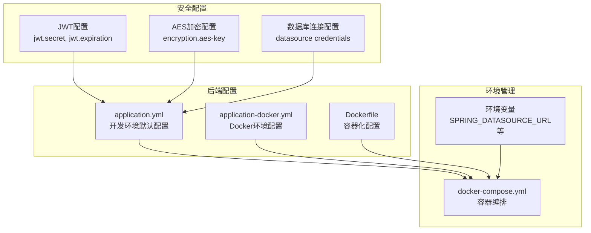
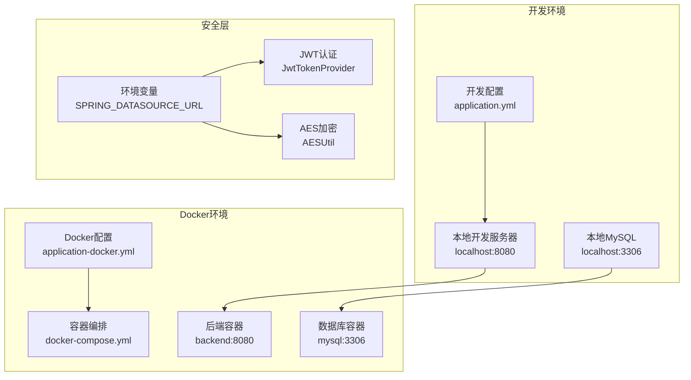
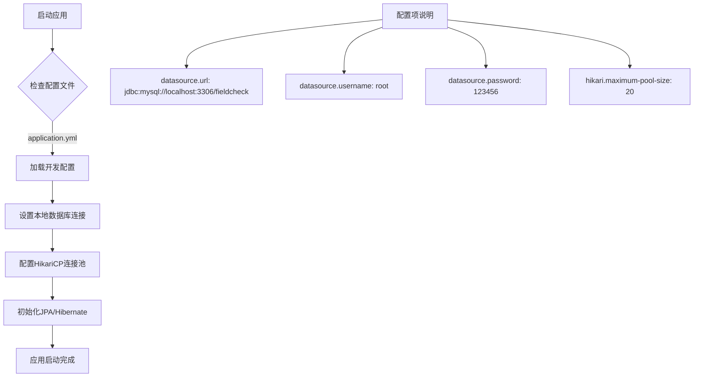
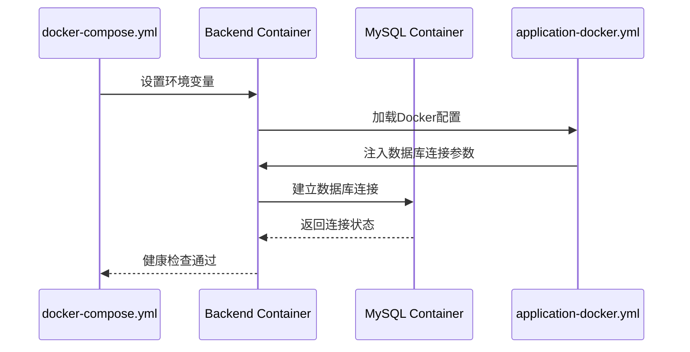
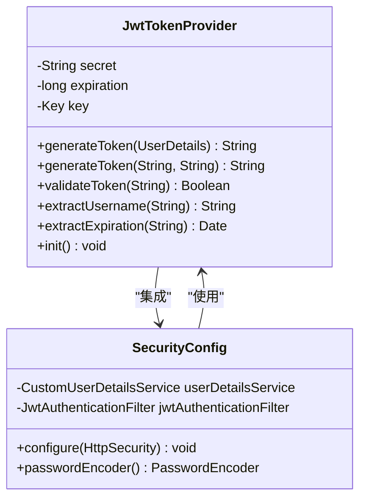
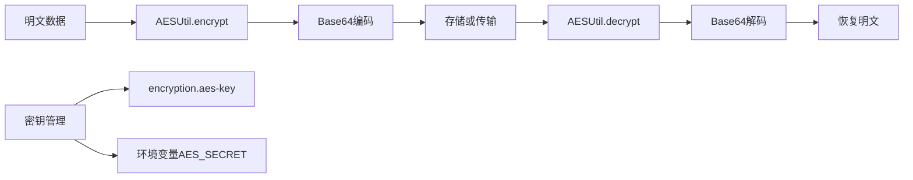
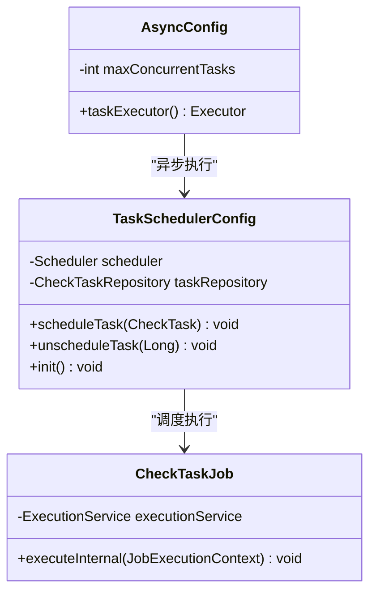
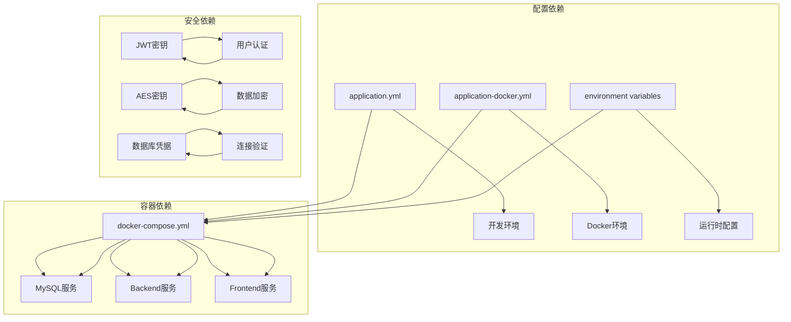
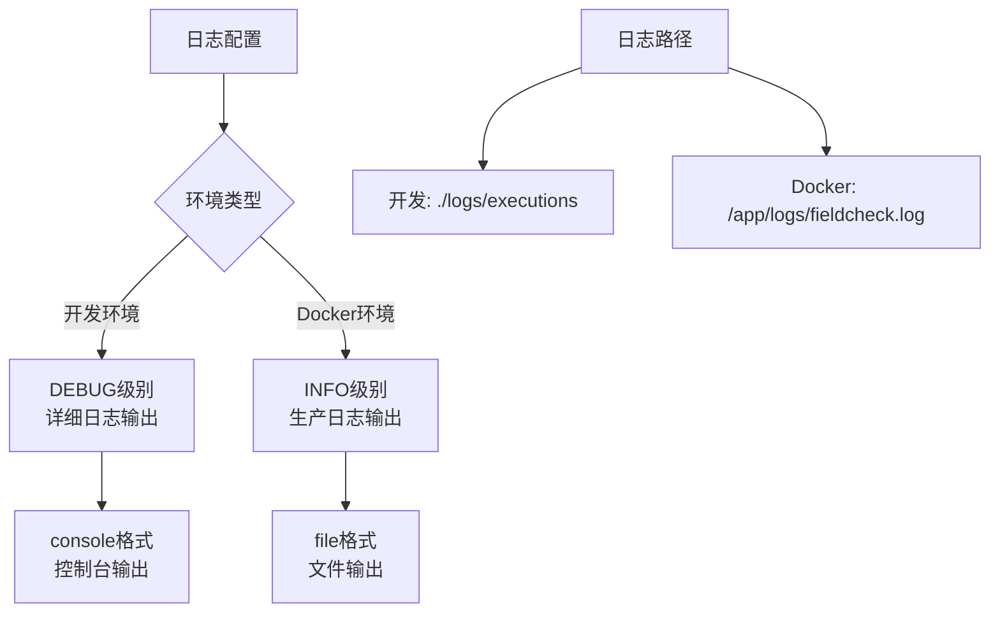

# 环境配置管理

<cite>
**本文档引用的文件**
- [application.yml](file://backend/src/main/resources/application.yml)
- [application-docker.yml](file://backend/src/main/resources/application-docker.yml)
- [Dockerfile](file://backend/Dockerfile)
- [docker-compose.yml](file://docker-compose.yml)
- [pom.xml](file://backend/pom.xml)
- [SecurityConfig.java](file://backend/src/main/java/com/fieldcheck/config/SecurityConfig.java)
- [JwtTokenProvider.java](file://backend/src/main/java/com/fieldcheck/security/JwtTokenProvider.java)
- [AESUtil.java](file://backend/src/main/java/com/fieldcheck/util/AESUtil.java)
- [AsyncConfig.java](file://backend/src/main/java/com/fieldcheck/config/AsyncConfig.java)
- [TaskSchedulerConfig.java](file://backend/src/main/java/com/fieldcheck/scheduler/TaskSchedulerConfig.java)
- [my.cnf](file://mysql/conf/my.cnf)
</cite>

## 目录
1. [简介](#简介)
2. [项目结构](#项目结构)
3. [核心组件](#核心组件)
4. [架构概览](#架构概览)
5. [详细组件分析](#详细组件分析)
6. [依赖分析](#依赖分析)
7. [性能考虑](#性能考虑)
8. [故障排除指南](#故障排除指南)
9. [结论](#结论)
10. [附录](#附录)

## 简介

本项目是一个基于Spring Boot的MySQL字段容量风险检查平台，采用多环境配置管理策略。本文档详细说明了开发、测试和生产环境的配置差异与最佳实践，解释了application.yml和application-docker.yml的配置项含义和使用场景，提供了敏感信息安全管理方案，包括数据库密码、JWT密钥和AES密钥的配置方法，并给出了环境变量设置指南和安全存储策略。

## 项目结构

项目采用前后端分离架构，后端使用Spring Boot框架，前端使用Vue.js技术栈。配置文件主要位于后端项目的resources目录中。

**图表来源**
- [application.yml](file://backend/src/main/resources/application.yml#L1-L75)
- [application-docker.yml](file://backend/src/main/resources/application-docker.yml#L1-L46)
- [docker-compose.yml](file://docker-compose.yml#L1-L91)

**章节来源**
- [application.yml](file://backend/src/main/resources/application.yml#L1-L75)
- [application-docker.yml](file://backend/src/main/resources/application-docker.yml#L1-L46)
- [docker-compose.yml](file://docker-compose.yml#L1-L91)

## 核心组件

### 配置文件层次结构

系统采用Spring Boot的配置文件层次结构，支持多环境配置：

1. **基础配置**：application.yml - 开发环境默认配置
2. **环境特定配置**：application-docker.yml - Docker环境专用配置
3. **容器化配置**：Dockerfile - 容器运行时配置
4. **编排配置**：docker-compose.yml - 多容器服务编排

### 环境配置差异

| 配置项 | 开发环境(application.yml) | Docker环境(application-docker.yml) | 用途 |
|--------|---------------------------|-----------------------------------|------|
| 数据库URL | localhost:3306 | mysql:3306 | 数据库连接地址 |
| 数据库用户名 | root | fieldcheck | 数据库认证 |
| 数据库密码 | 123456 | fieldcheck123 | 数据库认证 |
| JWT密钥 | YourSecretKey... | your-super-secret-key... | Token签名密钥 |
| AES密钥 | AES256BitKeyFor... | fieldcheck-aes-key | 密码加密密钥 |
| 日志级别 | DEBUG | INFO | 应用日志输出 |

**章节来源**
- [application.yml](file://backend/src/main/resources/application.yml#L8-L62)
- [application-docker.yml](file://backend/src/main/resources/application-docker.yml#L4-L29)

## 架构概览

系统采用微服务架构，通过Docker容器化部署，支持多环境配置管理。

**图表来源**
- [docker-compose.yml](file://docker-compose.yml#L30-L59)
- [application.yml](file://backend/src/main/resources/application.yml#L1-L75)
- [application-docker.yml](file://backend/src/main/resources/application-docker.yml#L1-L46)

## 详细组件分析

### 数据库配置管理

#### 开发环境配置
开发环境使用本地MySQL数据库，配置相对简单，便于快速开发和调试。

**图表来源**
- [application.yml](file://backend/src/main/resources/application.yml#L8-L23)

#### Docker环境配置
Docker环境通过环境变量注入配置，支持动态配置和容器化部署。

**图表来源**
- [docker-compose.yml](file://docker-compose.yml#L37-L43)
- [application-docker.yml](file://backend/src/main/resources/application-docker.yml#L4-L14)

**章节来源**
- [application.yml](file://backend/src/main/resources/application.yml#L8-L23)
- [application-docker.yml](file://backend/src/main/resources/application-docker.yml#L4-L14)
- [docker-compose.yml](file://docker-compose.yml#L37-L43)

### JWT安全配置

JWT配置用于用户身份认证和授权，包含密钥管理和过期时间设置。

**图表来源**
- [JwtTokenProvider.java](file://backend/src/main/java/com/fieldcheck/security/JwtTokenProvider.java#L16-L30)
- [SecurityConfig.java](file://backend/src/main/java/com/fieldcheck/config/SecurityConfig.java#L23-L58)

JWT配置的关键参数：

| 参数 | 默认值 | 说明 | 安全建议 |
|------|--------|------|----------|
| jwt.secret | YourSecretKeyForJWTToken... | HMAC-SHA256密钥 | 使用至少256位随机密钥 |
| jwt.expiration | 86400000 (24小时) | Token过期时间(ms) | 生产环境建议更短的过期时间 |
| spring.profiles.active | docker | 激活的配置文件 | 开发环境可设为default |

**章节来源**
- [application.yml](file://backend/src/main/resources/application.yml#L55-L58)
- [application-docker.yml](file://backend/src/main/resources/application-docker.yml#L24-L26)
- [JwtTokenProvider.java](file://backend/src/main/java/com/fieldcheck/security/JwtTokenProvider.java#L19-L23)

### AES加密配置

AES加密用于保护敏感数据，如数据库连接密码等。

**图表来源**
- [AESUtil.java](file://backend/src/main/java/com/fieldcheck/util/AESUtil.java#L15-L45)

AES配置的关键参数：

| 参数 | 默认值 | 说明 | 安全建议 |
|------|--------|------|----------|
| encryption.aes-key | AES256BitKeyForPasswordEncryption! | AES-256密钥 | 使用32字节(256位)随机密钥 |
| aes.secret | fieldcheck-aes-key | Docker环境密钥 | 生产环境必须使用强密钥 |

**章节来源**
- [application.yml](file://backend/src/main/resources/application.yml#L60-L62)
- [application-docker.yml](file://backend/src/main/resources/application-docker.yml#L28-L29)
- [AESUtil.java](file://backend/src/main/java/com/fieldcheck/util/AESUtil.java#L12-L13)

### 应用程序配置

应用程序配置管理并发任务和日志设置。

**图表来源**
- [AsyncConfig.java](file://backend/src/main/java/com/fieldcheck/config/AsyncConfig.java#L14-L29)
- [TaskSchedulerConfig.java](file://backend/src/main/java/com/fieldcheck/scheduler/TaskSchedulerConfig.java#L20-L36)

**章节来源**
- [AsyncConfig.java](file://backend/src/main/java/com/fieldcheck/config/AsyncConfig.java#L16-L17)
- [TaskSchedulerConfig.java](file://backend/src/main/java/com/fieldcheck/scheduler/TaskSchedulerConfig.java#L25-L36)

## 依赖分析

系统依赖关系主要体现在配置文件之间的相互作用和容器间的通信。

**图表来源**
- [docker-compose.yml](file://docker-compose.yml#L30-L59)
- [application.yml](file://backend/src/main/resources/application.yml#L8-L62)
- [application-docker.yml](file://backend/src/main/resources/application-docker.yml#L4-L29)

**章节来源**
- [pom.xml](file://backend/pom.xml#L28-L87)
- [docker-compose.yml](file://docker-compose.yml#L30-L59)

## 性能考虑

### 连接池配置

系统使用HikariCP作为数据库连接池，针对不同环境进行了优化：

| 参数 | 开发环境 | Docker环境 | 优化目的 |
|------|----------|------------|----------|
| maximum-pool-size | 20 | 20 | 最大连接数限制 |
| minimum-idle | 5 | 5 | 最小空闲连接 |
| connection-timeout | 20000 | 20000 | 连接超时时间(ms) |
| idle-timeout | 300000 | 300000 | 空闲超时时间(ms) |
| max-lifetime | 1800000 | 1200000 | 连接最大生命周期 |

### 日志配置

日志配置根据环境调整输出级别和格式：

**图表来源**
- [application.yml](file://backend/src/main/resources/application.yml#L69-L75)
- [application-docker.yml](file://backend/src/main/resources/application-docker.yml#L31-L36)

**章节来源**
- [application.yml](file://backend/src/main/resources/application.yml#L13-L22)
- [application-docker.yml](file://backend/src/main/resources/application-docker.yml#L9-L14)

## 故障排除指南

### 常见配置问题

#### 数据库连接失败
1. **检查数据库服务状态**
   - 确认MySQL容器已启动且健康
   - 验证数据库凭据正确性

2. **验证网络连接**
   - 开发环境使用localhost:3306
   - Docker环境使用mysql:3306

3. **检查连接池配置**
   - 调整maximum-pool-size参数
   - 验证连接超时设置

#### JWT认证失败
1. **验证密钥配置**
   - 确认jwt.secret长度足够
   - 检查密钥是否在所有环境中一致

2. **检查Token过期时间**
   - 验证jwt.expiration设置合理
   - 确认客户端处理过期Token逻辑

#### AES加密错误
1. **验证密钥长度**
   - 确认使用32字节(256位)密钥
   - 检查密钥字符集编码

2. **检查加密算法**
   - 确认使用AES/CBC/PKCS5Padding
   - 验证IV参数设置

**章节来源**
- [docker-compose.yml](file://docker-compose.yml#L22-L26)
- [JwtTokenProvider.java](file://backend/src/main/java/com/fieldcheck/security/JwtTokenProvider.java#L27-L30)
- [AESUtil.java](file://backend/src/main/java/com/fieldcheck/util/AESUtil.java#L12-L13)

## 结论

本项目实现了完整的多环境配置管理体系，通过以下关键特性确保配置管理的有效性：

1. **环境隔离**：开发和Docker环境使用不同的配置文件，避免配置冲突
2. **安全优先**：敏感信息通过环境变量管理，避免硬编码
3. **容器化支持**：Docker配置文件支持动态环境变量注入
4. **性能优化**：针对不同环境优化连接池和日志配置
5. **故障诊断**：完善的错误处理和日志记录机制

建议在生产环境中进一步强化安全措施，包括使用专门的密钥管理系统、实施配置审计和定期轮换密钥。

## 附录

### 环境变量参考表

| 变量名 | 来源 | 用途 | 必需性 |
|--------|------|------|--------|
| SPRING_PROFILES_ACTIVE | docker-compose.yml | 激活配置文件 | 必需 |
| SPRING_DATASOURCE_URL | docker-compose.yml | 数据库连接URL | 必需 |
| SPRING_DATASOURCE_USERNAME | docker-compose.yml | 数据库用户名 | 必需 |
| SPRING_DATASOURCE_PASSWORD | docker-compose.yml | 数据库密码 | 必需 |
| JWT_SECRET | docker-compose.yml | JWT签名密钥 | 必需 |
| AES_SECRET | docker-compose.yml | AES加密密钥 | 必需 |
| MYSQL_ROOT_PASSWORD | docker-compose.yml | MySQL根密码 | 可选 |
| MYSQL_PASSWORD | docker-compose.yml | 应用数据库密码 | 可选 |

### 配置最佳实践

1. **密钥管理**
   - 使用环境变量存储所有敏感信息
   - 定期轮换JWT和AES密钥
   - 实施密钥访问权限控制

2. **配置验证**
   - 启动时验证必需配置项
   - 实施配置格式验证
   - 建立配置变更审批流程

3. **监控告警**
   - 监控配置加载状态
   - 设置配置变更通知
   - 实施配置回滚机制