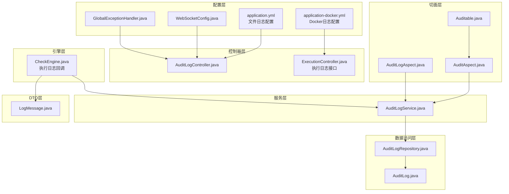
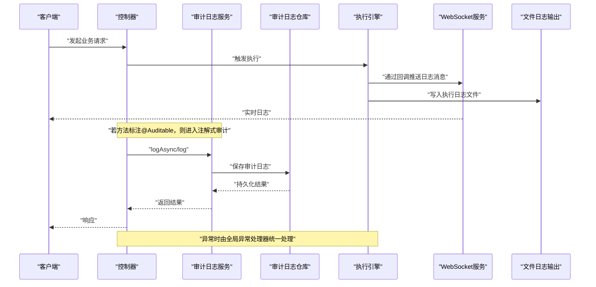
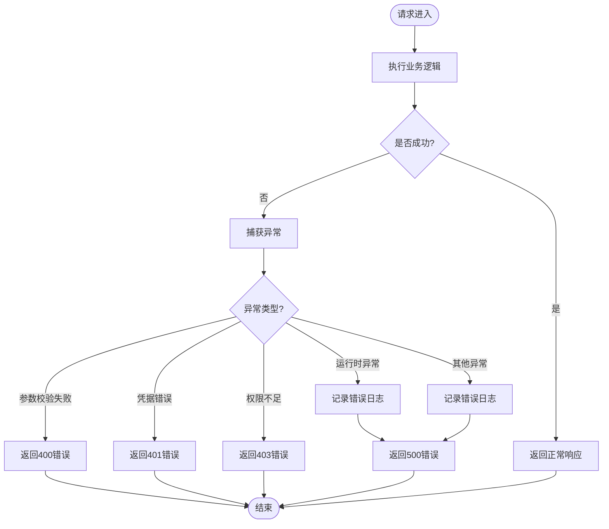
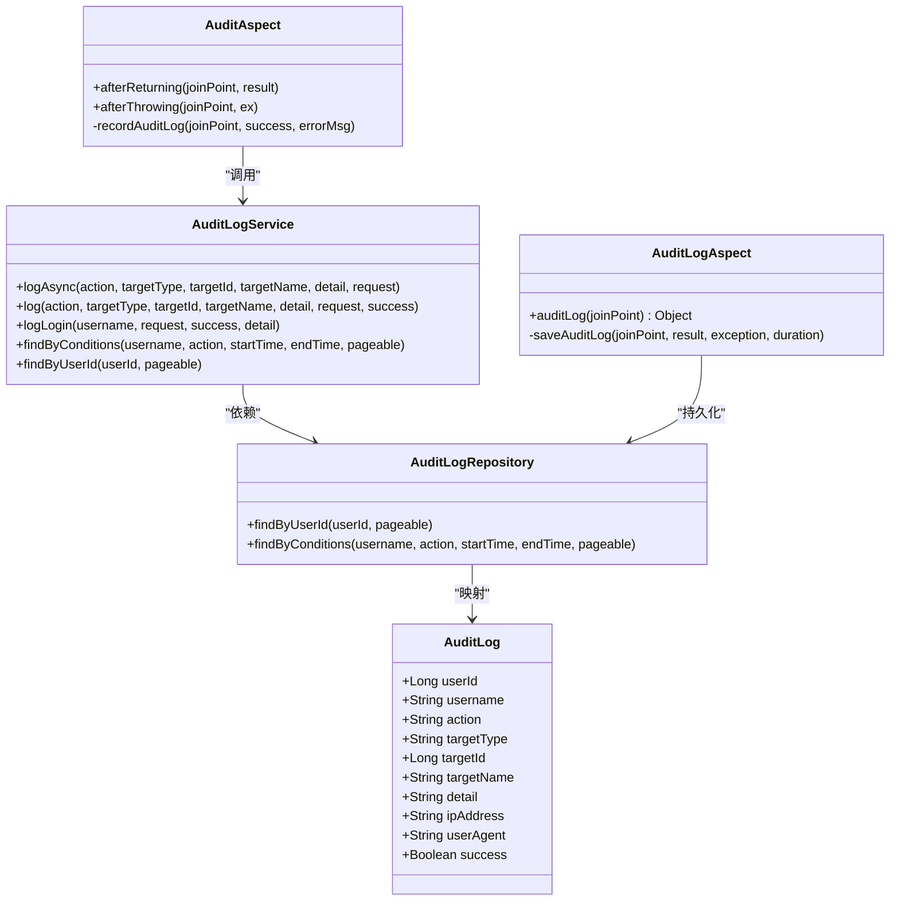
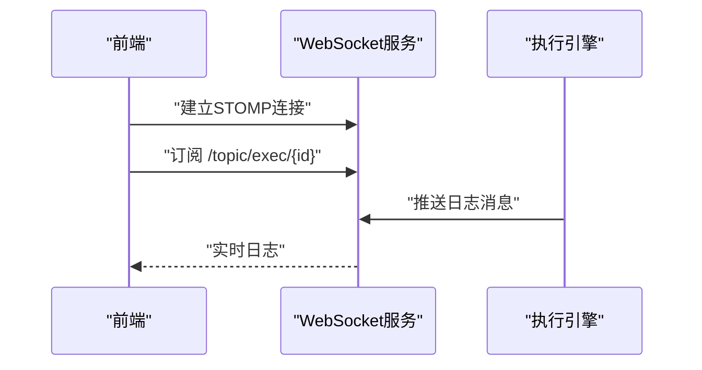
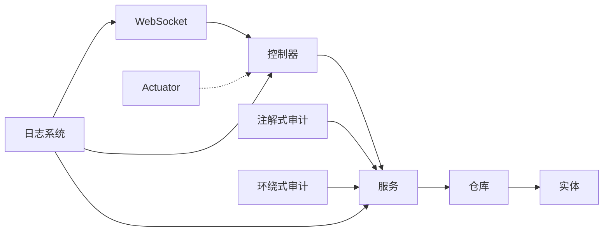

# 监控与日志

<cite>
**本文引用的文件**
- [application.yml](file://backend/src/main/resources/application.yml)
- [application-docker.yml](file://backend/src/main/resources/application-docker.yml)
- [pom.xml](file://backend/pom.xml)
- [GlobalExceptionHandler.java](file://backend/src/main/java/com/fieldcheck/config/GlobalExceptionHandler.java)
- [WebSocketConfig.java](file://backend/src/main/java/com/fieldcheck/config/WebSocketConfig.java)
- [LogMessage.java](file://backend/src/main/java/com/fieldcheck/dto/LogMessage.java)
- [AuditAspect.java](file://backend/src/main/java/com/fieldcheck/aspect/AuditAspect.java)
- [AuditLogAspect.java](file://backend/src/main/java/com/fieldcheck/aspect/AuditLogAspect.java)
- [Auditable.java](file://backend/src/main/java/com/fieldcheck/aspect/Auditable.java)
- [AuditLog.java](file://backend/src/main/java/com/fieldcheck/entity/AuditLog.java)
- [AuditLogRepository.java](file://backend/src/main/java/com/fieldcheck/repository/AuditLogRepository.java)
- [AuditLogService.java](file://backend/src/main/java/com/fieldcheck/service/AuditLogService.java)
- [AuditLogController.java](file://backend/src/main/java/com/fieldcheck/controller/AuditLogController.java)
- [CheckEngine.java](file://backend/src/main/java/com/fieldcheck/engine/CheckEngine.java)
</cite>

## 更新摘要
**所做更改**
- 新增文件日志输出支持章节，详细说明控制台和文件双通道日志配置
- 更新日志级别与日志轮转策略章节，反映新增的文件日志配置
- 新增日志文件管理与存储策略章节，涵盖执行日志文件的组织结构
- 更新配置示例，展示application.yml中的完整日志配置结构
- 新增Docker环境下的日志配置差异说明

## 目录
1. [简介](#简介)
2. [项目结构](#项目结构)
3. [核心组件](#核心组件)
4. [架构总览](#架构总览)
5. [组件详解](#组件详解)
6. [依赖关系分析](#依赖关系分析)
7. [性能与监控](#性能与监控)
8. [故障排查指南](#故障排查指南)
9. [结论](#结论)
10. [附录](#附录)

## 简介
本文件面向系统监控与日志管理，围绕以下主题展开：Spring Boot Actuator 的监控配置与指标采集、全局异常处理与错误日志策略、审计日志的生成、存储与查询、WebSocket 实时日志推送的实现原理与使用方法、**新增的文件日志输出支持**、日志级别与轮转策略、性能监控指标解读与告警配置、日志分析工具集成与使用、以及日志相关的故障排查与性能优化建议。文档在技术深度与可读性之间取得平衡，既适合开发者深入理解实现细节，也便于运维人员快速上手。

## 项目结构
后端采用 Spring Boot 标准目录组织，关键模块包括：
- 配置层：全局异常处理、WebSocket 配置、应用配置
- 切面层：审计日志切面（注解式与环绕式）
- 服务层：审计日志服务（同步/异步）
- 数据访问层：审计日志仓库（JPA）
- 控制器层：审计日志查询接口
- 引擎层：执行引擎，负责业务逻辑与日志回调
- DTO 层：日志消息传输对象

**图表来源**
- [application.yml](file://backend/src/main/resources/application.yml#L69-L77)
- [application-docker.yml](file://backend/src/main/resources/application-docker.yml#L31-L37)
- [WebSocketConfig.java](file://backend/src/main/java/com/fieldcheck/config/WebSocketConfig.java#L1-L26)
- [GlobalExceptionHandler.java](file://backend/src/main/java/com/fieldcheck/config/GlobalExceptionHandler.java#L1-L55)
- [AuditAspect.java](file://backend/src/main/java/com/fieldcheck/aspect/AuditAspect.java#L1-L147)
- [AuditLogAspect.java](file://backend/src/main/java/com/fieldcheck/aspect/AuditLogAspect.java#L1-L241)
- [Auditable.java](file://backend/src/main/java/com/fieldcheck/aspect/Auditable.java#L1-L39)
- [AuditLogService.java](file://backend/src/main/java/com/fieldcheck/service/AuditLogService.java#L1-L133)
- [AuditLogRepository.java](file://backend/src/main/java/com/fieldcheck/repository/AuditLogRepository.java#L1-L29)
- [AuditLog.java](file://backend/src/main/java/com/fieldcheck/entity/AuditLog.java#L1-L54)
- [AuditLogController.java](file://backend/src/main/java/com/fieldcheck/controller/AuditLogController.java#L1-L66)
- [CheckEngine.java](file://backend/src/main/java/com/fieldcheck/engine/CheckEngine.java#L1-L579)
- [LogMessage.java](file://backend/src/main/java/com/fieldcheck/dto/LogMessage.java#L1-L24)

**章节来源**
- [application.yml](file://backend/src/main/resources/application.yml#L1-L78)
- [application-docker.yml](file://backend/src/main/resources/application-docker.yml#L1-L46)
- [pom.xml](file://backend/pom.xml#L1-L161)

## 核心组件
- 全局异常处理器：统一捕获运行时异常与常见安全异常，输出结构化响应并记录错误日志。
- 审计日志切面：两类切面协同工作，分别用于注解式审计与控制器环绕审计。
- 审计日志服务：提供同步与异步写入能力，并封装 IP、User-Agent、用户上下文等信息。
- 审计日志仓库：基于 JPA 提供条件查询与分页。
- WebSocket 配置：启用 STOMP over SockJS，支持实时日志推送。
- 执行引擎：在任务执行过程中通过回调向客户端推送日志消息。
- 日志消息 DTO：标准化前端接收的日志消息结构。
- **文件日志输出**：支持同时输出到控制台和文件，提供完整的日志管理能力。

**章节来源**
- [GlobalExceptionHandler.java](file://backend/src/main/java/com/fieldcheck/config/GlobalExceptionHandler.java#L1-L55)
- [AuditAspect.java](file://backend/src/main/java/com/fieldcheck/aspect/AuditAspect.java#L1-L147)
- [AuditLogAspect.java](file://backend/src/main/java/com/fieldcheck/aspect/AuditLogAspect.java#L1-L241)
- [AuditLogService.java](file://backend/src/main/java/com/fieldcheck/service/AuditLogService.java#L1-L133)
- [AuditLogRepository.java](file://backend/src/main/java/com/fieldcheck/repository/AuditLogRepository.java#L1-L29)
- [WebSocketConfig.java](file://backend/src/main/java/com/fieldcheck/config/WebSocketConfig.java#L1-L26)
- [CheckEngine.java](file://backend/src/main/java/com/fieldcheck/engine/CheckEngine.java#L1-L579)
- [LogMessage.java](file://backend/src/main/java/com/fieldcheck/dto/LogMessage.java#L1-L24)

## 架构总览
下图展示从控制器到审计日志、再到 WebSocket 推送的整体流程，以及异常处理贯穿始终的作用点。**新增了文件日志输出通道**，实现控制台与文件的双重日志记录。

**图表来源**
- [AuditLogController.java](file://backend/src/main/java/com/fieldcheck/controller/AuditLogController.java#L1-L66)
- [AuditLogService.java](file://backend/src/main/java/com/fieldcheck/service/AuditLogService.java#L1-L133)
- [AuditLogRepository.java](file://backend/src/main/java/com/fieldcheck/repository/AuditLogRepository.java#L1-L29)
- [AuditAspect.java](file://backend/src/main/java/com/fieldcheck/aspect/AuditAspect.java#L1-L147)
- [AuditLogAspect.java](file://backend/src/main/java/com/fieldcheck/aspect/AuditLogAspect.java#L1-L241)
- [CheckEngine.java](file://backend/src/main/java/com/fieldcheck/engine/CheckEngine.java#L1-L579)
- [WebSocketConfig.java](file://backend/src/main/java/com/fieldcheck/config/WebSocketConfig.java#L1-L26)

## 组件详解

### 全局异常处理机制与错误日志记录
- 覆盖范围：参数校验失败、凭据错误、权限不足、运行时异常、未预期异常。
- 响应策略：统一返回结构化错误响应，状态码与错误信息明确。
- 日志策略：对运行时异常与未预期异常进行错误级别日志记录，便于后续追踪。

**图表来源**
- [GlobalExceptionHandler.java](file://backend/src/main/java/com/fieldcheck/config/GlobalExceptionHandler.java#L1-L55)

**章节来源**
- [GlobalExceptionHandler.java](file://backend/src/main/java/com/fieldcheck/config/GlobalExceptionHandler.java#L1-L55)

### 审计日志：生成、存储与查询
- 注解式审计（AOP）：通过方法级注解自动记录操作行为，支持从参数中提取目标 ID/名称，构建详情描述。
- 环绕式审计（AOP）：拦截控制器层非查询类操作，自动解析操作类型、目标类型、用户信息、IP、UA、耗时与结果状态。
- 异步写入：避免阻塞主业务线程，提升吞吐。
- 存储与查询：基于 JPA 的实体与仓库，支持按用户、操作类型、时间范围分页查询。

**图表来源**
- [AuditLog.java](file://backend/src/main/java/com/fieldcheck/entity/AuditLog.java#L1-L54)
- [AuditLogRepository.java](file://backend/src/main/java/com/fieldcheck/repository/AuditLogRepository.java#L1-L29)
- [AuditLogService.java](file://backend/src/main/java/com/fieldcheck/service/AuditLogService.java#L1-L133)
- [AuditAspect.java](file://backend/src/main/java/com/fieldcheck/aspect/AuditAspect.java#L1-L147)
- [AuditLogAspect.java](file://backend/src/main/java/com/fieldcheck/aspect/AuditLogAspect.java#L1-L241)

**章节来源**
- [AuditAspect.java](file://backend/src/main/java/com/fieldcheck/aspect/AuditAspect.java#L1-L147)
- [AuditLogAspect.java](file://backend/src/main/java/com/fieldcheck/aspect/AuditLogAspect.java#L1-L241)
- [AuditLogService.java](file://backend/src/main/java/com/fieldcheck/service/AuditLogService.java#L1-L133)
- [AuditLogRepository.java](file://backend/src/main/java/com/fieldcheck/repository/AuditLogRepository.java#L1-L29)
- [AuditLog.java](file://backend/src/main/java/com/fieldcheck/entity/AuditLog.java#L1-L54)

### WebSocket 实时日志推送
- 配置：启用简单消息代理与 STOMP 端点，允许跨域模式。
- 使用：前端通过 STOMP 连接 /ws，订阅 /topic/* 接收实时日志。
- 引擎回调：执行引擎在关键节点调用回调函数，将日志消息推送到已连接的客户端。

**图表来源**
- [WebSocketConfig.java](file://backend/src/main/java/com/fieldcheck/config/WebSocketConfig.java#L1-L26)
- [CheckEngine.java](file://backend/src/main/java/com/fieldcheck/engine/CheckEngine.java#L1-L579)
- [LogMessage.java](file://backend/src/main/java/com/fieldcheck/dto/LogMessage.java#L1-L24)

**章节来源**
- [WebSocketConfig.java](file://backend/src/main/java/com/fieldcheck/config/WebSocketConfig.java#L1-L26)
- [CheckEngine.java](file://backend/src/main/java/com/fieldcheck/engine/CheckEngine.java#L1-L579)
- [LogMessage.java](file://backend/src/main/java/com/fieldcheck/dto/LogMessage.java#L1-L24)

### 文件日志输出支持
**新增功能**：系统现已支持同时输出到控制台和文件的双通道日志配置，提供更完善的日志管理能力。

- **配置结构**：在 application.yml 中通过 logging.file.name 指定文件路径，logging.pattern.file 定义文件格式
- **双通道输出**：日志同时输出到控制台和指定文件，便于开发调试与生产环境日志归档
- **文件格式**：支持与控制台相同的日志格式，包含时间戳、线程名、日志级别、Logger 名称和消息内容
- **路径管理**：支持相对路径和绝对路径，文件自动创建，无需手动预创建目录

**章节来源**
- [application.yml](file://backend/src/main/resources/application.yml#L69-L77)
- [application-docker.yml](file://backend/src/main/resources/application-docker.yml#L31-L37)

### 日志级别与日志轮转策略
- **日志级别**：根级别默认 INFO；应用包 com.fieldcheck 设置为 DEBUG，便于开发调试。
- **控制台格式**：自定义控制台日志格式，包含时间、线程、级别、Logger 与消息。
- **文件格式**：文件日志格式与控制台保持一致，确保日志格式统一。
- **日志路径**：应用配置项 app.log-path 指定执行日志目录，便于离线分析与轮转。
- **文件管理**：支持多文件日志输出，每个执行任务生成独立日志文件，便于追踪和分析。

**章节来源**
- [application.yml](file://backend/src/main/resources/application.yml#L65-L77)
- [application-docker.yml](file://backend/src/main/resources/application-docker.yml#L31-L37)

### 性能监控指标解读与告警配置
- **Actuator 依赖**：项目已引入 spring-boot-starter-actuator，可用于暴露 JVM、进程、HTTP 请求、缓存、数据源等指标。
- **指标解读要点**：
  - HTTP 指标：请求数、错误率、响应时间分布、并发请求数。
  - JVM 指标：堆内存使用、GC 次数与耗时、线程数、类加载数。
  - 数据源指标：活跃连接数、空闲连接数、连接超时次数。
- **告警建议**：
  - 错误率阈值：如 5xx 错误占比超过 1% 持续 5 分钟。
  - 响应时间：P95/P99 超过阈值持续 10 分钟。
  - 数据源：连接池耗尽或超时次数激增。
  - GC：频繁 Full GC 或长时间停顿。
- **建议使用 Prometheus + Grafana + Alertmanager 组合进行采集、可视化与告警。**

**章节来源**
- [pom.xml](file://backend/pom.xml#L28-L61)

### 日志分析工具集成与使用
- **结构化日志**：建议将审计日志与业务日志统一为结构化 JSON，便于 ELK/EFK 或 OpenSearch 等平台解析。
- **审计日志查询**：通过控制器接口按用户、操作类型、时间范围分页查询，支持导出。
- **执行日志**：执行引擎回调输出的文本日志可结合日志轮转策略集中存储与检索。
- **文件日志分析**：支持通过标准日志分析工具（如ELK Stack、Splunk等）对文件日志进行集中分析和可视化。

**章节来源**
- [AuditLogController.java](file://backend/src/main/java/com/fieldcheck/controller/AuditLogController.java#L1-L66)
- [application.yml](file://backend/src/main/resources/application.yml#L65-L67)

## 依赖关系分析
- **组件耦合**：
  - 控制器依赖服务；服务依赖仓库；仓库映射实体。
  - 切面通过服务间接依赖仓库，形成"横切关注点"与"领域模型"的协作。
- **外部依赖**：
  - Actuator：监控指标暴露。
  - WebSocket：实时通信。
  - AOP：切面编程。
  - JPA/Hibernate：持久化。
  - Quartz：调度（与日志无直接关系，但影响系统整体负载）。
- **日志系统依赖**：
  - Spring Boot Logging：提供日志框架支持
  - 文件系统：支持日志文件的创建和写入
  - Docker环境：支持容器内日志持久化

**图表来源**
- [AuditLogController.java](file://backend/src/main/java/com/fieldcheck/controller/AuditLogController.java#L1-L66)
- [AuditLogService.java](file://backend/src/main/java/com/fieldcheck/service/AuditLogService.java#L1-L133)
- [AuditLogRepository.java](file://backend/src/main/java/com/fieldcheck/repository/AuditLogRepository.java#L1-L29)
- [AuditLog.java](file://backend/src/main/java/com/fieldcheck/entity/AuditLog.java#L1-L54)
- [AuditAspect.java](file://backend/src/main/java/com/fieldcheck/aspect/AuditAspect.java#L1-L147)
- [AuditLogAspect.java](file://backend/src/main/java/com/fieldcheck/aspect/AuditLogAspect.java#L1-L241)
- [WebSocketConfig.java](file://backend/src/main/java/com/fieldcheck/config/WebSocketConfig.java#L1-L26)
- [pom.xml](file://backend/pom.xml#L28-L61)

**章节来源**
- [pom.xml](file://backend/pom.xml#L28-L61)

## 性能与监控
- **异常处理**：全局异常处理器减少重复代码，统一错误输出，降低前端适配成本。
- **审计日志异步化**：注解式审计通过异步写入，避免阻塞业务主路径。
- **数据源连接池**：HikariCP 参数合理设置，有助于降低连接抖动与超时。
- **执行引擎日志回调**：采用回调方式推送日志，避免阻塞数据库扫描过程。
- **指标采集**：Actuator 暴露关键指标，结合外部监控系统实现可观测性闭环。
- **文件日志性能**：双通道日志输出可能增加I/O开销，建议在生产环境根据需求调整日志级别。

**章节来源**
- [GlobalExceptionHandler.java](file://backend/src/main/java/com/fieldcheck/config/GlobalExceptionHandler.java#L1-L55)
- [AuditLogService.java](file://backend/src/main/java/com/fieldcheck/service/AuditLogService.java#L1-L133)
- [application.yml](file://backend/src/main/resources/application.yml#L13-L22)
- [CheckEngine.java](file://backend/src/main/java/com/fieldcheck/engine/CheckEngine.java#L1-L579)
- [pom.xml](file://backend/pom.xml#L28-L61)

## 故障排查指南
- **审计日志未入库**
  - 检查切面是否生效（注解是否正确、AOP 是否开启）。
  - 查看服务层异常日志，确认保存异常。
  - 核对用户上下文与 IP 提取逻辑。
- **WebSocket 无法接收实时日志**
  - 确认前端已连接 /ws 并订阅对应 topic。
  - 检查回调是否被正确调用。
- **异常未被捕获**
  - 确认异常类型是否在全局异常处理器覆盖范围内。
  - 检查响应状态码与错误信息是否符合预期。
- **日志级别与格式**
  - 根级别与包级别配置是否正确。
  - 控制台格式是否满足团队规范。
- **文件日志问题**
  - 检查 logging.file.name 配置路径是否存在写权限。
  - 确认日志文件是否正确创建和写入。
  - 验证文件格式配置是否正确。
- **Docker环境日志**
  - 确认容器内日志目录具有写权限。
  - 检查日志文件是否正确挂载到宿主机。

**章节来源**
- [AuditAspect.java](file://backend/src/main/java/com/fieldcheck/aspect/AuditAspect.java#L1-L147)
- [AuditLogAspect.java](file://backend/src/main/java/com/fieldcheck/aspect/AuditLogAspect.java#L1-L241)
- [AuditLogService.java](file://backend/src/main/java/com/fieldcheck/service/AuditLogService.java#L1-L133)
- [WebSocketConfig.java](file://backend/src/main/java/com/fieldcheck/config/WebSocketConfig.java#L1-L26)
- [GlobalExceptionHandler.java](file://backend/src/main/java/com/fieldcheck/config/GlobalExceptionHandler.java#L1-L55)
- [application.yml](file://backend/src/main/resources/application.yml#L69-L77)
- [application-docker.yml](file://backend/src/main/resources/application-docker.yml#L31-L37)

## 结论
本项目在日志与监控方面形成了较为完整的体系：通过全局异常处理保障错误可见性，通过两类审计日志切面实现细粒度的行为追踪，借助异步写入与 JPA 查询满足高并发场景下的可靠性与可查询性；同时，WebSocket 与执行引擎回调共同实现了实时日志推送。**新增的文件日志输出支持**进一步提升了日志管理能力，实现了控制台与文件的双通道输出。配合 Actuator 指标与外部监控平台，可进一步完善可观测性闭环。建议在生产环境中完善日志轮转、结构化输出与告警策略，并定期复盘审计日志以发现潜在风险。

## 附录
- **关键配置项参考**
  - 日志级别与控制台格式：见 application.yml 中 logging 节点。
  - 文件日志配置：logging.file.name 指定文件路径，logging.pattern.file 定义文件格式。
  - 应用日志路径：见 application.yml 中 app.log-path。
  - Docker环境日志：见 application-docker.yml 中 logging.file.name。
  - 数据源连接池参数：见 application.yml 中 spring.datasource.hikari.*。
- **常用查询接口**
  - 审计日志列表：GET /api/audit-logs
  - 用户审计日志：GET /api/audit-logs/user/{userId}
  - 操作类型枚举：GET /api/audit-logs/actions
  - 执行日志获取：GET /api/executions/{id}/log
- **日志文件管理**
  - 执行日志文件：位于 app.log-path 指定目录，按任务ID和时间戳命名
  - 应用日志文件：位于 logging.file.name 指定路径
  - 文件权限：确保应用账户对日志目录具有写权限

**章节来源**
- [application.yml](file://backend/src/main/resources/application.yml#L65-L77)
- [application-docker.yml](file://backend/src/main/resources/application-docker.yml#L31-L37)
- [AuditLogController.java](file://backend/src/main/java/com/fieldcheck/controller/AuditLogController.java#L1-L66)
- [CheckEngine.java](file://backend/src/main/java/com/fieldcheck/engine/CheckEngine.java#L57-L84)