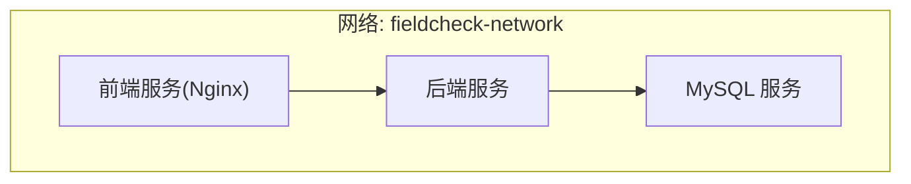
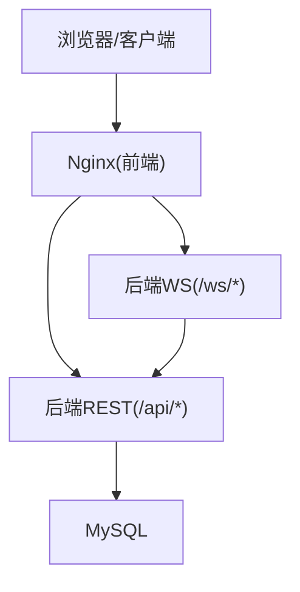
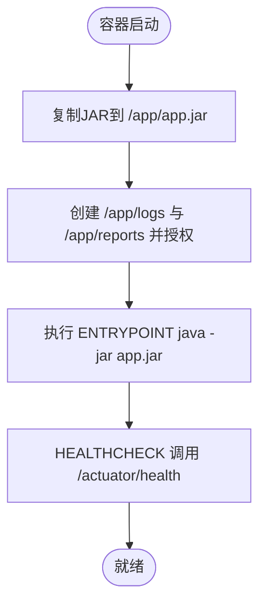
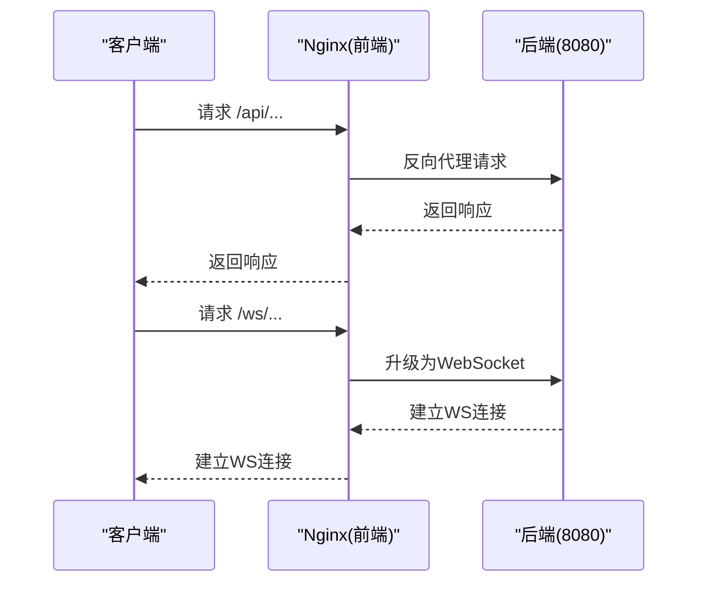
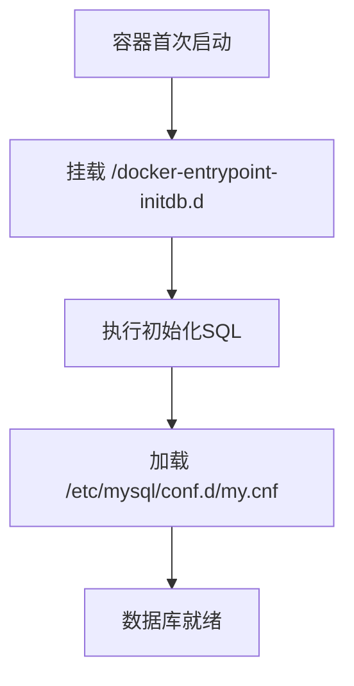
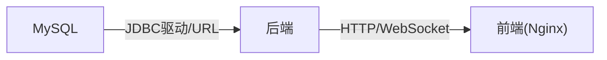

# 部署与运维

<cite>
**本文引用的文件**
- [docker-compose.yml](file://docker-compose.yml)
- [start.sh](file://start.sh)
- [.gitignore](file://.gitignore)
- [backend/pom.xml](file://backend/pom.xml)
- [backend/Dockerfile](file://backend/Dockerfile)
- [backend/src/main/resources/application.yml](file://backend/src/main/resources/application.yml)
- [backend/src/main/resources/application-docker.yml](file://backend/src/main/resources/application-docker.yml)
- [frontend/Dockerfile](file://frontend/Dockerfile)
- [frontend/nginx.conf](file://frontend/nginx.conf)
- [frontend/package.json](file://frontend/package.json)
- [mysql/conf/my.cnf](file://mysql/conf/my.cnf)
- [mysql/init/01_init_schema.sql](file://mysql/init/01_init_schema.sql)
</cite>

## 目录
1. [简介](#简介)
2. [项目结构](#项目结构)
3. [核心组件](#核心组件)
4. [架构总览](#架构总览)
5. [详细组件分析](#详细组件分析)
6. [依赖关系分析](#依赖关系分析)
7. [性能考虑](#性能考虑)
8. [故障排除指南](#故障排除指南)
9. [结论](#结论)
10. [附录](#附录)

## 简介
本文件面向MySQL风险字段检查平台的部署与运维团队，提供从零到一的容器化部署指南、多环境配置策略、数据库初始化与迁移、日志与监控、性能调优、故障排除、备份与恢复以及CI/CD流水线建议。内容基于仓库中的Compose编排、Dockerfile、Spring Boot配置、前端Nginx配置与MySQL初始化脚本进行整理与提炼。

## 项目结构
平台采用三容器编排：MySQL数据库、Spring Boot后端、Vue前端（Nginx承载）。通过docker-compose统一编排，卷挂载实现持久化与配置注入；后端通过JPA/Hibernate与Quartz管理数据库与定时任务；前端通过Nginx反向代理后端API与WebSocket。

图表来源
- [docker-compose.yml](file://docker-compose.yml#L3-L91)

章节来源
- [docker-compose.yml](file://docker-compose.yml#L1-L91)
- [backend/src/main/resources/application.yml](file://backend/src/main/resources/application.yml#L1-L75)
- [backend/src/main/resources/application-docker.yml](file://backend/src/main/resources/application-docker.yml#L1-L46)
- [frontend/nginx.conf](file://frontend/nginx.conf#L1-L69)
- [mysql/conf/my.cnf](file://mysql/conf/my.cnf#L1-L31)

## 核心组件
- MySQL数据库
  - 使用官方镜像，字符集utf8mb4，慢查询日志开启，连接数与缓冲池按示例配置。
  - 初始化脚本创建业务库与表结构，包含审计、任务、白名单、告警等核心表。
- Spring Boot后端
  - 多环境配置：本地application.yml与Docker专用application-docker.yml。
  - 数据源、JPA、Quartz、邮件、JWT、AES等配置分离于不同profiles。
  - 健康检查端点暴露，Actuator启用health/info。
- Vue前端（Nginx）
  - Nginx静态托管，反向代理/api至后端，WebSocket路径/ws透传。
  - 健康检查端点/health返回healthy，Gzip压缩与安全头设置。

章节来源
- [backend/src/main/resources/application.yml](file://backend/src/main/resources/application.yml#L1-L75)
- [backend/src/main/resources/application-docker.yml](file://backend/src/main/resources/application-docker.yml#L1-L46)
- [frontend/nginx.conf](file://frontend/nginx.conf#L1-L69)
- [mysql/conf/my.cnf](file://mysql/conf/my.cnf#L1-L31)
- [mysql/init/01_init_schema.sql](file://mysql/init/01_init_schema.sql#L1-L185)

## 架构总览
下图展示容器间依赖与通信路径：前端通过Nginx反代访问后端REST与WebSocket；后端连接MySQL；MySQL由初始化脚本建立业务表结构。

图表来源
- [docker-compose.yml](file://docker-compose.yml#L61-L78)
- [frontend/nginx.conf](file://frontend/nginx.conf#L33-L57)
- [backend/src/main/resources/application.yml](file://backend/src/main/resources/application.yml#L8-L22)

## 详细组件分析

### 后端服务（Spring Boot）
- 镜像构建
  - 多阶段构建：Maven下载依赖后打包，运行阶段使用OpenJDK 8 JRE，安装curl用于健康检查。
  - 非root用户运行，创建/logs与/reports目录并授权。
  - JVM参数示例：最小/最大堆与CMS GC，便于在容器中调整。
- 配置文件
  - 本地开发：application.yml定义数据源、JPA方言、Quartz JDBC初始化、Jackson时区与日志级别。
  - Docker环境：application-docker.yml通过环境变量覆盖数据源、JWT与AES密钥、日志文件路径、Actuator暴露端点。
- 健康检查
  - Compose健康检查调用/actuator/health；Dockerfile HEALTHCHECK同理。
- 关键特性
  - Quartz使用JDBC存储作业，DDL策略在Docker中为validate以避免破坏生产表结构。
  - 日志输出级别在Docker中降低，日志文件落盘至/app/logs。

图表来源
- [backend/Dockerfile](file://backend/Dockerfile#L14-L44)

章节来源
- [backend/Dockerfile](file://backend/Dockerfile#L1-L44)
- [backend/src/main/resources/application.yml](file://backend/src/main/resources/application.yml#L1-L75)
- [backend/src/main/resources/application-docker.yml](file://backend/src/main/resources/application-docker.yml#L1-L46)

### 前端服务（Nginx）
- 镜像构建
  - Node构建产物，Nginx alpine运行，复制dist与nginx.conf。
- 反向代理
  - /api代理到后端8080；/ws升级为WebSocket；静态资源缓存一年；Gzip压缩与安全头。
- 健康检查
  - /health返回200 healthy字符串，Compose健康检查使用wget spider。

图表来源
- [frontend/Dockerfile](file://frontend/Dockerfile#L1-L35)
- [frontend/nginx.conf](file://frontend/nginx.conf#L33-L57)

章节来源
- [frontend/Dockerfile](file://frontend/Dockerfile#L1-L35)
- [frontend/nginx.conf](file://frontend/nginx.conf#L1-L69)

### 数据库（MySQL）
- 镜像与环境
  - 使用8.0镜像，设置时区、字符集与root/普通用户凭据。
  - 挂载卷：/var/lib/mysql（数据）、/docker-entrypoint-initdb.d（初始化脚本）、/etc/mysql/conf.d（my.cnf）。
- 初始化脚本
  - 创建业务库与全部业务表，含索引与外键约束；插入默认管理员用户。
- MySQL配置
  - 字符集utf8mb4、慢查询日志、长查询阈值、连接上限、缓冲池大小、大小写不敏感等。

图表来源
- [docker-compose.yml](file://docker-compose.yml#L17-L21)
- [mysql/init/01_init_schema.sql](file://mysql/init/01_init_schema.sql#L1-L185)
- [mysql/conf/my.cnf](file://mysql/conf/my.cnf#L1-L31)

章节来源
- [docker-compose.yml](file://docker-compose.yml#L1-L91)
- [mysql/init/01_init_schema.sql](file://mysql/init/01_init_schema.sql#L1-L185)
- [mysql/conf/my.cnf](file://mysql/conf/my.cnf#L1-L31)

### 部署与运维脚本
- start.sh
  - 校验Docker与Compose；自动创建.env；支持up/start、down/stop、restart、logs、status、clean（含数据卷清理）。
  - 提供默认账号提示与服务访问地址。

章节来源
- [start.sh](file://start.sh#L1-L80)

## 依赖关系分析
- 组件耦合
  - 前端依赖后端REST与WebSocket；后端依赖MySQL；MySQL依赖初始化脚本与配置文件。
- 依赖链
  - Compose启动顺序：mysql -> backend(等待健康) -> frontend。
  - 健康检查：mysql ping；backend actuator health；frontend /health spider。

图表来源
- [docker-compose.yml](file://docker-compose.yml#L30-L78)
- [backend/src/main/resources/application-docker.yml](file://backend/src/main/resources/application-docker.yml#L4-L7)

章节来源
- [docker-compose.yml](file://docker-compose.yml#L1-L91)
- [backend/src/main/resources/application-docker.yml](file://backend/src/main/resources/application-docker.yml#L1-L46)

## 性能考虑
- 数据库层
  - 慢查询日志与阈值已启用，建议结合慢查询日志定位热点SQL并优化索引。
  - 连接数与缓冲池按示例配置，建议根据并发与内存资源动态调整。
- 应用层
  - Hikari连接池参数已在配置中给出，建议结合压测结果微调最大池大小与超时。
  - Quartz使用JDBC存储，建议独立数据库或隔离schema，避免与业务库争抢资源。
- 前端层
  - Nginx已启用Gzip与静态资源缓存，建议CDN加速与HTTPS开启。
- JVM与容器
  - 示例JVM参数可按容器内存限制调整，避免GC压力过大；必要时启用G1GC并配合容器资源限制。

章节来源
- [mysql/conf/my.cnf](file://mysql/conf/my.cnf#L1-L31)
- [backend/src/main/resources/application.yml](file://backend/src/main/resources/application.yml#L13-L22)
- [frontend/nginx.conf](file://frontend/nginx.conf#L7-L30)
- [backend/Dockerfile](file://backend/Dockerfile#L36-L36)

## 故障排除指南
- 服务无法启动
  - 检查compose健康检查失败原因：后端/前端健康检查失败通常与依赖未就绪有关。
  - 查看容器日志：使用start.sh logs或docker-compose logs。
- 数据库初始化失败
  - 确认初始化脚本是否被正确挂载；确认字符集与时区配置一致。
- 登录与鉴权异常
  - 核对JWT密钥与AES密钥环境变量；确认application-docker.yml中相关配置。
- 前端无法访问后端接口
  - 检查Nginx反代配置与后端端口映射；确认跨域与WebSocket路径。
- 数据库连接异常
  - 校验SPRING_DATASOURCE_URL、用户名与密码；确认网络连通与防火墙。

章节来源
- [start.sh](file://start.sh#L52-L57)
- [docker-compose.yml](file://docker-compose.yml#L22-L26)
- [backend/src/main/resources/application-docker.yml](file://backend/src/main/resources/application-docker.yml#L4-L7)
- [frontend/nginx.conf](file://frontend/nginx.conf#L33-L57)

## 结论
本平台通过docker-compose实现了后端、前端与数据库的一键编排部署，配合初始化脚本与Dockerfile多阶段构建，具备良好的可移植性与可观测性。建议在生产环境中进一步完善密钥管理、监控告警、备份策略与CI/CD流水线。

## 附录

### 多环境部署策略
- 开发环境
  - 使用本地application.yml，JPA ddl-auto设为update，便于快速迭代。
  - 本地端口直连，无需Nginx反代。
- 测试环境
  - 使用application-docker.yml，JPA ddl-auto设为validate，避免误改表结构。
  - 通过Compose暴露端口，便于联调。
- 生产环境
  - 使用application-docker.yml，严格控制日志级别与Actuator暴露范围。
  - 建议使用外部负载均衡与反向代理，启用TLS与WAF。

章节来源
- [backend/src/main/resources/application.yml](file://backend/src/main/resources/application.yml#L24-L37)
- [backend/src/main/resources/application-docker.yml](file://backend/src/main/resources/application-docker.yml#L16-L26)

### 数据库初始化与迁移
- 初始化
  - 首次启动会执行/docker-entrypoint-initdb.d下的SQL脚本，创建业务库与表结构。
- 迁移
  - 当前配置使用JPA ddl-auto与Quartz初始化schema，建议在测试/生产环境改为手动迁移或Flyway/Liquibase管理。

章节来源
- [docker-compose.yml](file://docker-compose.yml#L19-L21)
- [mysql/init/01_init_schema.sql](file://mysql/init/01_init_schema.sql#L1-L185)
- [backend/src/main/resources/application.yml](file://backend/src/main/resources/application.yml#L33-L37)

### 日志与监控
- 后端日志
  - Docker环境日志文件位于/app/logs/fieldcheck.log；控制台与文件双通道输出。
  - Actuator暴露health与info端点，便于外部监控。
- 数据库日志
  - 慢查询日志已启用，建议定期巡检与分析。
- 前端健康检查
  - /health端点返回healthy，便于K8s/Compose健康检查。

章节来源
- [backend/src/main/resources/application-docker.yml](file://backend/src/main/resources/application-docker.yml#L31-L45)
- [mysql/conf/my.cnf](file://mysql/conf/my.cnf#L15-L18)
- [frontend/nginx.conf](file://frontend/nginx.conf#L19-L24)

### 备份与恢复策略
- 数据库备份
  - 建议定期执行逻辑备份（mysqldump）或物理备份（xtrabackup），并校验恢复流程。
- 配置与日志
  - 将初始化脚本与my.cnf纳入版本管理；日志目录通过卷挂载持久化。
- 回滚与演练
  - 制定回滚计划与演练方案，确保在变更失败时快速恢复。

章节来源
- [.gitignore](file://.gitignore#L12-L20)
- [mysql/conf/my.cnf](file://mysql/conf/my.cnf#L1-L31)

### CI/CD流水线建议
- 构建阶段
  - Maven构建后端JAR；npm安装与构建前端产物；分别构建多阶段镜像。
- 扫描与测试
  - 镜像扫描与安全基线检查；后端单元测试与集成测试。
- 发布阶段
  - 使用Compose或Kubernetes部署；滚动更新与健康检查。
- 配置管理
  - 密钥与敏感配置通过Secret管理；不同环境使用不同profile与环境变量文件。
- 监控与告警
  - 集成Prometheus/Grafana与日志聚合系统，配置关键指标告警。

章节来源
- [backend/pom.xml](file://backend/pom.xml#L1-L161)
- [frontend/package.json](file://frontend/package.json#L1-L33)
- [docker-compose.yml](file://docker-compose.yml#L1-L91)