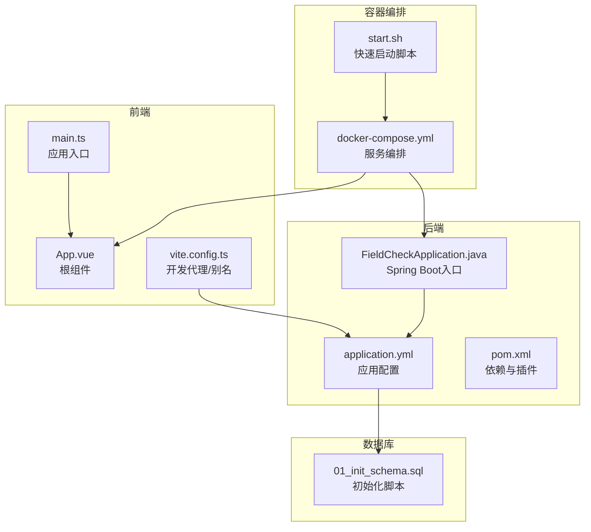
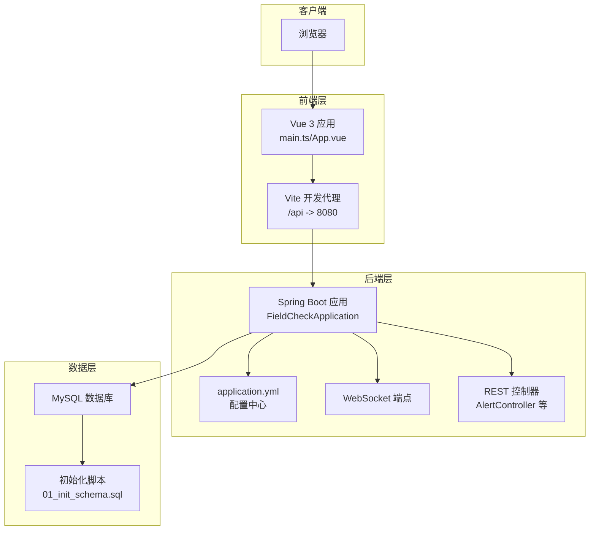
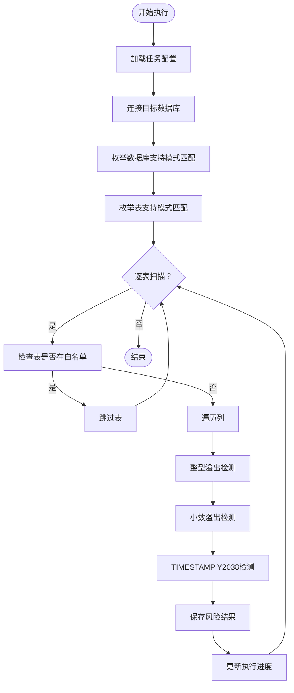
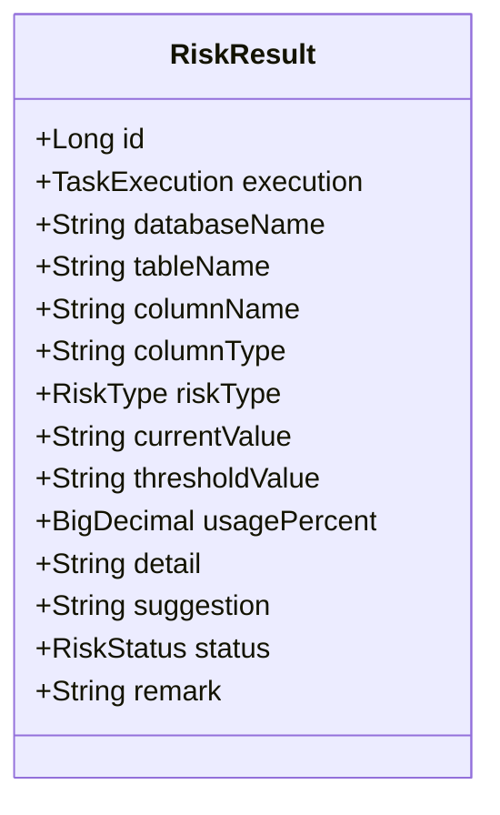
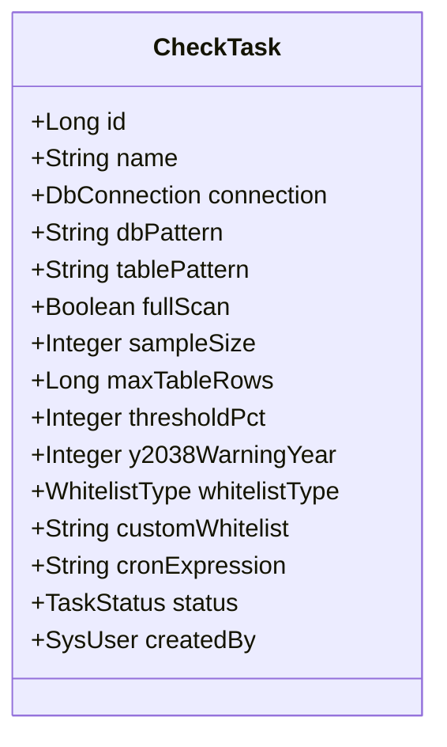
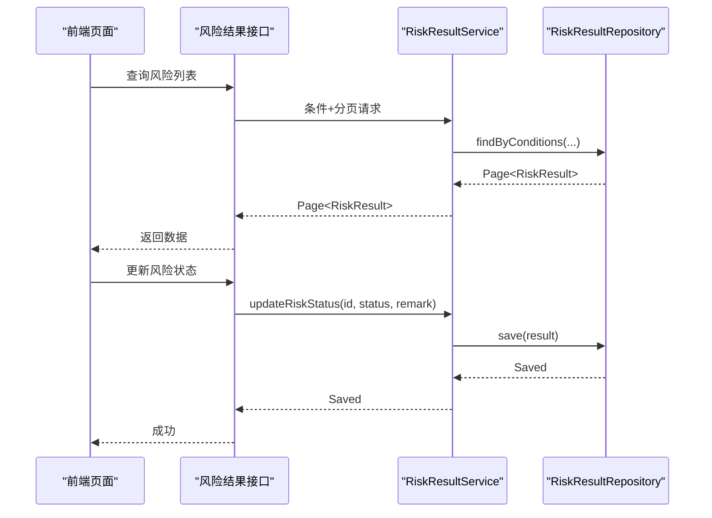
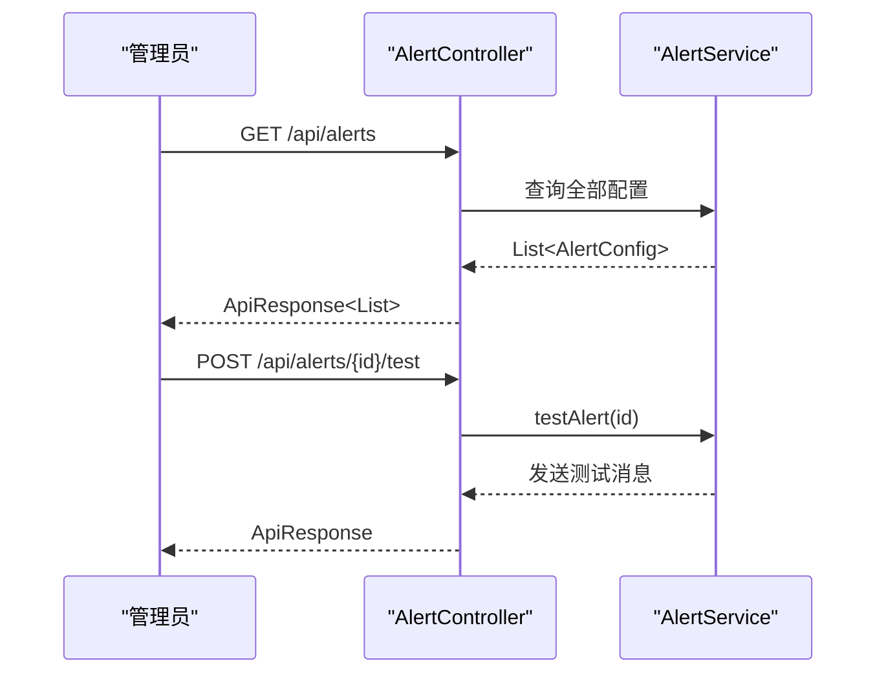
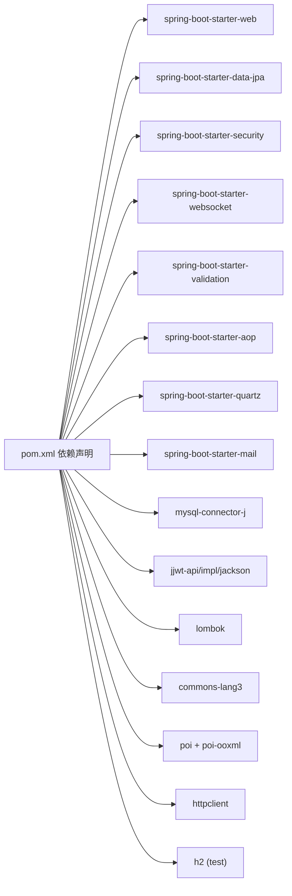

# 项目概述

<cite>
**本文引用的文件**
- [FieldCheckApplication.java](file://backend/src/main/java/com/fieldcheck/FieldCheckApplication.java)
- [CheckEngine.java](file://backend/src/main/java/com/fieldcheck/engine/CheckEngine.java)
- [RiskResult.java](file://backend/src/main/java/com/fieldcheck/entity/RiskResult.java)
- [CheckTask.java](file://backend/src/main/java/com/fieldcheck/entity/CheckTask.java)
- [RiskResultService.java](file://backend/src/main/java/com/fieldcheck/service/RiskResultService.java)
- [AlertController.java](file://backend/src/main/java/com/fieldcheck/controller/AlertController.java)
- [application.yml](file://backend/src/main/resources/application.yml)
- [pom.xml](file://backend/pom.xml)
- [docker-compose.yml](file://docker-compose.yml)
- [start.sh](file://start.sh)
- [01_init_schema.sql](file://mysql/init/01_init_schema.sql)
- [main.ts](file://frontend/src/main.ts)
- [App.vue](file://frontend/src/App.vue)
- [vite.config.ts](file://frontend/vite.config.ts)
- [package.json](file://frontend/package.json)
</cite>

## 目录
1. [引言](#引言)
2. [项目结构](#项目结构)
3. [核心组件](#核心组件)
4. [架构总览](#架构总览)
5. [详细组件分析](#详细组件分析)
6. [依赖分析](#依赖分析)
7. [性能考量](#性能考量)
8. [故障排查指南](#故障排查指南)
9. [结论](#结论)
10. [附录](#附录)

## 引言
MySQL风险字段检查平台旨在帮助数据库管理员与开发团队主动识别并治理数据库字段容量风险，避免因整型溢出、小数精度不足、TIMESTAMP“Y2038”边界风险等问题引发的业务中断与数据异常。系统通过可配置的任务调度、白名单机制、抽样检测与实时日志推送，实现对大规模数据库的高效扫描与可视化呈现，降低运维成本并提升系统稳定性。

该平台的核心价值在于：
- 主动预警：在风险达到阈值前及时发现并提示
- 可配置策略：支持按库/表/字段模式匹配、阈值百分比、抽样大小等灵活配置
- 安全可控：内置白名单、权限控制与审计日志
- 实时反馈：WebSocket推送执行进度与日志
- 可视化管理：前后端分离，提供直观的管理界面

## 项目结构
项目采用前后端分离架构，后端基于Spring Boot，前端基于Vue 3 + TypeScript，配合Docker Compose进行统一编排部署。数据库使用MySQL，初始Schema由SQL脚本初始化。

**图表来源**
- [main.ts](file://frontend/src/main.ts#L1-L23)
- [App.vue](file://frontend/src/App.vue#L1-L25)
- [vite.config.ts](file://frontend/vite.config.ts#L1-L31)
- [FieldCheckApplication.java](file://backend/src/main/java/com/fieldcheck/FieldCheckApplication.java#L1-L17)
- [application.yml](file://backend/src/main/resources/application.yml#L1-L75)
- [pom.xml](file://backend/pom.xml#L1-L161)
- [01_init_schema.sql](file://mysql/init/01_init_schema.sql#L1-L185)
- [docker-compose.yml](file://docker-compose.yml#L1-L91)
- [start.sh](file://start.sh#L1-L80)

**章节来源**
- [FieldCheckApplication.java](file://backend/src/main/java/com/fieldcheck/FieldCheckApplication.java#L1-L17)
- [application.yml](file://backend/src/main/resources/application.yml#L1-L75)
- [pom.xml](file://backend/pom.xml#L1-L161)
- [docker-compose.yml](file://docker-compose.yml#L1-L91)
- [start.sh](file://start.sh#L1-L80)
- [01_init_schema.sql](file://mysql/init/01_init_schema.sql#L1-L185)
- [main.ts](file://frontend/src/main.ts#L1-L23)
- [App.vue](file://frontend/src/App.vue#L1-L25)
- [vite.config.ts](file://frontend/vite.config.ts#L1-L31)
- [package.json](file://frontend/package.json#L1-L33)

## 核心组件
- 执行引擎（CheckEngine）：负责扫描数据库、解析字段类型、计算使用率并生成风险结果；支持整型溢出、小数溢出、TIMESTAMP Y2038风险检测；对大表采用抽样策略以平衡性能与准确性。
- 风险结果模型（RiskResult）：持久化风险项，包含数据库/表/字段名称、类型、当前值、阈值、使用率、建议与状态等。
- 任务模型（CheckTask）：定义扫描范围（库/表模式）、阈值、抽样大小、是否全量扫描、定时任务表达式等。
- 风险结果服务（RiskResultService）：提供风险查询、统计与状态变更接口，支撑前端展示与运营处置。
- 告警控制器（AlertController）：提供告警配置的增删改查与测试接口，便于集成邮件、钉钉等通知渠道。
- 应用配置（application.yml）：集中管理数据源、JPA、Quartz、邮件、JWT、AES密钥与日志路径等。
- 前后端入口与路由：前端通过Element Plus与Vue Router构建UI；后端通过Spring MVC暴露REST API与WebSocket端点。

**章节来源**
- [CheckEngine.java](file://backend/src/main/java/com/fieldcheck/engine/CheckEngine.java#L1-L454)
- [RiskResult.java](file://backend/src/main/java/com/fieldcheck/entity/RiskResult.java#L1-L68)
- [CheckTask.java](file://backend/src/main/java/com/fieldcheck/entity/CheckTask.java#L1-L75)
- [RiskResultService.java](file://backend/src/main/java/com/fieldcheck/service/RiskResultService.java#L1-L124)
- [AlertController.java](file://backend/src/main/java/com/fieldcheck/controller/AlertController.java#L1-L67)
- [application.yml](file://backend/src/main/resources/application.yml#L1-L75)

## 架构总览
系统采用三层架构：前端（Vue 3）、后端（Spring Boot）、数据库（MySQL）。通过Docker Compose将MySQL、后端、前端（Nginx）编排为独立容器，实现一键部署与健康检查。

**图表来源**
- [main.ts](file://frontend/src/main.ts#L1-L23)
- [App.vue](file://frontend/src/App.vue#L1-L25)
- [vite.config.ts](file://frontend/vite.config.ts#L1-L31)
- [FieldCheckApplication.java](file://backend/src/main/java/com/fieldcheck/FieldCheckApplication.java#L1-L17)
- [application.yml](file://backend/src/main/resources/application.yml#L1-L75)
- [AlertController.java](file://backend/src/main/java/com/fieldcheck/controller/AlertController.java#L1-L67)
- [01_init_schema.sql](file://mysql/init/01_init_schema.sql#L1-L185)

## 详细组件分析

### 执行引擎（CheckEngine）
执行引擎是系统的核心，负责：
- 解析任务配置（库/表模式、阈值、抽样大小、全量扫描开关）
- 连接目标数据库，枚举数据库、表与列
- 对整型、小数、时间戳三类风险进行检测
- 计算使用率并生成风险结果
- 支持白名单过滤与抽样策略
- 实时保存执行进度与风险计数

**图表来源**
- [CheckEngine.java](file://backend/src/main/java/com/fieldcheck/engine/CheckEngine.java#L57-L139)

**章节来源**
- [CheckEngine.java](file://backend/src/main/java/com/fieldcheck/engine/CheckEngine.java#L1-L454)

### 风险结果模型（RiskResult）
风险结果实体用于持久化风险项，包含：
- 执行上下文：execution 关联
- 位置信息：databaseName、tableName、columnName
- 类型与阈值：columnType、currentValue、thresholdValue
- 统计指标：usagePercent
- 处置信息：riskType、status、remark、suggestion

**图表来源**
- [RiskResult.java](file://backend/src/main/java/com/fieldcheck/entity/RiskResult.java#L1-L68)

**章节来源**
- [RiskResult.java](file://backend/src/main/java/com/fieldcheck/entity/RiskResult.java#L1-L68)

### 任务模型（CheckTask）
任务模型定义了扫描策略与触发方式：
- 范围与过滤：dbPattern、tablePattern、whitelistType、customWhitelist
- 性能参数：fullScan、sampleSize、maxTableRows、thresholdPct
- 时间维度：y2038WarningYear、cronExpression
- 状态与归属：status、createdBy

**图表来源**
- [CheckTask.java](file://backend/src/main/java/com/fieldcheck/entity/CheckTask.java#L1-L75)

**章节来源**
- [CheckTask.java](file://backend/src/main/java/com/fieldcheck/entity/CheckTask.java#L1-L75)

### 风险结果服务（RiskResultService）
服务层提供：
- 分页与条件查询风险结果
- 风险统计与趋势分析
- 风险状态更新与备注写入
- DTO转换与中文描述映射

**图表来源**
- [RiskResultService.java](file://backend/src/main/java/com/fieldcheck/service/RiskResultService.java#L27-L50)

**章节来源**
- [RiskResultService.java](file://backend/src/main/java/com/fieldcheck/service/RiskResultService.java#L1-L124)

### 告警控制器（AlertController）
提供告警配置的CRUD与测试能力，支持基于角色的访问控制，便于对接邮件、钉钉等外部通知系统。

**图表来源**
- [AlertController.java](file://backend/src/main/java/com/fieldcheck/controller/AlertController.java#L19-L65)

**章节来源**
- [AlertController.java](file://backend/src/main/java/com/fieldcheck/controller/AlertController.java#L1-L67)

## 依赖分析
后端使用Spring Boot生态与关键依赖：
- Web/WebFlux、JPA、Security、WebSocket、Validation、AOP、Quartz、Mail
- MySQL Connector/J、JWT（jjwt）、Lombok、Apache Commons、Apache POI、HTTP Client
- 测试：Spring Boot Starter Test、Spring Security Test、H2

**图表来源**
- [pom.xml](file://backend/pom.xml#L28-L141)

**章节来源**
- [pom.xml](file://backend/pom.xml#L1-L161)

## 性能考量
- 大表抽样：当表行数超过阈值且未开启全量扫描时，采用随机抽样以降低查询开销。
- 批量写入：进度保存按固定间隔批量落库，减少数据库压力。
- 连接池与超时：HikariCP连接池参数优化，SQL校验与超时控制保障稳定性。
- 并发与异步：启用异步与调度，支持定时任务与并发任务上限配置。
- 日志与报告：可配置日志路径与报告目录，便于定位性能瓶颈。

**章节来源**
- [CheckEngine.java](file://backend/src/main/java/com/fieldcheck/engine/CheckEngine.java#L274-L277)
- [CheckEngine.java](file://backend/src/main/java/com/fieldcheck/engine/CheckEngine.java#L125-L131)
- [application.yml](file://backend/src/main/resources/application.yml#L13-L22)
- [application.yml](file://backend/src/main/resources/application.yml#L65-L68)

## 故障排查指南
- 启动失败
  - 检查Docker与docker-compose是否安装，确认端口占用情况
  - 使用脚本查看服务状态与日志输出
- 数据库连接
  - 核对application.yml中的数据源URL、用户名、密码
  - 确认MySQL容器健康状态与初始化脚本执行
- 执行异常
  - 查看后端日志与执行记录中的错误信息
  - 检查任务配置（阈值、抽样大小、模式匹配）是否合理
- 前后端通信
  - 前端代理指向后端8080端口，确认跨域与代理配置
  - WebSocket端点需正确转发至后端

**章节来源**
- [start.sh](file://start.sh#L11-L20)
- [start.sh](file://start.sh#L52-L57)
- [application.yml](file://backend/src/main/resources/application.yml#L8-L12)
- [docker-compose.yml](file://docker-compose.yml#L22-L26)
- [docker-compose.yml](file://docker-compose.yml#L52-L57)
- [vite.config.ts](file://frontend/vite.config.ts#L18-L28)

## 结论
本项目通过工程化的手段，将数据库字段容量风险检测流程化、可视化与自动化，既适合初学者快速上手，也为有经验的工程师提供了可扩展的架构与完善的治理能力。结合白名单、抽样策略、阈值配置与实时日志推送，能够在不干扰生产的情况下持续监控与预警潜在风险，为数据库长期稳定运行提供坚实保障。

## 附录
- 快速启动
  - 执行脚本会自动拉起MySQL、后端与前端容器，并提供健康检查
  - 默认管理员账号可在初始化脚本中查看
- 前端开发
  - Vite开发服务器默认监听3000端口，代理将/api与/ws转发至后端
  - Element Plus按需引入图标与主题，适配中文环境

**章节来源**
- [start.sh](file://start.sh#L32-L51)
- [01_init_schema.sql](file://mysql/init/01_init_schema.sql#L182-L185)
- [vite.config.ts](file://frontend/vite.config.ts#L16-L29)
- [main.ts](file://frontend/src/main.ts#L18-L20)